# Development in iOS 
--------------------

## Profesor
-----------
Ricardo
jalbacar at gmail

iOS v8
Swift 2x

3 semanas = 60 horas

Entorno sandbox Playground para jugar y probar código swift

## Documentation
----------------
- https://developer.apple.com/
- https://developer.apple.com/library/ios/documentation/Swift/Conceptual/Swift_Programming_Language/TheBasics.html
- http://swiftdoc.org/
- https://developer.apple.com/xcode/download/
- https://developer.apple.com/library/ios/navigation/#section=Topics&topic=Swift
- Start with Swift: https://developer.apple.com/library/ios/referencelibrary/GettingStarted/DevelopiOSAppsSwift/Lesson1.html#//apple_ref/doc/uid/TP40015214-CH3-SW1

Descargar los ejemplos de PlayGround y verlos.

## Referencias
--------------
Buscar "swift" en iBooks:
- The Swift Programming Language (Swift 2.2 edition)

## IDE: XCode
--------------

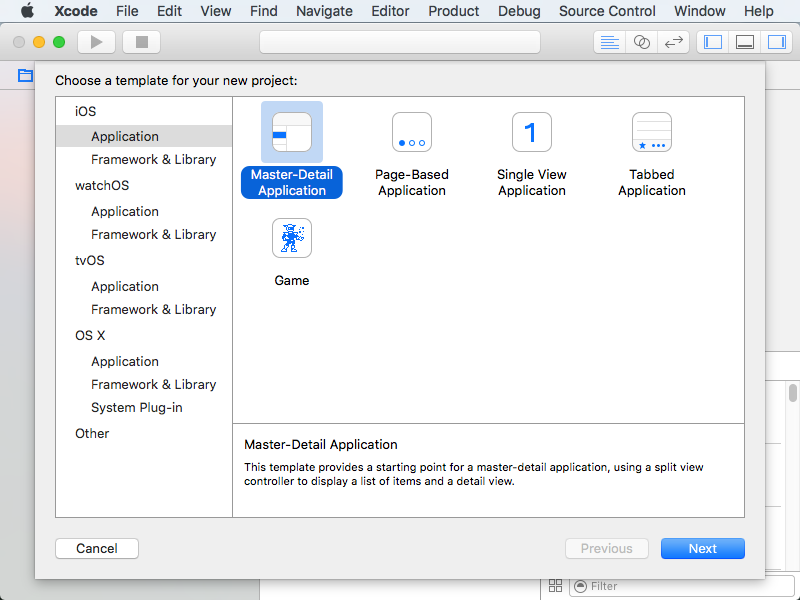

Abrir Xcode e ir a la segunda opción (_create a new XCode Project_). Entre las opciones se puede escoger diferentes tipos de aplicaciones entre las opciones están:
- Master detail app
- Page Based App
- Single View App
- Tabbed App: Una aplicación con tabs
- Game

También se pueden desarrollar librerías y frameworks en la sección _Frameworks & Library_ con _Cocoa Touch Framework_ y _Cocoa Static Library_

Otras opciones son desarrollar para _wereables_ como _watchOS_ o aplicaciones para OS X tales como juegos o aplicaciones de terminal.

## Hello World
-----------
Crear una app con Single View App con los siguientes datos
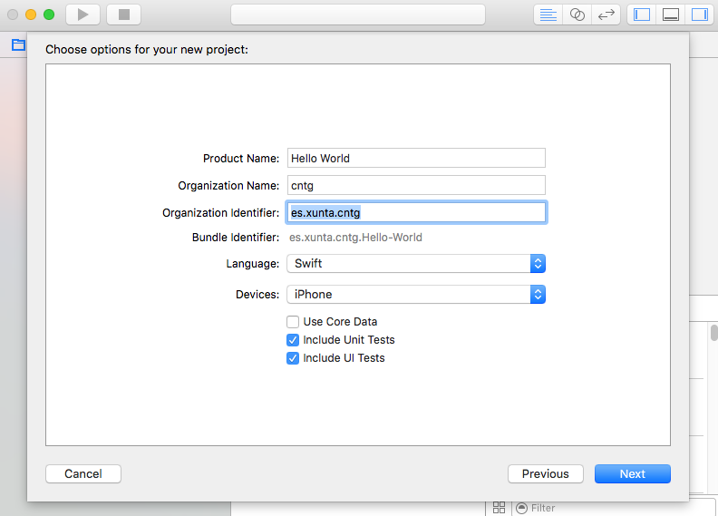

Desmarcar _Use Core Data_ y desmarcar _Unit Test_ y _UI tests_

Guardar el proyecto en una ruta.
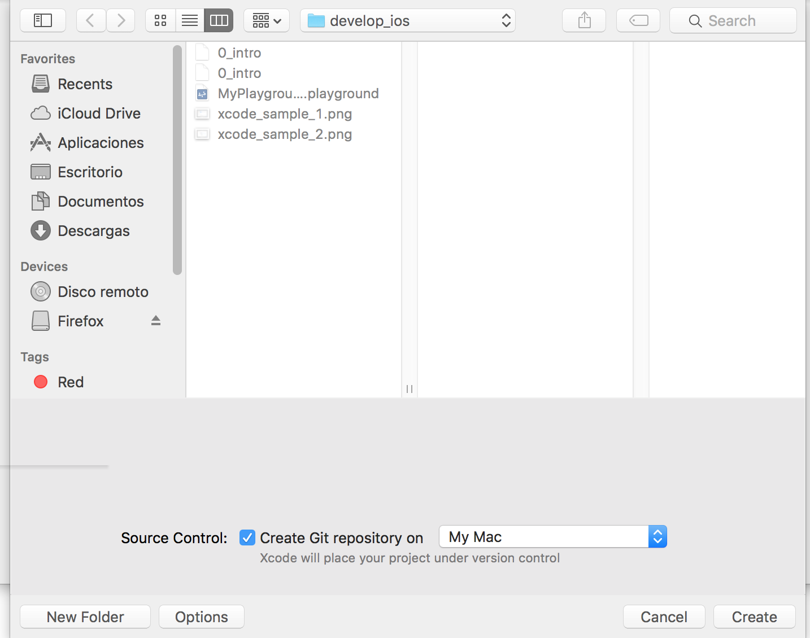

En la estructura del proyecto pulsar la tecla de _Play_ en la parte superior izquierda
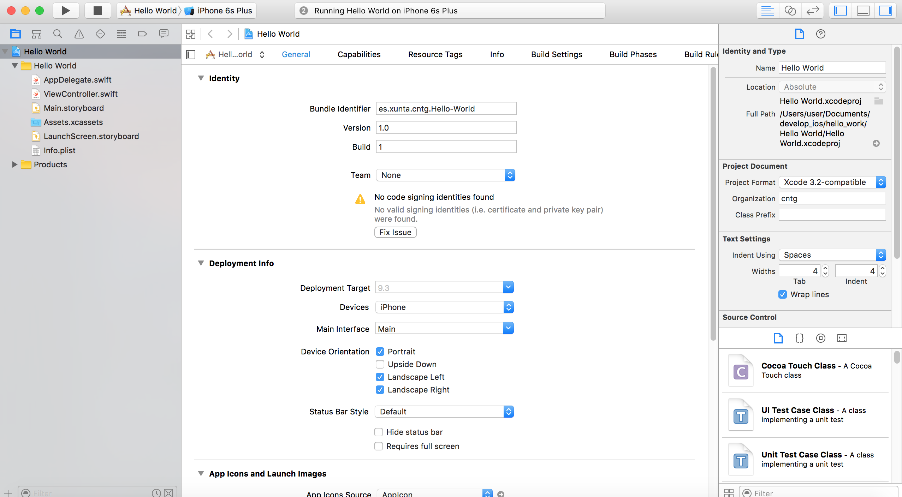

El simulador de iPhone arrancará en cuanto compile el proyecto.
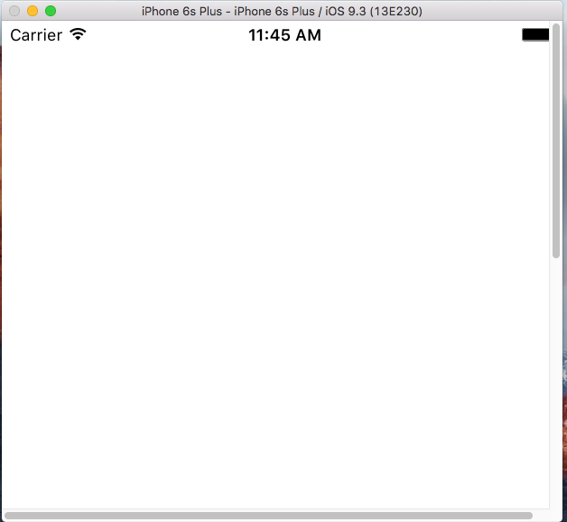

## Consejos
----

Atajos de teclado
En la parte de XCode en el menú Xcode, en _About XCode_ se indica la versión actual 7.3.1. Es importante que sea la versión 7 porque a partir de esta versión Apple permite crear apps y ejecutarlas en el iPhone sin necesidad de pagar licencia para publicar aplicaciones.
La versión indica también que versión de Swift, con la versión 7.3 se puede ejecutar Swift 2.2

En XCode, menú _Preferences..._, pestaña _Components_ para ejecutar en versiones de iOS 8 se puede descargar los diferentes simuladores.
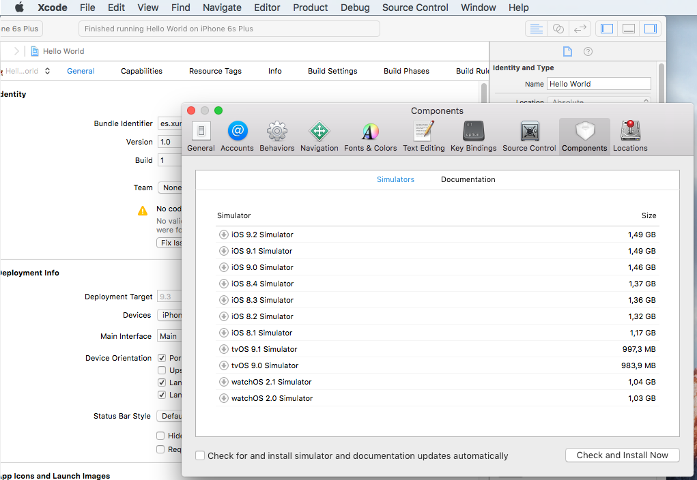

En file se puede crear nuevos tipos de ficheros o proyectos. En _Workspace_ se pueden crear proyectos compartidos.
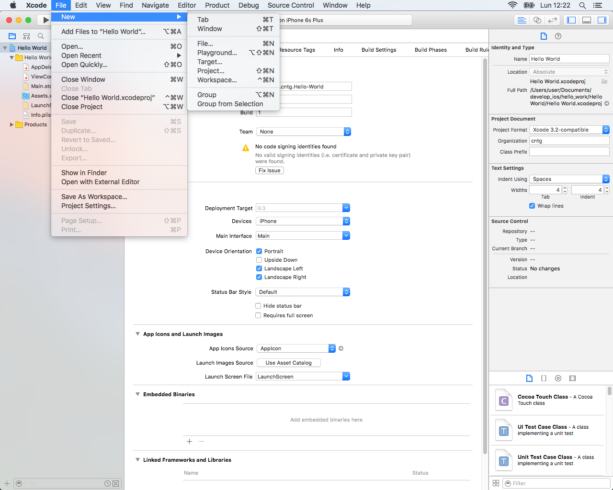

Para ejecutar están las teclas rápidas:
- Run: cmd + R
- Test: cmd + U
- Compile: cmd + B
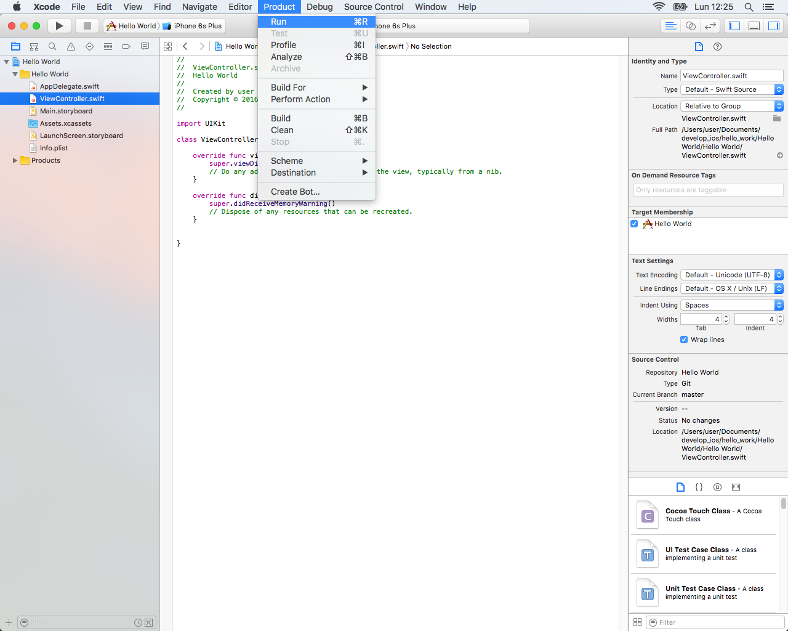

En Windows -> devices se muestran los dispositivos que hay disponibles. Se puede escoger el simulador seleccionando con el ratón y pulsando Cmd+R se arranca en el nuevo simulador.
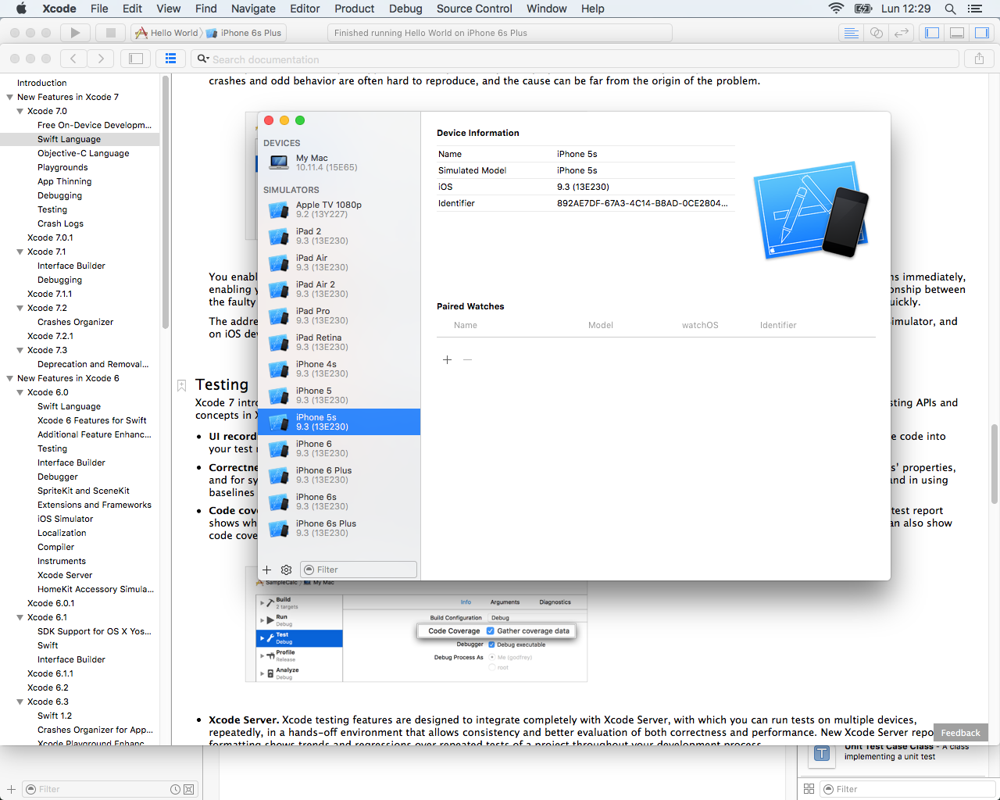

En la parte superior irquierda, al lado del nombre del proyecto seleccionar el dispositivo.
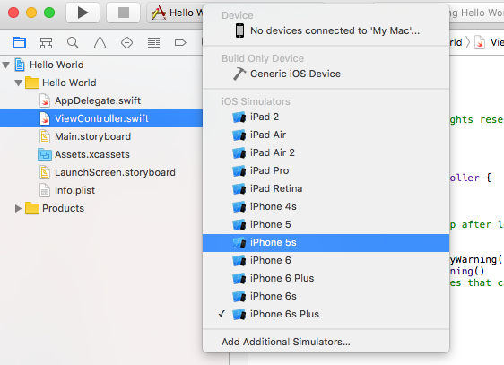

Una cosa es el modelo del dispositivo y otra muy distinta la versión de iOS.

La pantalla del simulador de puede rotar, pulsar la tecla home, etc.
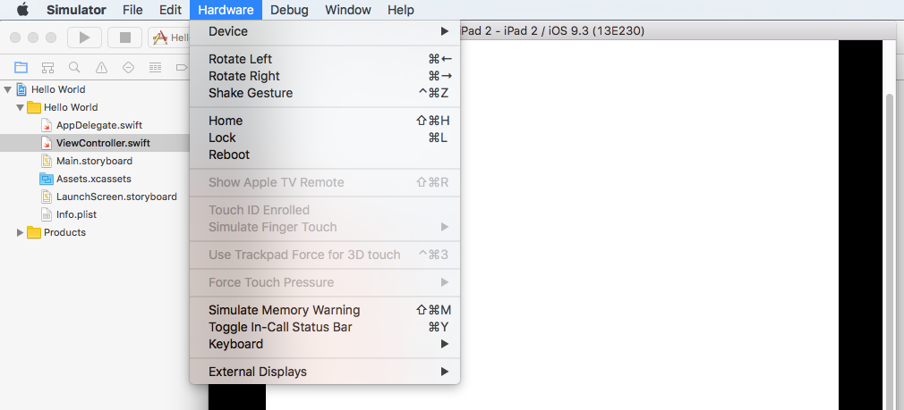

## Entorno IDE XCode
-------------

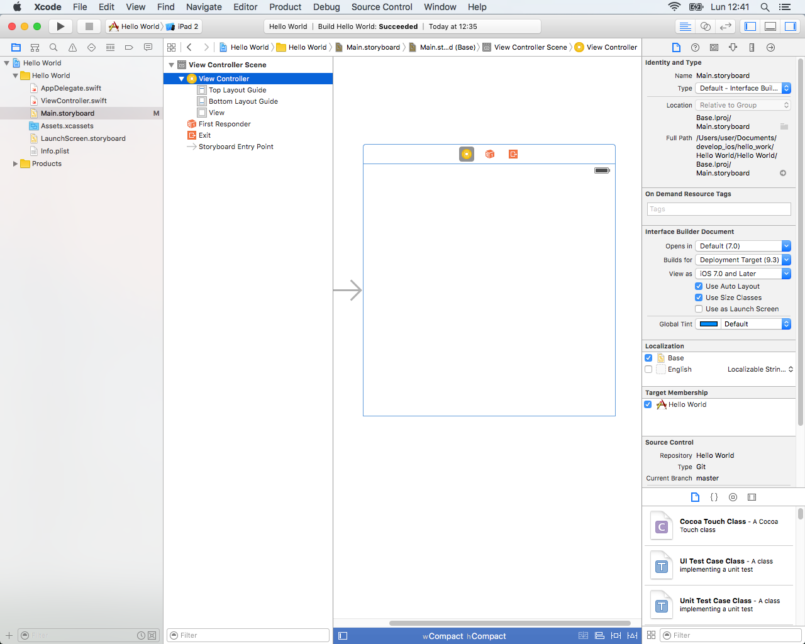
El entorno del proyecto se compone de 3 partes principales:
- Izquierda: esquema del proyecto.
  - _Assets.xcassets_ es la ruta para los ficheros gráficos de la App
  - _Main.Storyborad_ es la definición de las pantallas
  - Ficheros _.swift_

- Centro: editor de código y visualización de la storyboard
- Centro abajo: salidas, modo debug, resultados de compilación y ejecución.
- Derecha. propiedades de ficheros, git, proyecto, etc.

En la parte superior derecha de XCode se puede ocultar paneles presentes.
Pulsando doble clic sobre el código se abrirá el editor de la clase o fichero en una nueva ventana.

## Lenguaje de Programación
---------------------------

El lenguaje Swift simplifica el código frente Object-C.

Ejemplo de Hello World:
```swift
//
//  AppDelegate.swift
//  Hello World2
//
//  Created by user on 23/5/16.
//  Copyright © 2016 cntg. All rights reserved.
//

import UIKit

@UIApplicationMain
class AppDelegate: UIResponder, UIApplicationDelegate {

    var window: UIWindow?


    func application(application: UIApplication, didFinishLaunchingWithOptions launchOptions: [NSObject: AnyObject]?) -> Bool {
        // Override point for customization after application launch.
        return true
    }

    func applicationWillResignActive(application: UIApplication) {
        // Sent when the application is about to move from active to inactive state. This can occur for certain types of temporary interruptions (such as an incoming phone call or SMS message) or when the user quits the application and it begins the transition to the background state.
        // Use this method to pause ongoing tasks, disable timers, and throttle down OpenGL ES frame rates. Games should use this method to pause the game.
    }

    func applicationDidEnterBackground(application: UIApplication) {
        // Use this method to release shared resources, save user data, invalidate timers, and store enough application state information to restore your application to its current state in case it is terminated later.
        // If your application supports background execution, this method is called instead of applicationWillTerminate: when the user quits.
    }

    func applicationWillEnterForeground(application: UIApplication) {
        // Called as part of the transition from the background to the inactive state; here you can undo many of the changes made on entering the background.
    }

    func applicationDidBecomeActive(application: UIApplication) {
        // Restart any tasks that were paused (or not yet started) while the application was inactive. If the application was previously in the background, optionally refresh the user interface.
    }

    func applicationWillTerminate(application: UIApplication) {
        // Called when the application is about to terminate. Save data if appropriate. See also applicationDidEnterBackground:.
    }


}
```

## Playground
--------------

Crear un nuevo PlayGround en XCode en File -> new -> New PlayGround
en el proyecto seleccionar en qué plataforma y automáticamente se abre un editor de playground
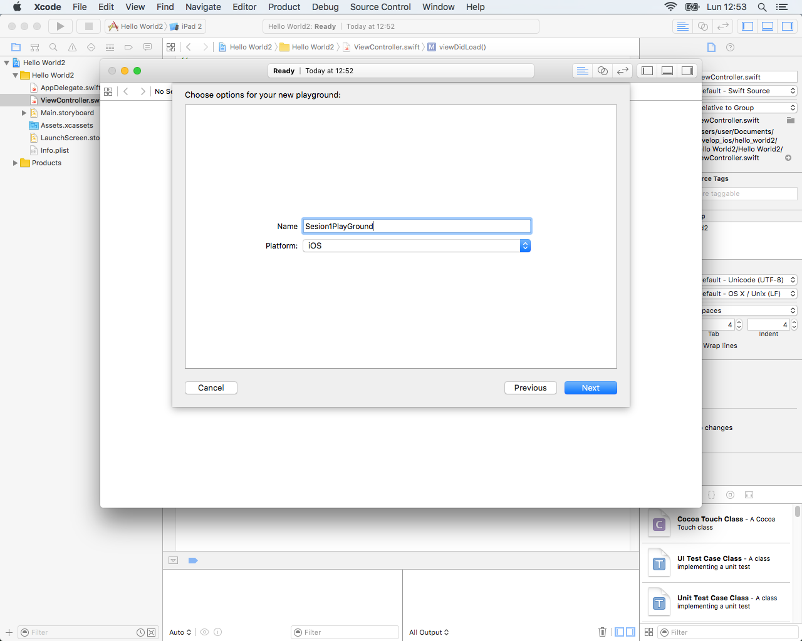

Se pueden realizar operaciones o añadir líneas de código. Pulsando _Enter_ se muestra a la derecha el resultado.
Las sentencias no terminan en ;

Para cambiar la ejecución automática se puede cambiar manteniendo pulsado la tecla _play_ en la parte inferior izquierda.

Tiene autocompletado, por ejemplo escribir una función, clave, enumerado o excepción como _eval_
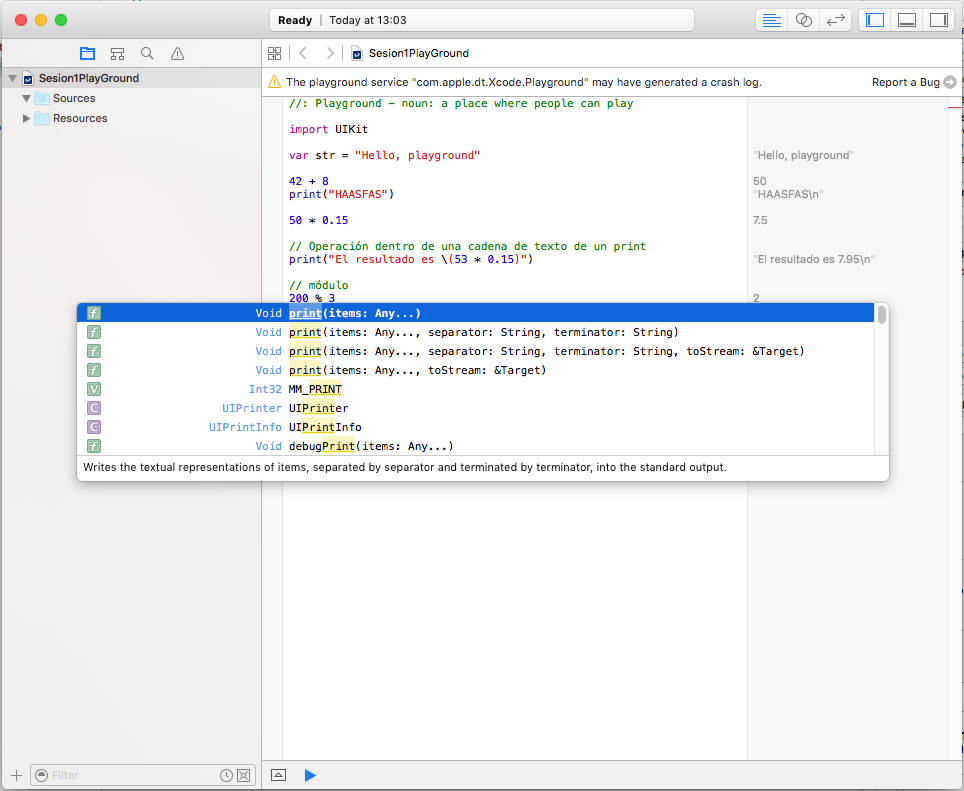

```swift
//: Playground - noun: a place where people can play

import UIKit

var str = "Hello, playground"

42 + 8
print("HAASFAS")

// error_ 50 *0.15, tiene que haber espacio
50 * 0.15

// Operación dentro de una cadena de texto de un print
print("El resultado es \(53 * 0.15)")

// módulo
200 % 3


// Constante
let DEFAULT: UInt64 = 992

// Variable
var myVar: Double = 2.0

func sayHello(personName : String) -> String {
    let result = "Hello " + personName + "!"
    return result
}

print(sayHello("Anna"))

// estructuras iterativas
let totalBill : Double = 95.0
var tipPercentageAccount : Double
for rating in 1...5 {
    if rating == 5 {
        tipPercentageAccount = 0.25
    }else if rating >= 3 {
        tipPercentageAccount = 0.15
    }else {
        tipPercentageAccount = 0.10
    }

    let totalRateAccount : Double = totalBill +
    (totalBill * tipPercentageAccount)

    print("Total rate account es \(totalRateAccount)")
}
```

Para ver el resultado de un bucle hay que pulsar en el icono marcado en la línea en la parte de la derecha. Otra opción es con el botón derecho del ratón.
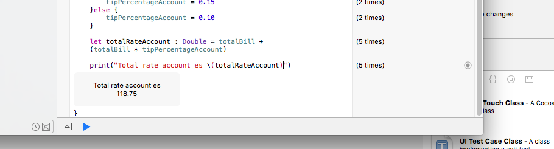

En rendimiento es mucho mejor utilizar contantes con _let_ antes que la declaración de variables.
