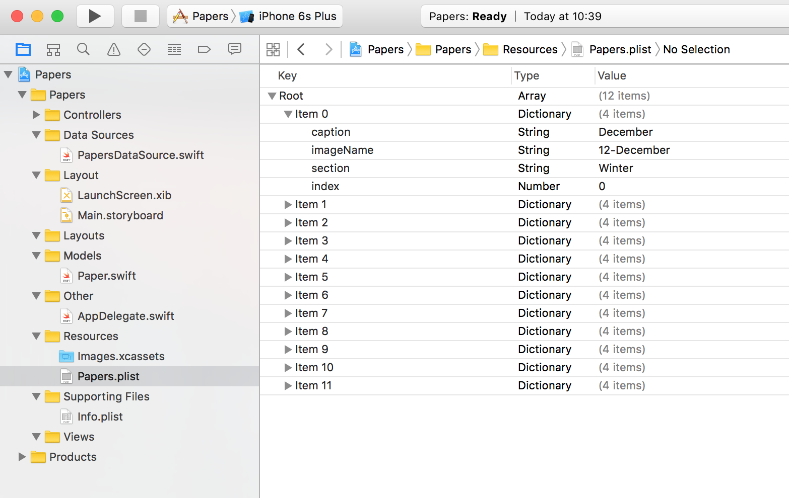

# Collection View
-----------------

Equivale al elemento _grid_ de Android, ideal para uso en galería de imágenes. Es una collección de datos que sigue los elementos de izquerda a derecha y sigue descendiendo. Los item no tienen que ser del mismo tamaño.

Descomprimir assets/Papers_INT.zip en samples/ y abrir el proyecto Papers.

1. Crear una clase _Paper_ en Models

Requiere inicialización con [_convenience_](https://developer.apple.com/library/ios/documentation/Swift/Conceptual/Swift_Programming_Language/Initialization.html) para poder clonar un Paper.

```
class Paper {

    var caption : String
    var imageName : String
    var section: String
    var index: Int


    /**
     * Constructor
     */
    init(caption : String, imageName : String, section: String, index: Int){
        self.caption = caption
        self.section = section
        self.index = index
        self.imageName = imageName
    }

    /**
    * método clone
    */
    convenience init(copying paper: Paper){
        self.init(caption: paper.caption, imageName: paper.imageName, section: paper.section, index: paper.index)
    }

}

```

2. La clase _PapersDataSource_ gestiona los Papers y hay que implementar algo de código.

```
papers = loadPapersFromDisk()

// Carga los datos de Papers.plist:
if let path = NSBundle.mainBundle().pathForResource("Papers", ofType: "plist") {
  ...
```

Carga los datos de Resources/Papers.plist. Es un _XML_ de una forma tipo array con ítems. En el Papers.plist se puede crear nuevos ítems y funciona como un difccionario donde se pueden añadir nuevos valores desde XCode. Se puede abrir en formato XML pulsando Controler y clic Open as -> Source Code.



  - Añadir una properties llamada _count_ que solo será de lectura.
  ```
  var count : Int {
      return papers.count
  }
  ```

  - Crear paperForIndexPath que dé el paper de esa posición
  ```
    func paperForIndexAtIndexPath(indexPath : NSIndexPath) -> Paper? {
          if indexPath.section > 0 {
              let papers = papersForSection(indexPath.section)
              return papers[indexPath.item]
          } else {
              return papers[indexPath.item]
          }
      }
  ```

2. Añadir una pantalla CollectionViewController y el _CollectionViewController_ en Controllers que herede de UIViewController.

  - En Main.StoryBoard arrastrar al lienzo el CollectionViewController y seleccionar el cuadro de la parte superior derecha que ha creado y centrarla con un tamaño de 200x200 en la parte superior de la pantalla.

  - Arrastrar una vista _View_ hacia dentro de la celda Collection View Cell. La vista cambiar el tamaño de las contraints y en el icono "Pin" de la parte de abajo de la pantalla. Poner 0 en todos los márgenes y desmarcar _width_, _high_ y "contraints to margins". En la parte de abajo seleccionar en el desplegable la segunda opción "Items of New Constraints" y pulsar en add 4 contraints. En el arquetipo deberían estar solo estos.

  

  


3. Crear la clase MasterViewController en Controller que implemente el protocolo _UICollectionViewController_

Esta clase tiene el conception de _item_ en lugar _rows_. Usará un método con el parámetro _numberOfItemsInSection_.

```
import UIKit

class MasterViewController : UICollectionViewController{

    private var papersDataSource = PapersDataSource()

        override func viewDidLoad() {
        super.viewDidLoad()
    }

    override func numberOfSectionsInCollectionView(collectionView: UICollectionView) -> Int {
        return 1
    }

    override func collectionView(collectionView: UICollectionView, numberOfItemsInSection section: Int) -> Int {
        return papersDataSource.count
    }

    override func collectionView(collectionView: UICollectionView, cellForItemAtIndexPath indexPath: NSIndexPath) -> UICollectionViewCell {
        // TODO

        let cell = collectionView.dequeueReusableCellWithReuseIdentifier("PaperCell", forIndexPath: indexPath)

        return cell
    }
}
```

Para poder acceder a la celda, seleccionarla en la pantalla gráfica, seleccionar en la jerarquía del CollectionView en la "Collection View Cell" poner el nombre "PaperCell" en el panel derecho en la pantalla de identifier.

4. Configurar la pantalla

Seleccionar y en panel derecho marcar como "Is Initial View Controller" en inspector.

Seleccionar la pantalla Master View Controller y en la ficha del panel derecho seleccionar el controlador creado _MasterViewController_ en el paso anterior.

5. Volver al MasterViewController y marcar el tamaño del contenedor collection.

```
// Obtener el ancho de la collection view
let width = CGRectGetWidth(collectionView!.frame) / 3

// obtener el layout
let layout = collectionViewLayout as! UICollectionViewFlowLayout

// Cada item del layout asignar el width como ancho y alto
layout.itemSize = CGSize(width: width, height: width)
```

Ir a la pantalla y seleccionar "Collection View" y en el panel derecho en el "Size inspector" (icono regla), en "Min Spacing" dejarlo a 0 para cells y lines.

5. Vincular PaperViewController

Hay que crear un controllador de tipo UICollectionViewCell que contenga el ImageView. Primero eliminar el widget View creado anteriormente pero en este caso con la imagen. Vincular con PaperViewController y cargar la celda el ImageView.

En Resources/Images.xcassets están las imágenes. Cada recurso contiene la imagen de diferentes tamaños. Arrastrar un widget ImageView a la celda. Hacer lo de contraints de antes con el View.

  - Crear la clase _PaperCell_ que hereada de UICollectionViewCell en la ruta _Views_
  - Vincular la celda PaperCell con la nueva clase creada _PaperCell_
  - Vincular el outlet de ImageView (seleccionar con Control desde la jerarquía) como propiedad en la clase PaperCell y llamarle imageView.

7. En la clase PaperCell añadir un didSet

Patrón KVO: https://developer.apple.com/library/ios/documentation/General/Conceptual/DevPedia-CocoaCore/KVO.html

```
import UIKit

class PaperCell: UICollectionViewCell {


    @IBOutlet weak var imageView: UIImageView!

    var paper : Paper? {

        // KVO design pattern
        // Key-Value Observer
        // Justo después de settear la variable
        didSet {
            if let paper = paper {
                imageView.image = UIImage(named: paper.imageName)
            }
        }

        // Justo antes de settear la variable
        /*wilSet{
        }*/
    }

}

```

8. En MasterViewController añadir la carga de los datos de la celda

```
override func collectionView(collectionView: UICollectionView, cellForItemAtIndexPath indexPath: NSIndexPath) -> UICollectionViewCell {

    let cell = collectionView.dequeueReusableCellWithReuseIdentifier("PaperCell", forIndexPath: indexPath) as! PaperCell

    if let paper = papersDataSource.paperForIndexAtIndexPath(indexPath){
        cell.paper = paper
    }

    return cell
}
```

9. Añadir Navigation Controller en Editor -> Embebed in -> Navigation Controller

10. Crear un nuevo ViewController y arrastrar desde la primera pantalla a la segunda con la opción "Show"

"Push" es una función deprecated. Si sale el desplegable de Segue "manual" seleccionar Push.
Añadir el widget ImageView a la nueva pantalla.

11. Añadir el Controllador _DetailViewController_ que herede de UIViewController

  - Añadir propiedad paper
  - Vincular la pantalla con este controlador.
  - Vincular el outlet ImageView como parámetro en el controlador

```
import UIKit

class DetailViewController : UIViewController{


    @IBOutlet weak var imageView: UIImageView!

    var paper : Paper?

    override func viewWillAppear(animated: Bool) {
        super.viewWillAppear(true)
        if let paper = paper {
            imageView.image = UIImage(named: paper.imageName

            // Acceder a la barra con la propiedad heredada
            navigationItem.title = paper.caption
        }
    }
}

```

12. Al pulsar un ítem, abrir la otra pantalla ViewController con la imagen y el botón de volver.

Hay que conectar ambas pantallas con un _Segue_. Con el método del protocolo _prepareForSegue_ donde si es el nombre del identifiar se envia el valor al otro controllador.

En propiedades del Segue, seleccionar la flecha de conexión entre ambas pantallas y en el panel derecho, en "attributes identifier" poner en Identifier el nombre _MasterToDetail_

13. Implementar el método _didSelectItemAtIndexPath_ en MasterViewController

```
    override func collectionView(collectionView: UICollectionView, didSelectItemAtIndexPath indexPath: NSIndexPath) {

        if let paper = papersDataSource.paperForIndexAtIndexPath(indexPath){
            performSegueWithIdentifier("MasterToDetail", sender: paper)
        }

    }
```

14. Añadir prepareForSegue en DetailViewController

prepareForSegue recibe como parámetro _sender_ de un tipo de cualquier objeto (AnyObject) y desde el controllador de la primera pantalla se envia el objeto _paper_.


```
override func prepareForSegue(segue: UIStoryboardSegue, sender: AnyObject?) {

     if segue.identifier == "MasterToDetail" {

         let detailController = segue.destinationViewController as! DetailViewController

         detailController.paper = sender as? Paper

     }
 }
```
