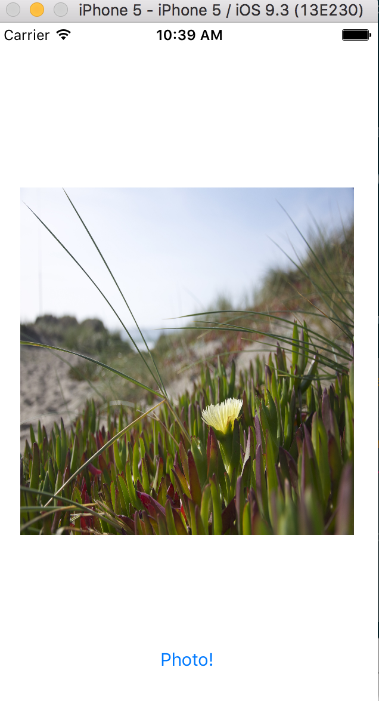

# Cámara
--------

Se verán los Tab bars y pickers. Durante la semana se verán Documentos e iCloud (requiere iPhone real), procesamiento en segundo plano (por ejemplo realizar peticiones http contra un recurso REST), dibujos con Core Graphics  con [SprikeKiT](https://developer.apple.com/library/ios/documentation/GraphicsAnimation/Conceptual/SpriteKit_PG/Introduction/Introduction.html). También se verá Persistencia básica de datos con ficheros XML y se intentará dar la parte de base de datos con consultas SQL usando [CoreData](https://developer.apple.com/library/watchos/documentation/Cocoa/Conceptual/CoreData/index.html). Por último se verá la biblioteca de la cámara (requiere iPhone) y Localización e i18n de la aplicación.

1. CameraPhoto

Crear un proyecto nuevo "CameraPhoto" con un user interface con un widget para mostrar la foto realizada y un botón que acceda al subsistema de la cámara de iOS. Conectar la imageVew y la acción del botón makePhoto en el controllador.

2.[UIImagePickerController](https://developer.apple.com/library/ios/documentation/UIKit/Reference/UIImagePickerController_Class/)

Manages system-supplied user interfaces for taking pictures and movies on supported devices, and for choosing saved images and movies for use in your app.

```
@IBAction func makePhoto(sender: AnyObject) {

    let picker = UIImagePickerController()
    picker.allowsEditing = true
    if UIImagePickerController.isSourceTypeAvailable(.Camera) {
        picker.sourceType = .Camera

    }else {
        picker.sourceType = .PhotoLibrary
        picker.modalPresentationStyle = .FullScreen
    }

    presentViewController(picker, animated: true, completion: nil)
}
```

3. UIImagePickerControllerDelegate y UINavigationControllerDelegate

El protocolo [UIImagePickerControllerDelegate](https://developer.apple.com/library/ios/documentation/UIKit/Reference/UIImagePickerControllerDelegate_Protocol/) contiene los métodos opcionales _imagePickerController_ e _imagePickerControllerDidCancel_.
```
func imagePickerController(picker: UIImagePickerController, didFinishPickingMediaWithInfo info: [String : AnyObject])

func imagePickerControllerDidCancel(picker: UIImagePickerController)
```

El protocolo UINavigationControllerDelegate permite acceder a los eleentos del explorador de imágenes de la galería.

Implementar el método cuando se seleccionar o saca una foto de UIImagePickerControllerDelegate:
```

extension ViewController: UIImagePickerControllerDelegate, UINavigationControllerDelegate {

    //didFinishPickingMediaWithInfo es un diccionario que recibe por clave la image
    // UIImagePickerControllerOriginalImage es una constante de la imagen que se puede recuperar
    func imagePickerController(picker: UIImagePickerController, didFinishPickingMediaWithInfo info: [String : AnyObject]) {
        if let image = info[UIImagePickerControllerOriginalImage] {
            imageView.image = image as? UIImage

            // descartar de memoria el controllador
            dismissViewControllerAnimated(true, completion: nil)


        }
    }
}

```


Si no se indica el picker.delegate no cargará la imagen:
```
// Añadir en la configuración del picker en makePhoto:
// requires implements UINavigationControllerDelegate and UIImagePickerControllerDelegate
picker.delegate = self
```


