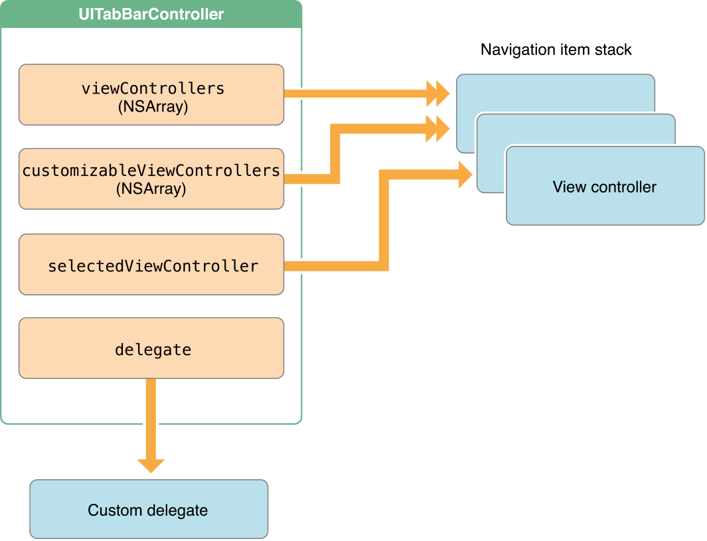

# Tab Bars y pickers
--------------------

Se verán los Tab bars y pickers. Durante la semana se verán Documentos e iCloud (requiere iPhone real), procesamiento en segundo plano (por ejemplo realizar peticiones http contra un recurso REST), dibujos con Core Graphics  con [SprikeKiT](https://developer.apple.com/library/ios/documentation/GraphicsAnimation/Conceptual/SpriteKit_PG/Introduction/Introduction.html). También se verá Persistencia básica de datos con ficheros XML y se intenterá dar la parte de base de datos con consultas SQL. Por último se verá la biblioteca de la cámara (requiere iPhone) y Localización e i18n de la aplicación.

Ver [Tab Bar Controllers](https://developer.apple.com/library/ios/documentation/WindowsViews/Conceptual/ViewControllerCatalog/Chapters/TabBarControllers.html)

Tab bar es un elemento que segmenta las funcionalidades de una aplicación. Tiene una barra inferior de hasta 5 opciones/elementos como máximo. Cada acción compuesta por un icono y un nombre descriptivo de cada una de los controladores que están detrás.



tiene un customizableViewControllers con un arras de elementos controller y un selectedViewController que te dice que controlador está seleccionado. Cuando se carga la aplicación por defecto se muestra la primera opción seleccionada (el icono de la izquierda), por tanto es recomendable dejar una buena UX en la primera pantalla para el usuario.

La quinta opción puede ser una botón de "..." que permita mostrar opciones adicionales con sus iconos en columnas.

## TVG App
-------------

1. Crear un nuevo proyecto SinglePageApplication llamado "TVG" con elementos:
- Portada
- Programación
- Deportes
- O Tempo
- Luar
- Xabarín Club
- Preferencias

2.  Crear un controllador que en la parte central ponga cada una de las opiones. Crear 5 ViewController por separada usando copy&paste cada uno con un Label y diferentes colores.

3.  Seleccionar el que queramos que sea el primero, editor -> embebed in -> Tab Bar Controller

4. Pulsar control y arrastrar desde Tab Bar Controller hacia las otros pantallas y elegir la opción "ViewControllers".
  


Se crearán seis controladores, uno para el Tab Bar Controller y los cinco de cada pantalla.
  

5. Seleccionar el "item" de cada ViewCotnroller y en el panel derecho, en inspector, ir a "Bar Item", en Title poner el nombre del título que corresponda a cada pantalla.

6. Seleccionando y arrastrando cada icono desde el Tab View Controller se puede reordenar.

7. No debe de haber muchas opciones. Cada pantalla debería tener subclasificado con un Navigation Controller que equilibre las pantallas en horizontal y vertical.


## Authors sample
-----------------

Autores, libros y portada. En lista de autores se seleccionar una celda y muestra la lista de libros. Seleccionando el libro muestra una portada. Estos libros están filtrado por autor.

El Tab tiene una lista de libros, al pulsar en libros se muestran todos los libros de la colección y cuando se accede al libro sale la portada.

En portada se muestra una imagen de portada aleatoria.

Los iconos y la lista de libros (Books.plist) están en _Resources_ tienen el nombre y @2x.png (iPhone con retina) y @3x.png (iPhone 6s).

En _AuthorsViewController_ está la tabla con autores con UITableViewController. Los mismo en BooksViewController. BookCoverViewController tiene un ViewController que muestra una imagen de la portada del libro.

1. Abrir el proyecto "TabbedLibrary" inicial. Los controlladores contienen la forma de obtener la lista de libros y autores del plist.

```
let filePath = NSBundle.mainBundle().pathForResource("Books", ofType: "plist")
```

Así como la conexión entre las pantallas.

2. Crear la pantalla visual con "Tab Bar Controller"

  - Añadir las 3 pantallas: Dos TableViewController (autores y libros) y un ViewController con un widget ImageView.
  - Conectar el outlet de imageView con la propiedad en el controlador BookCoverViewController
  - Añadir el nombre de la celda de autores y libros con el mismo utilizando en el controlador ("Cell Identifier") en las propiedades del panel derecho en inspector seleccionado las Table View Cell.
  - Crear una conexión "Show", (si solo aparece "Push", escoger esta opción) entre las pantallas: autores -> libros y libros -> portadas, seleccionar la flecha del Segue y poner el nombre utilizado en los controladores (_BooksViewController_ y _BookCoverViewController_)
  - Crear los Navigation Controller en la pantalla de autores y otro más en la de libros (cuando pulsemos en autores podremos navegar desde la lista hasta la portada, en libros hace falta otro para acceder directamente desde esta pantalla). Al crear el segundo Navigation Controller, la conexión Segue entre la pantalla de Autores con Libros quedará el Navigation entre ambos, hay que eliminar la conexión Segue y volver a asociar directamente Autores con la pantalla de libros y poner el nombre identificador.
  - Crear un Tab View Controller con las 3 pantallas conectadas. Renombrar los ítems de cada pantalla.

3. Escenarios Tab Bar en el StoryBoard


A veces el Xcode mantiene en caché información que puede hacer que no funcione. Ir a Editor -> Clean, y compilar de nuevo.
