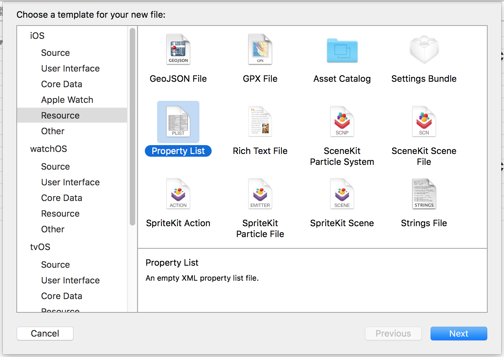
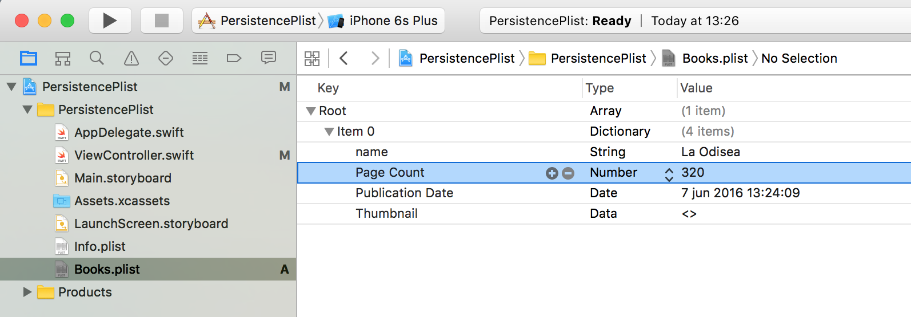

# Ficheros y Plist
------------------

- Ficheros generales

Solo se pueden acceder a ellos en la ruta _Documents_ donde el usuario puede poner datos (fotos, vídeos, música, backups). En cualquier otra ruta no se puede escritir. Hay la ruta /temp para ficheros temporales y /cache pero no son persistentes.

- PList
En los proyectos de Xcode hay siempre in fichero llamado _info.plist_. Se puede visualizar en forma de tabla con elementos de la configuration y propiedad del proyecto. En realidad es un formato XML que se puede abrir con open as source.


- Información relacionada con el usuario es [NSUserDefaults](https://developer.apple.com/library/mac/documentation/Cocoa/Reference/Foundation/Classes/NSUserDefaults_Class/)

Contiene información en XML clave-valor almacenados en un fichero del dispositivo.

- Settings: Fichero especial (XML) con datos de preferencias de la aplicación desde el punto de vista de la propia aplicación, para poder acceder a la cámara, wifi, 3g. Se encuentran fuera de la aplicación.


Por temas de seguridad iOS está basado en UNIX. Cada aplicación está enjaulada en su propio [_Sandbox_](https://developer.apple.com/app-sandboxing/), una capa, ninguna otra aplicación puede acceder a los datos de esta.

Ver guía [Secure Coding Guide](https://developer.apple.com/library/mac/documentation/Security/Conceptual/SecureCodingGuide/Introduction.html#//apple_ref/doc/uid/TP40002415)

- [CodeData](https://developer.apple.com/library/watchos/documentation/Cocoa/Conceptual/CoreData/index.html): Es el ORM de iOS que permite acceder a base de datos SQLite o un sistema de ficheros.

- CloudKit: Persistencia en el servicio cloud de Apple

## Ejemplo PlayGround _PersistenceSample_
-----------

- Escritura de ficheros:

Para acceder a los ficheros es necesario importar Foundation y usar la clase NSFileManager.
Para escribir un texto se usa el método writeToURL en una variable de tipo String.

```
import UIKit
import Foundation

let file = NSFileManager.defaultManager()

do {
    // get path
    var documents = try file.URLForDirectory(.DocumentDirectory, inDomain: .UserDomainMask, appropriateForURL: nil, create: false)

    // create file data
    var url = NSURL(string: "datos.txt", relativeToURL: documents)
    print(url)

    // create content
    let datos = "La temperatura obtenida del API de Yahoo! es de 70 grados Farenheit\n"
    if let url = url {
        // escribir los datos en el documento datos.txt
        // la codificación debe ser UTF8
        try datos.writeToURL(url, atomically: true, encoding: NSUTF8StringEncoding)
    }

}catch{
    print ("Error \(error)")
}
```

Ver el resultado:
```
$ cat /var/folders/76/mcbzr1pj77s_zlgh3ft7ffq00000gq/T/com.apple.dt.Xcode.pg/containers/com.apple.dt.playground.stub.iOS_Simulator.PersistenceSample-02B7A59C-0484-4F55-8D52-98FF3FB177A6/Documents/datos.txt

La temperatura obtenida del API de Yahoo! es de 70 grados Farenheit

```


- Lectura de fichero:

Para leer se utiliza el constuctor de String con el parámetro contentsOrUrl
```
// Lectura
do {
    var documents = try file.URLForDirectory(.DocumentDirectory, inDomain: .UserDomainMask, appropriateForURL: nil, create: false)

    var url = NSURL(string: "datos.txt", relativeToURL: documents)

    if let url = url {

        var text = try String(contentsOfURL: url)
        print("\n\tValor leído \(text)\n")
    }
}catch{
    print ("Error \(error)")
}
```


## Guardado y recuperación de contenido binario
-----------

Ver [Working With Binary Data](https://developer.apple.com/library/ios/documentation/Cocoa/Conceptual/BinaryData/Tasks/WorkingBinaryData.html)
Arrastrar una imagen al panel izquierdo del PlayGround, en la ruta _Resources_.

- Guardar binario

Para almacenar el binario se utiliza el método writeToURL del objeto UIImagePNGRepresentation

```
//: Playground - noun: a place where people can play

import UIKit

import Foundation
let file = NSFileManager.defaultManager()


if let myImage = UIImage(named: "earth.png"){

    let imageData = UIImagePNGRepresentation(myImage)


    do {
        var documents = try file.URLForDirectory(.DocumentDirectory, inDomain: .UserDomainMask, appropriateForURL: nil, create: false)

        var url = NSURL(string: "calendario.bin", relativeToURL: documents)!

        try imageData?.writeToURL(url, atomically: true)


    }catch{
        print("ERROR \(error)")
    }
}
```

- Leer binario

Para leer de binario se usa el constructor de NSData con el parámetro contentsOfUrl. Devolverá un UIImagePNGRepresentation que hay que convertir a UImage.

```
do {
    var documents = try file.URLForDirectory(.DocumentDirectory, inDomain: .UserDomainMask, appropriateForURL: nil, create: false)

    var url = NSURL(string: "calendario.bin", relativeToURL: documents)

    if let imageData = NSData(contentsOfURL: url!){
        let myImage = UIImage(data: imageData)

        myImage!
    }

}catch{
    print("ERROR \(error)")
}
```


## Persistencia Properties List
-------------------------------

Crear un proyecto "PersistenciaPList"

1. Crear un PList nuevo _Books_ pulsando "Control" clic sobre el proyecto -> New File -> iOS -> Resources -> "Property List"


2. Ir a Open as Property List. Añadir una entrada en la lista. La clave "Root" está por defecto como tipo Diccionario, cambiar a tipo _Array_.

3. Añadir un nuevo ítem pulsando en el icono más

El ítem 0 de tipo _Dictionary_. Seleccionar el ítem y pulsar en el más. Para ello es importante pulsar sobre el icono flecha del "ítem 0" pulsarlo y tiene que apuntar hacia abajo. Si la flecha apunta a la derecha, el botón más creará una nueva fila "Ítem 1".

Crear datos en ítem0 con las claves:
  - name de tipo String
  - "Page Count": Number
  - Publication Date: Date
  - Thumbnai: Data

Reordenar los elementos arrastrando.


4. Cargar en el controlador

Con [NSBundle](https://developer.apple.com/library/ios/documentation/Cocoa/Reference/Foundation/Classes/NSBundle_Class/) se cargan los recursos PList del proyecto.

```
        // Manipulación de PList
        let plistURL = NSBundle.mainBundle().URLForResource("Books", withExtension: "plist")

        let fileManager = NSFileManager.defaultManager()
```
