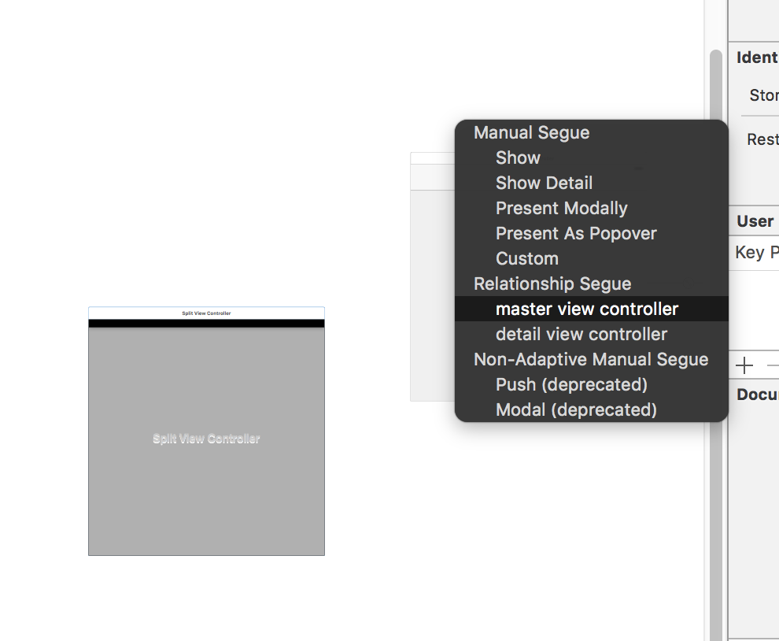
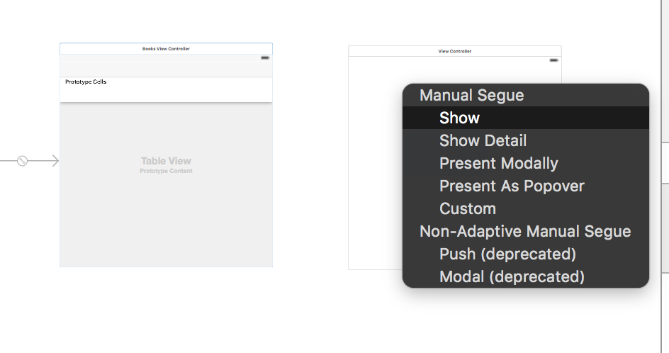
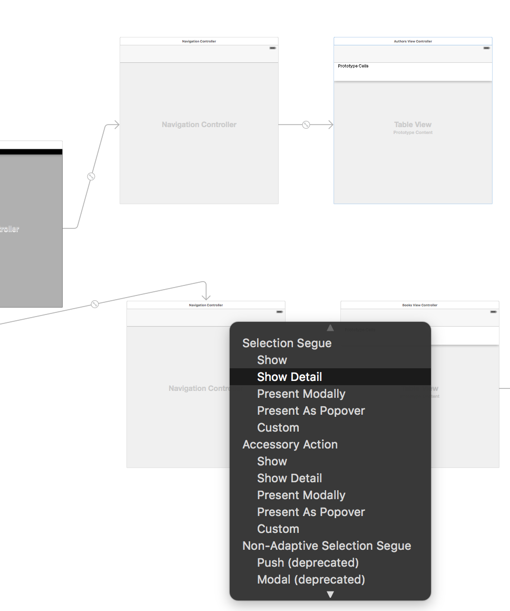
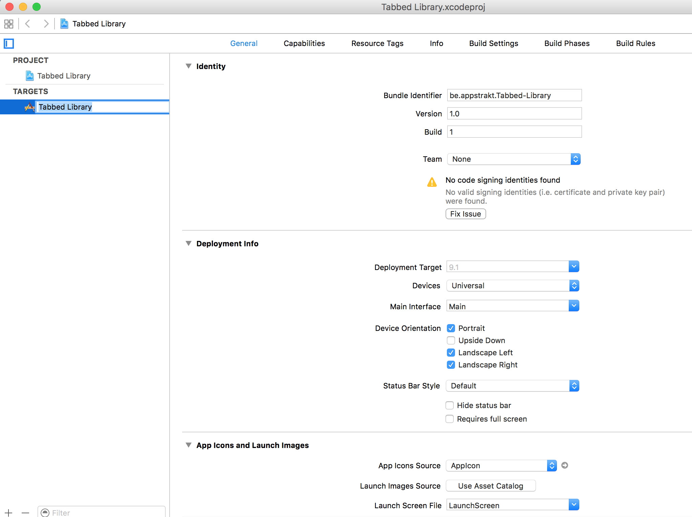
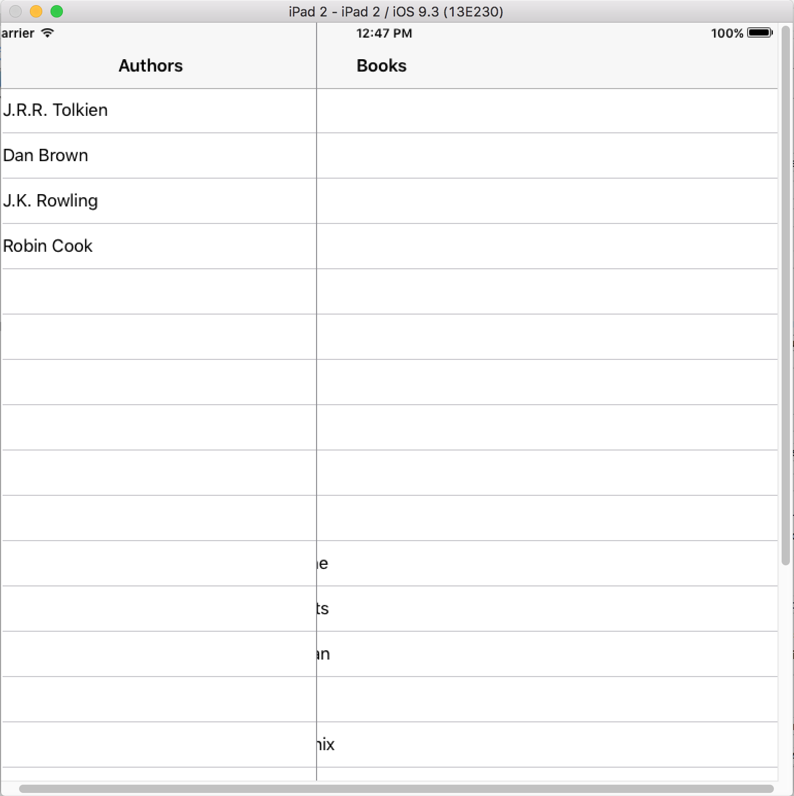
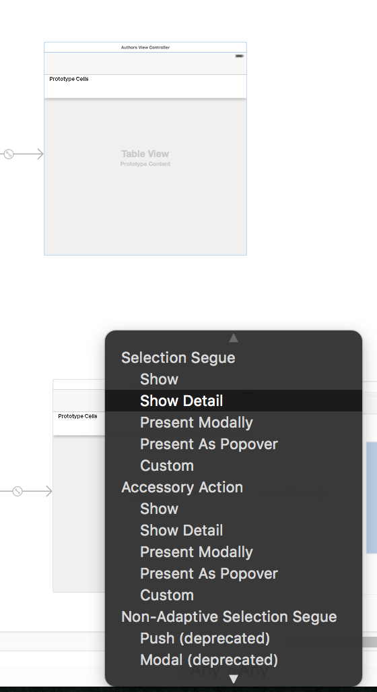

# Split View Controller
------------------------

https://developer.apple.com/library/ios/documentation/UIKit/Reference/UISplitViewController_class/
Divide la pantalla en dos zonas.


Orientaciones Landscape (horizontal) y Portrait cuando está en vertical.

Por código se puede saber si es un iPhone o un iPad. Normalmente es del tipo universal. Ese mismo código vale para las dos. A nivel de StoryBoard se puede tener solo un storyboad

- LandScape
En la pantalla landScape aparece una zona izquierda como menú llamada _master_ y la pantalla de información llamada _detail_.


- Portrait

Lo primero que se ve en la pantalla vertical es el Detail. Este tipo de disposiciones se puede hacer que haya un Split View Controller que si le haces swipe interaccione y muestre el panel _master_ oculto.

Para ello usar [UIDevice](https://developer.apple.com/library/ios/documentation/UIKit/Reference/UIDevice_Class/) y preguntar si es un iPad o un iPhone.

Un protocolo con delegados propios dan la posibilidad de detectar los eventos sobre estos elementos.

## Ejemplo Autores y libros

Abrir el proyecto samples/TabbedLibraryProfesor. Es una copia de TabbedLibrary pero que está vacío. Abrir el Main.StoryBoard y comprobar que esté vacío.

Primero en la parte _master_ hacer que aparezcan los autores y en la _detail_ los libros.

1. Crear el SplitViewController sobre el lienzo
2. Eliminar el NavigationView Controller y TableView
3. Crear un Table View Controller y en Inspector asociar al controllador AuthorsViewController
4. Seleccionar la pantalla TableViewController y añadirle un NavigationController desde editor -> embebed in -> NavigationController

Esta es la parte _master_

5. Seleccionar el SplitViewController pulsando Control arrastrar la flecha hasta TableViewController. Establecer como _MasterViewController_


6. Crear Table View para libros y repetir el proceso que en los pasos 3 y 4 asignado la clase BooskViewController.

7.  Seleccionar el SplitViewController pulsando Control arrastrar la flecha hasta TableViewController de libros.  Establecer como _DetailViewController_.


8. Crear el View controller para la portada del libro. Asociar un Segue entre la tableview de libros con la view controller de tipo "Show".


9. Marcar el SplitView Controller como "Is Initial View Controller"

10. Lanzar la App, pulsando "Alt" se puede hacer _swipe_ sobre la Table View para mostar la pantalla _master_.

11. Desde Prototype Cell de Autores lanzar una flecha al NavigationController de libros (sobre el NavigationController) y seleccionar _Show Detail_.


12. Ir al controllador de _AppDelegate.swift_

Es una controllador importante donde se podrá comprobar el tipo del dispositivo. En el controllador ViewController tenemos el control de los ciclos de vida de una vista: _viewDidLoad_ se ejecuta cuando se lanza la App, _viewWillApper_ es cuando se muestra al usuario, _viewDidUnload_ cuando se ha descargado la vista.

La aplicación tiene un ciclo de vida y los estados por los que pasa. Aquí es donde se interactúa con estos ciclos de vida de la App controlando el ciclo de vida de la aplicación:

- Cuando la App entra en modo segundo plano _background_:
```
applicationDidEnterBackground(application: UIApplication)
```

- Cuando vuelve al primer plano
```
applicationWillEnterForeground
```

La propiedad _window_ es la ventana principal. También para notificaciones se incorpora aquí.

13. Añadir control de la ventana

```
class AppDelegate: UIResponder, UIApplicationDelegate, UISplitViewControllerDelegate {
  ...
      func application(application: UIApplication, didFinishLaunchingWithOptions launchOptions: [NSObject: AnyObject]?) -> Bool {
          // Override point for customization after application launch.

          let splitViewController = window!.rootViewController as! UISplitViewController

          // la clase debe implementar el UISplitViewControllerDelegate
          splitViewController.delegate = self

          // si es un iPad mostar en modo completo
          if UIDevice.currentDevice().userInterfaceIdiom == .Pad {
              splitViewController.preferredDisplayMode = .PrimaryOverlay
          }else {

          }

          return true
      }
```

Ir a propiedades del proyecto. Seleccionar el proyecto con doble clic. Ir a Targets y en "Deployment Info" seleccionar en "Devices" el tipo universal.


Seleccionar tipo iPad2 y lanzar la aplicación.


14. Si se quiere cambiar el segue entre navigationView eliminar el Segue entre Autores y Books y crear uno nuevo con la opción "Show Detail" directamtente en la vista de libros, no en el NavigationController.

