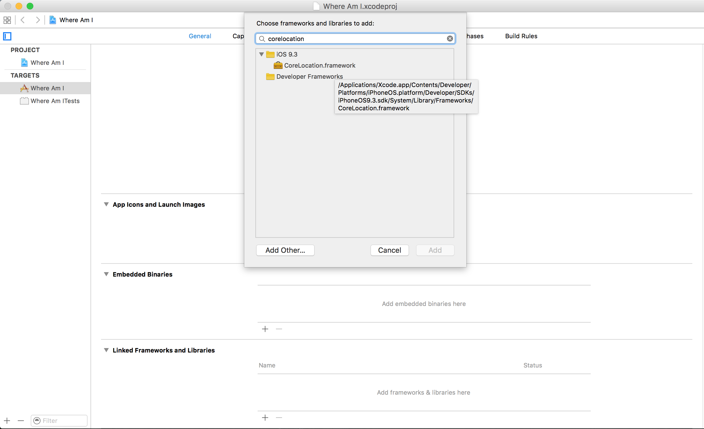
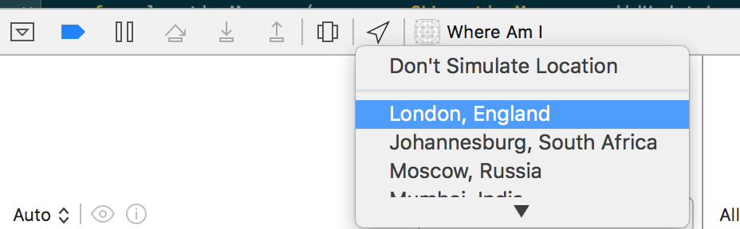
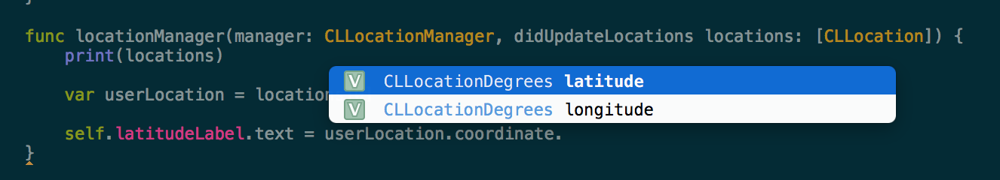
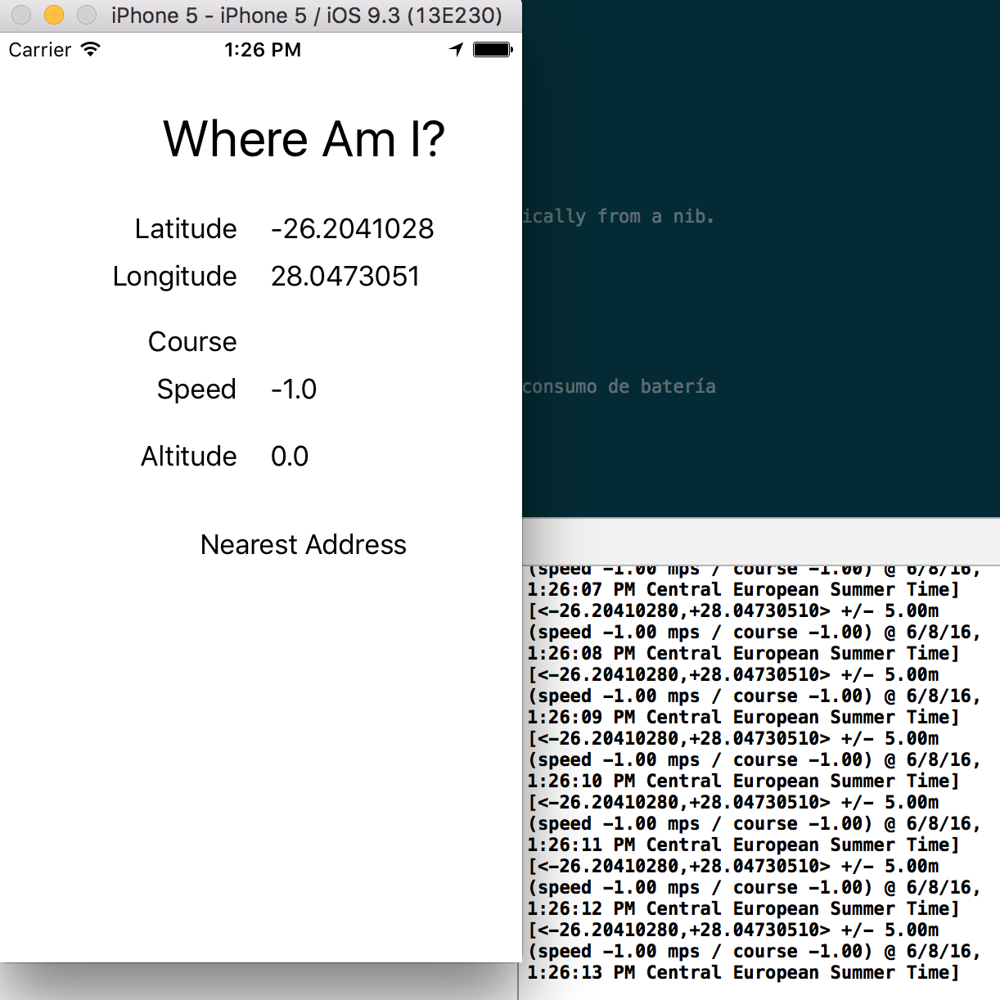

# Geolocalización
-----------------

Cómo integrar mapas en la aplicación y cómo trabajar con el GPS además de simularlo.

Abrir el proyecto de _samples/Where Am I_. Tiene una vista con los elementos. Frameworks que se pueden usar a parte de los que vienen por defecto. [_CoreLocation_](https://developer.apple.com/library/ios/documentation/CoreLocation/Reference/CoreLocation_Framework/) es un framework para iOS que permite obtener datos de Geolocalización.


1. Ir a la configuración del proyecto y en Target, en la parte inferior, en "Linked Frameworks and Libraries" pulsar en el botón más. Se abrirá un buscador con una lista de diferentes frameworks. Seleccionar CoreLocation.framework y pulsar en Add.



2. Declarar propiedad CLLocationManager
```
var manager = CLLocationManager()
```

3. Configurar manager

```
override func viewDidLoad() {
        super.viewDidLoad()

        // Decirle al delegado que es la propcia clase. Require el paso 4.
        manager.delegate = self

        // detallar la precisión. Cuanto más precisión, mayor consumo de batería
        manager.desiredAccuracy = kCLLocationAccuracyBest

        manager.requestWhenInUseAuthorization()

        // Empieza a escuchar
        manager.startUpdatingLocation()
    }
```

4. Recibir los datos que escucha con un Delegate

Es neceario Implementar el delegado de CLLocationManager

```
class ViewController: UIViewController, CLLocationManagerDelegate{
```

5. Implementar el método _didUpdateLocations_ que recuperará datos geográficos.

```
func locationManager(manager: CLLocationManager, didUpdateLocations locations: [CLLocation]) {
        print(locations)
}
```

Ejecutar la aplicación.

En la ejecución pulsar en el icono de la flecha llamado "Simulate location" del panel inferior.



6. Añadir los valores en los widgets label

```

    func locationManager(manager: CLLocationManager, didUpdateLocations locations: [CLLocation]) {
        print(locations)

        var userLocation = locations[0]

        self.latitudeLabel.text = "\(userLocation.coordinate.latitude)"
        self.longitudeLabel.text = "\(userLocation.coordinate.longitude)"

        self.speedLabel.text = "\(userLocation.speed)"

        self.altitudeLabel.text = "\(userLocation.altitude)"
    }
```


7. Ejecutar el simulador y poner la información


