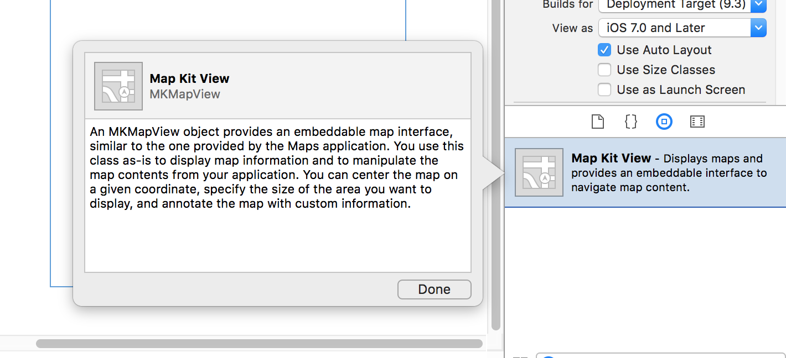
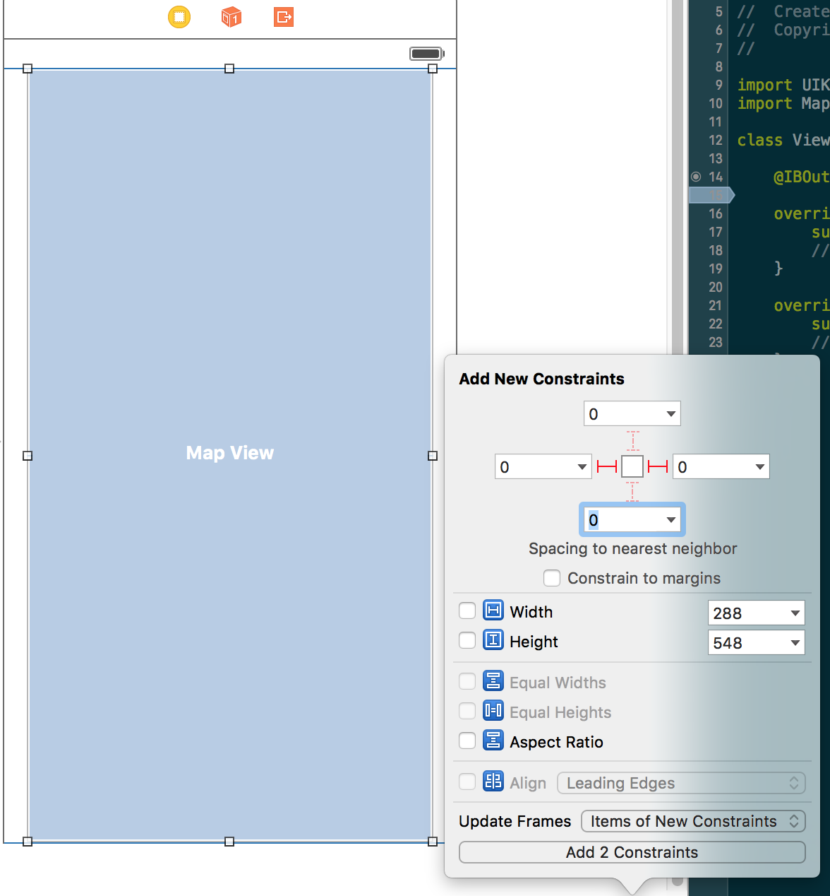
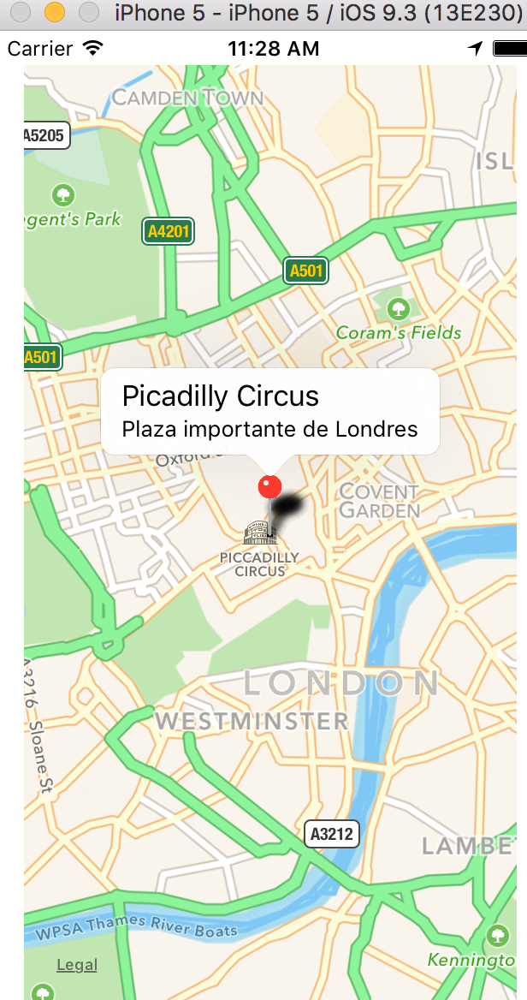
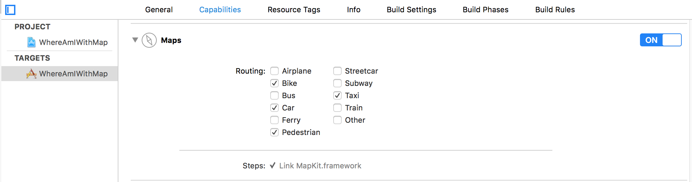
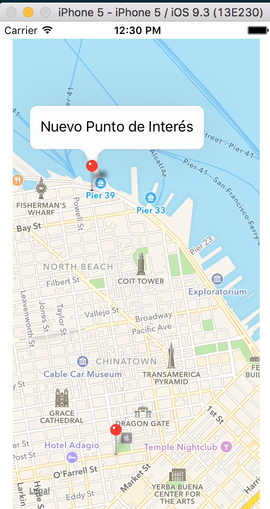

# Geolocalización (continuación)
--------------------------------

Continuaremos con el estudio del framework CoreLocation y se verán mapas. A continuación se volverá a persistencia con iCloud para almecenar fuera del dispositivo y sincronizar dispositivos diferentes. Se usará el framework [CloudKit](https://developer.apple.com/library/ios/documentation/DataManagement/Conceptual/CloutKitWebServicesReference/Introduction/Introduction.html).


## [Geocoding](https://en.wikipedia.org/wiki/Geocoding)

Obtener a partir de una dirección postal la latitud y longitud. Ver ejemplo "Address resolution" de [gmap3](http://gmap3.net/api-address.html).

Abrir el proyecto "Where Am I" y en ViewController ir al método locationManager:

[CLGeocoder](https://developer.apple.com/library/ios/documentation/CoreLocation/Reference/CLGeocoder_class/): recive como parámetros el userLocation y un método de callback de tipo _clousure_

```
  let userLocation = locations[0]
  CLGeocoder().reverseGeocodeLocation(userLocation) {
      (placemarks, error) -> Void in
      if error != nil {
          print("Error en el proceso de geocoding")
      }else {
          if let placemark = placemarks?[0] {
              var postalDirection = ""
              if placemark.subThoroughfare != nil {
                  postalDirection = placemark.subThoroughfare!
              }

              self.addressLabel.text = "\(postalDirection)\n\(placemark.subLocality)\n\(placemark.subAdministrativeArea)\n\(placemark.country)"
          }
      }
  }
```


## Mapas

Crear un proyecto "WhereAmIWithMap" nuevo que incluya el framework de CoreLocation y que extienda los mapas.

1. Ir a las propiedades del proyecto y en la parte de Frameworks añadir:
  - CoreLocation.framework
  - MapKit.framework

2. Añadir a las vista del ViewController por defecto en Main.StoryBoard un widget de tipo "Map Kit View".


3. En el icono de la vista "Pin" seleccionar márgenes a 0 y añadir la segunda opción "Items of new Constraints" del desplegable "Update Frames" y añadir "Add Constraints".



4. Conectar el outlet de MapKitView como propiedad en el controllador.

NOTA: Requiere importar MapKit en el controllador
```
import MapKit
...
@IBOutlet weak var mapKitView: MKMapView!

```

5. Importar CoreLocation y configurar el manager

Añadir el delegado de CLLocationManager y configurar manager de LocationManager

```
import CoreLocation

class ViewController: UIViewController, CLLocationManagerDelegate, MKMapViewDelegate{

    @IBOutlet weak var mapKitView: MKMapView!

    var manager = CLLocationManager()

    override func viewDidLoad() {
        super.viewDidLoad()

        // Decirle al delegado que es la clase
        manager.delegate = self

        // detallar la precisión. Cuanto más precisión, mayor consumo de batería
        manager.desiredAccuracy = kCLLocationAccuracyBest

        manager.requestWhenInUseAuthorization()

        // Empieza a escuchar
        manager.startUpdatingLocation()
    }
}
```

6. Delegar de MKMapViewDelegate

```
class ViewController: UIViewController, CLLocationManagerDelegate, MKMapViewDelegate{
```

7. Crear el método de _didUpdateLocations_ de _CLLocationManagerDelegate_


```
func locationManager(manager: CLLocationManager, didUpdateLocations locations: [CLLocation]) {

        let userLocation: CLLocation = locations[0]

        let latitude : CLLocationDegrees = userLocation.coordinate.latitude
        let longitude : CLLocationDegrees = userLocation.coordinate.longitude

        // TODO interactuar con el mapa y lo centre. Ver punto 8
        // Elementos del Mapa:
        // delta (lat, long)
        // span
        // region (zoom del map en base a userLocation, delta y span)
    }
```

8. Añadir la longitud y latitud del usuario centrada en el map:

```
// delta (lat, long)
let latDelta : CLLocationDegrees = 0.05
let lonDelta : CLLocationDegrees = 0.05

// span
let span: MKCoordinateSpan = MKCoordinateSpan(latitudeDelta: latDelta, longitudeDelta: lonDelta)

let location : CLLocationCoordinate2D = CLLocationCoordinate2D(latitude: latitude, longitude: longitude)

// region
let region : MKCoordinateRegion = MKCoordinateRegion(center: location, span: span)

// settear de forma animada
mapKitView.setRegion(region, animated: true)
```

Ejecutar la aplicación y probar a cambiar la ubicación. Se debería de actualizar y centrar el mapa en la nueva ubicación. ¿Por qué no funciona? No se ejecuta el método _didUpdateLocations_.

9. Requiere añadir claves de permisos de acceso en Info.plist.

Pulsar en "Information Property List" en el botón más y crear la propiead _NSLocationWhenInUseUsageDescription_.

En el valor hay que informar al usuario de porque necesitamos este permiso, por ejemplo "Necesario para ubicar al usuario mientras la App está en uso"

Opcionalmente se puede añadir la entrada _NSLocationAlwaysUsageDescription_ con un mensaje para informar al usuario de que será utilizado en segundo plano, por ejemplo  "Necesario para ubicar al usuario en segundo plano".

Ver punto 3 de http://matthewfecher.com/app-developement/getting-gps-location-using-core-location-in-ios-8-vs-ios-7/

10. Introducir una chincheta (market) en el mapa

El objeto es [MKPointAnnotation](https://developer.apple.com/library/ios/documentation/MapKit/Reference/MKPointAnnotation_class/)

Esta clase tiene una propiedad coordinate donde se le indica las coordenadas.

```
let annotation = MKPointAnnotation()
annotation.coordinate.latitude = latitude
annotation.coordinate.longitude = longitude

// info adicional al usuario
annotation.title = "Picadilly Circus"
annotation.subtitle = "Plaza importante de Londres"

mapKitView.addAnnotation(annotation)
```



## Rutas

Para añadir rutas en el mapa hay que ir a la configuración del proyecto, en Capabilities -> Maps y añadir las rutas posibles: bus, coche, bicicleta, taxi, andando, etc



Ver ejemplo: https://www.raywenderlich.com/73984/make-app-like-runkeeper-part-1

## Gesto LongPress

Determinar la posición y actualizar el puntero manteniendo pulsado sobre el mapa.

1. Habilitar y crear el recognizer en _viewDidLoad_

```
// habilitar interacción
mapKitView.userInteractionEnabled = true

// crear el gesto de longPress
let longPress = UILongPressGestureRecognizer(target: self, action: #selector(ViewController.longPressAction(_:)))

// asignar duración mínima de dos segundos
longPress.minimumPressDuration = 2
```

Es importante colocar la chincheta en el mapa sin esperar a que se ejecute el método del delegado, no tiene porque ejecutarse.

2. Asociar el recognizer a la vista
```
// asociar a la vista
mapKitView.gestureRecognizers = [longPress]
```

3. Transformar el mapa de una coordenada de pantalla a una real en el mapa

```
// Longpress gesture update map
func longPressAction(recognizer: UILongPressGestureRecognizer) {
    let touchPoint = recognizer.locationInView(self.mapKitView)

    let newCoordinate: CLLocationCoordinate2D = self.mapKitView.convertPoint(touchPoint, toCoordinateFromView: self.mapKitView)

    let annotation = MKPointAnnotation()
    annotation.coordinate = newCoordinate
    annotation.title = "Nuevo Punto de Interés"

    mapKitView.addAnnotation(annotation)
}
```


