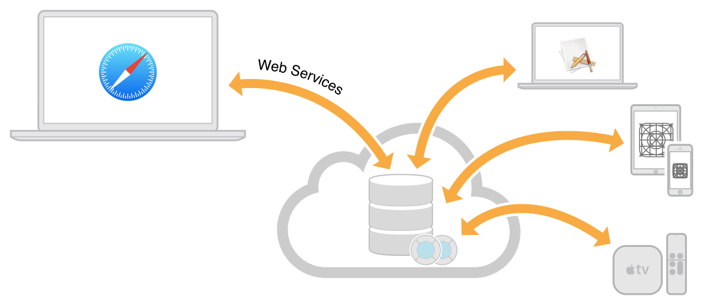

# CloudKit
----------

El framework [CloudKit](https://developer.apple.com/library/ios/documentation/DataManagement/Conceptual/CloutKitWebServicesReference/Introduction/Introduction.html) permite persistir datos en la cuenta del usuario y sincronizar sus dispositivos.



Cada dispositivo tiene los siguents modos de persistir:
- Documents
- Clave/valor
- CoudKit
  - Registros
  - Assets

iCloud tiene una parte pública que puede ser leída desde cualquier aplicación y hay una parte privada que en este caso Apple provee de 5 Gb gratuítos en la cuenta del usuario.

Para que una App utilice CloidKit y tenga permisos hay que incluir el framework y modificar el Info.plist del proyecto.

Como Rol de adimistrador se puede acceder al CloudKit Store donde se pueden añadir nuevos esquemas de datos con los que la aplicación puede interactuar. Al final se despliega el contenedor de CloudKit para desplegar la aplicación a la par. Para esto último es necesario poseer una cuenta de desarrollador Apple.

## Publish & Subscriber
-----------------------

iCloud notifica a la aplicación mediante un patrón [Publish-Subcribe](https://en.wikipedia.org/wiki/Publish%E2%80%93subscribe_pattern). El controllador se subscribe a las notificaciones de iCloud y cuando llega una notificación.

Las "Push Notificaciones" se habilitan en la pestaña Capabilities y requieren de una cuenta y certificado.

En Background Modes se pueden añadir la posibilidad de ejecutar en segundo plano "Remonte notifications" que no son de tipo Push.

## Crear proyecto

Abrir el proyecto "samples/iOS-CloudKit" de nombre "CloudBug".

1. Ir a las propiedades del proyecto, en Targets CloudBug, pestaña Capabilities y cancelar cualquier característica.

TODO 2. Vincular cuenta de ID de Apple...

3. Ir al controllador _MasterViewController_ y añadir el notificador center en el método _viewDidLoad_

Del que recibe la información al que tiene que procesar tiene que haber una comunicación. El notificador avisa a que han llegado los datos con _bugPosted_. Hay que subscribir el _MasterViewController_ a la escucha de notificaciones _bugPosted_
```
self.navigationItem.leftBarButtonItem = self.editButtonItem()

//TODO sistema de notificaciones (bugPosted/receiveBug)
// El selector es el método que se ejecuta al recibir
// name el nombre de la notificación de iCloud
NSNotificationCenter.defaultCenter().addObserver(self, selector: "receiveBug", name: "bugPosted", object: nil)
```

4. Crear método del proceso tras recibir Info en el mismo controllador

```
func receiveBug(sender: NSNotification) {
  let info = sender.userInfo!
  // recibes un diccionar de tipo AnyObject que hay que castear a Bug
  let bug = info["bug"] as! Bug

  // se añade a un array de datos para la vista
  objects.append(bug)
}
```

5. Desde el controlador _PostViewController_ se envía la notificación, el dato de info["bug"]

Indicar el nombre del método que recibirá la notificacion.

```
// bugPosted es el nombre de la notificación que se recibe en MasterViewController
NSNotificationCenter.defaultCenter().postNotificationName("bugPosted", object: self, userInfo: ["bug": bug])
```
La relación es OneToMany, un publicador y muchos subscriptores.

Si se quiere recibir noticiaciones externar AppleNS o AppleNotificationServer

En _samples/iOS-CloudKit_PART_1.zip_ están realiados los primeros pasos de este ejericio. Se continuará con CloudKit en la clase15, ver clase15/clase15_1_CloudKit_continuacion.md
