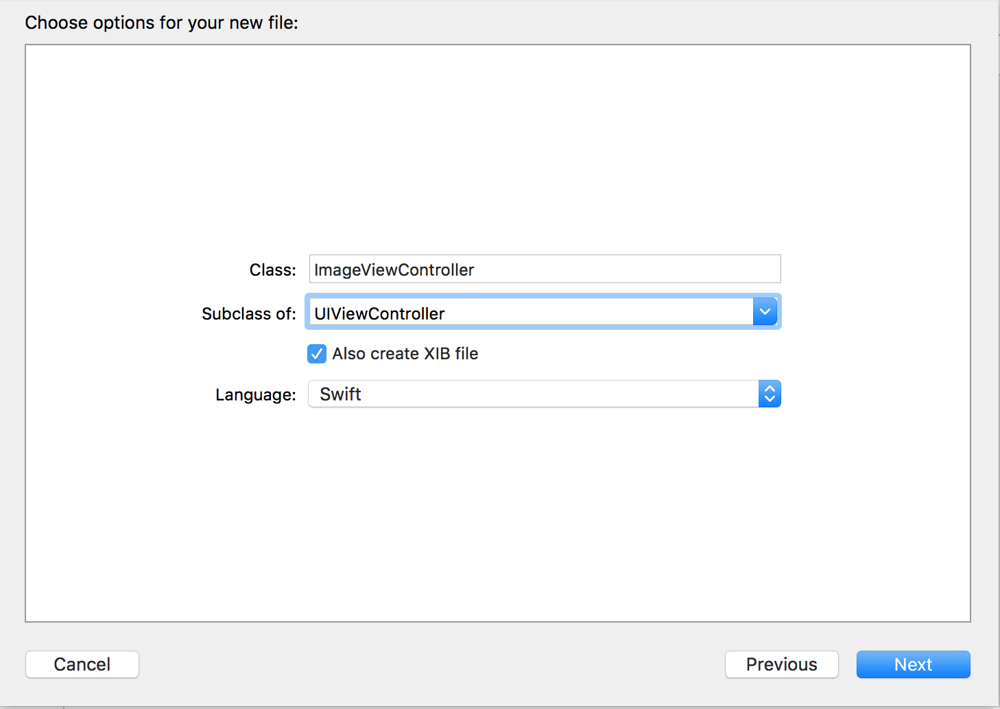
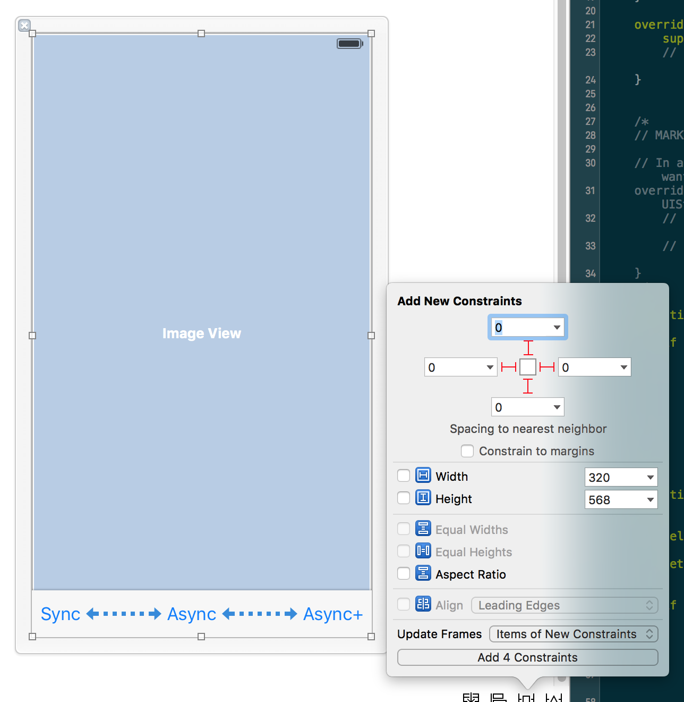
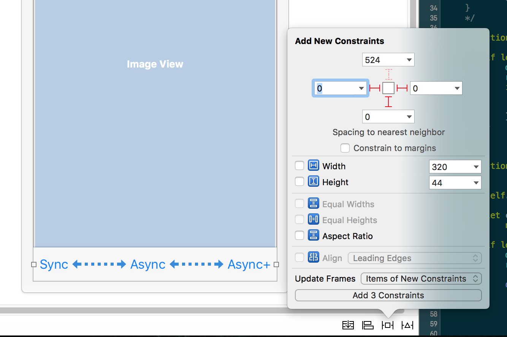
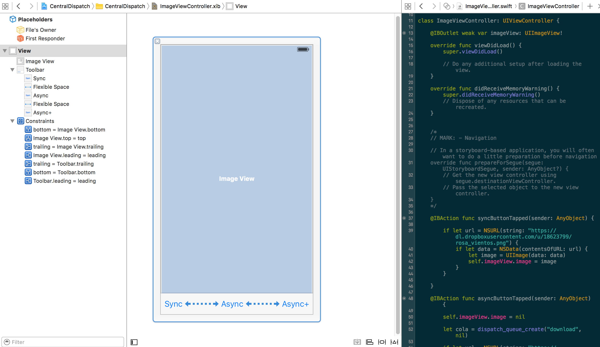

# Threads

En iOS CentralDispatch o CGD son threads.

1. Crear un proyecto "CentralDispatch",
  - eliminar el Main.StoryBoard y el ViewController.
  - en propiedades del proyecto, en "Main Interface" dejarlo en blanco.


2. En el AppDelegate, en el método _didFinishLaunchingWithOptions_

Crea un nuevo controllador llamada ImageViewController en new File -> iOS -> Cocoa Touch Class.
Marcar la opción "Also Create XIB file", de tipo UIViewController.



3. Seleccionar el fichero ImageViewController.xib, en la vista añadir un widget ImageView.

a mano hacer que ocupe toda la vista.
Pulsar en "Pin" y poner márgenes 0 (pulsar los segmentos en rojo). Dejar el resto desmarcado, seleciconar "Item of view constraints" y pulsar en add Contraints.


4. Añadir una Toolbar en la parte inferior

renombrar la etiqueta laben que tiene "Sync"

5. Añadir dos Bar Button Item sobre el Toobar

renombrar como "Async" y "Async+"

6. con "Flexible Space Bar Button Item" añadir entre botos para separarlos

Seleccionando la ToolBar, pulsar en "Pin" y poner márgenes izquierda, inferior y derecha a 0 (pulsar los segmentos en rojo). Dejar el resto desmarcado, seleciconar "Item of view constraints" y pulsar en add Contraints.




7. Crear un Outlet de ImageView y tres acciones de los botones.

es recomendable hacerlo desde el árbol de jerarquía ya que los botones están superpuestos por el Toolbar.

8. Ir a la clase _AppDelegate_

Ajustar el tamaño a la ventana en _didFinish_LaunchWithOptions_

```
// bounds son las dimensiones
window  = UIWindow(frame: UIScreen.mainScreen().bounds)

// hacer visible
window?.makeKeyAndVisible()

// indicar que el controlador ImageView es la vista principal
let imageViewController = ImageViewController()

window?.rootViewController = imageViewController
```

9. Añadir la funcionalidad "Sync"

```

@IBAction func syncButtonTapped(sender: AnyObject) {

  if let url = NSURL(string: "https://dl.dropboxusercontent.com/u/18623799/rosa_vientos.png") {
         if let data = NSData(contentsOfURL: url) {
             let image = UIImage(data: data)
             self.imageView.image = image
         }
  }
}
```

10. Añadir la funcionalidad "Async"

Dado que la imagen se descarga desde un recurso web, es buena práctica carga la imagen desde un thread que permita realizar la carga de forma asíncrona.

```
@IBAction func asyncButtonTapped(sender: AnyObject) {

    self.imageView.image = nil

    let cola = dispatch_queue_create("download", nil)

    if let url = NSURL(string: "https://dl.dropboxusercontent.com/u/18623799/rosa_vientos.png") {

        dispatch_async(cola) {
            if let data = NSData(contentsOfURL: url) {
                let image = UIImage(data: data)

                dispatch_async(dispatch_get_main_queue()){
                    self.imageView.image = image
                }
            }

        }
    }
}
```

11. añadir método withRosaVientos(completitionClosuere: (image) -> ())

Pero como un alias:

```
typealias ImageClosure = (image: UIImage) -> ()
  func withRosaViensto(completitionClosure : ImageClosure){

  }

```

Se obtiene una cola de la constante predefinida llamada QOS_CLASS_USER_INTERACTIVE
```
typealias ImageClosure = (image: UIImage) -> ()
func withRosaVientos(completitionClosure : ImageClosure){
    self.imageView.image = nil

        // cola get_global_queue tiene máxima prioridad.
        dispatch_async(dispatch_get_global_queue(QOS_CLASS_USER_INTERACTIVE, 0)) {

            if let url = NSURL(string: "https://dl.dropboxusercontent.com/u/18623799/rosa_vientos.png") {
                if let data = NSData(contentsOfURL: url) {
                    let image = UIImage(data: data)

                    dispatch_async(dispatch_get_main_queue()){
                        completitionClosure(image: image!)
                    }
                }
            }
        }
}
```

12. Implementar el método _asyncPlusButtonTapped_

```
@IBAction func asyncPlusButtonTapped(sender: AnyObject) {

      self.imageView.image = nil

      // función con un parámetro closure
      withRosaVientos {(image: UIImage) -> Void in
          self.imageView.image = image
      }

  }
```
