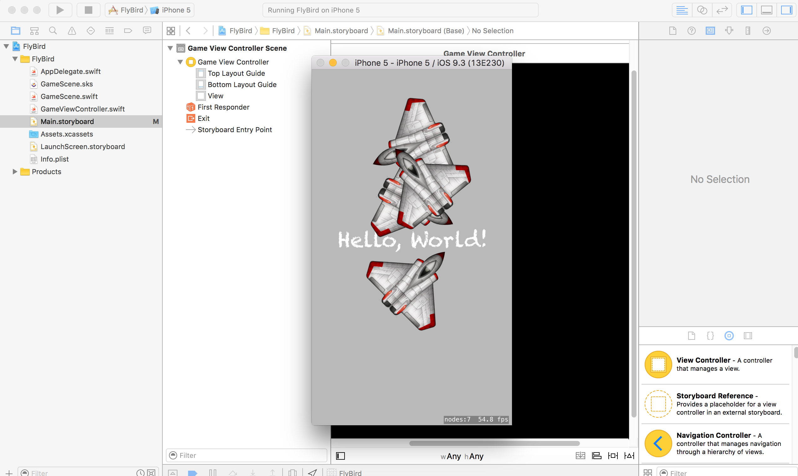
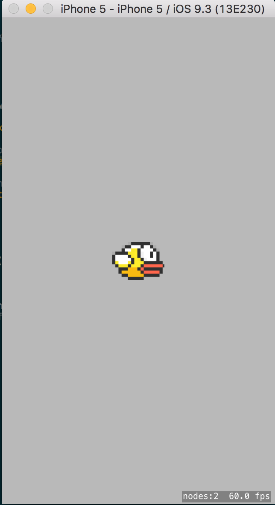
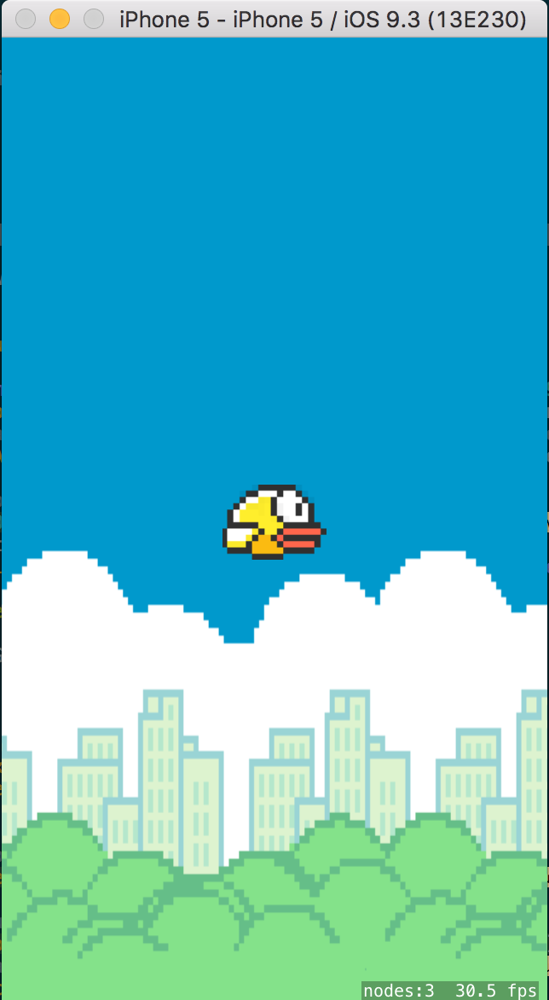

# SpriteKit

Framework de Juego

mostrar un juego con un pájaro que va avanzando en

Crear nuevo proyecto y seleccionar en iOS -> Application -> Game y llamarlo "FlyBird" seleccionando el framework en "Game Technology" SpriteKit.


Ir a la clase _GameScene_. El método _didMoveToView_ es el que se ejecuta al cargar. Toda la escena es un nodo llamda _SKLabelNode_.

```
let myLabel = SKLabelNode(fontNamed:"Chalkduster")
myLabel.text = "Hello, World!"
myLabel.fontSize = 45
myLabel.position = CGPoint(x:CGRectGetMidX(self.frame), y:CGRectGetMidY(self.frame))
```

Para mostrar en pantalla hay que añadirlo a la Escena con addChild:
```
self.addChild(myLabel)
```

Para añadir en escena se le aplica un tipo de Rotación:
```
sprite.runAction(SKAction.repeatActionForever(action))

// añadir el sprite a escena
self.addChild(sprite)
```

1. Eliminar el contenido de los métodos en GameScene

2. Descomprimir los recursos de assets/recursos_spritekit.zip y añadir las imágenes al proyecto

3. Añadir el Sprite de Flappy a escena en _didMoveToView_

```
// cargar la textura
       let birdTexture = SKTexture(imageNamed: "flappy1.png")

       // crear nodo pájaro con la textura cargada
       var bird = SKSpriteNode(texture: birdTexture)

       // colocar al pájaro en una posición centrada de la pantalla
       bird.position = CGPoint(x: CGRectGetMidX(self.frame), y: CGRectGetMidY(self.frame))

       // añadir el pájaro en escena
       self.addChild(bird)
```



4. Hacer que mueva las alas

Para ellos hay que cargar el Sprite con varias imágenes que cambien en el tiempo y simulen que está aleteando las alas. Para ello añadir el sprite _bird_ la segunda imagen.

```
let birdTexture2 = SKTexture(imageNamed: "flappy2.png")

// animar las dos texturas en 1 décima de segunda
var animation = SKAction.animateWithTextures([birdTexture, birdTexture2], timePerFrame: 0.1)
// indicar que es una animación contínua,
let makeBirdFlap = SKAction.repeatActionForever(animation)

// indicar al nodo bird que ejecute la acción indicada
bird.runAction(makeBirdFlap)
```

5. Cargar el fondo con movimiento

- Añadir la propiedad bg de tipo SpriteNode
```
var bg = SKSpriteNode()
```

- Cargar el fondo en _didMoveToView_
```
// Cargar el fondo
let bgTexture = SKTexture(imageNamed: "bg.png")

let moveBg = SKAction.moveByX(-bgTexture.size().width, y: 0, duration: 9)
let replaceBg = SKAction.moveByX(bgTexture.size().height, y: 0, duration: 0)
// para añadir varias acciones sobre repeatAction usar SKAction.sequence
let moveBGForever = SKAction.repeatActionForever(SKAction.sequence([moveBg, replaceBg]))

// Crear sprites del fondo
for var i : CGFloat = 0; i < 3; i++ {
   bg = SKSpriteNode(texture: bgTexture)
   bg.position = CGPoint(x: (bgTexture.size().width/2) + bgTexture.size().width * i,
                         y: CGRectGetMidY(self.frame))
   bg.size.height = self.frame.height
   bg.zPosition = -5
   bg.runAction(moveBGForever)
   self.addChild(bg)
}
```



Ejemplo de https://try.crashlytics.com/
