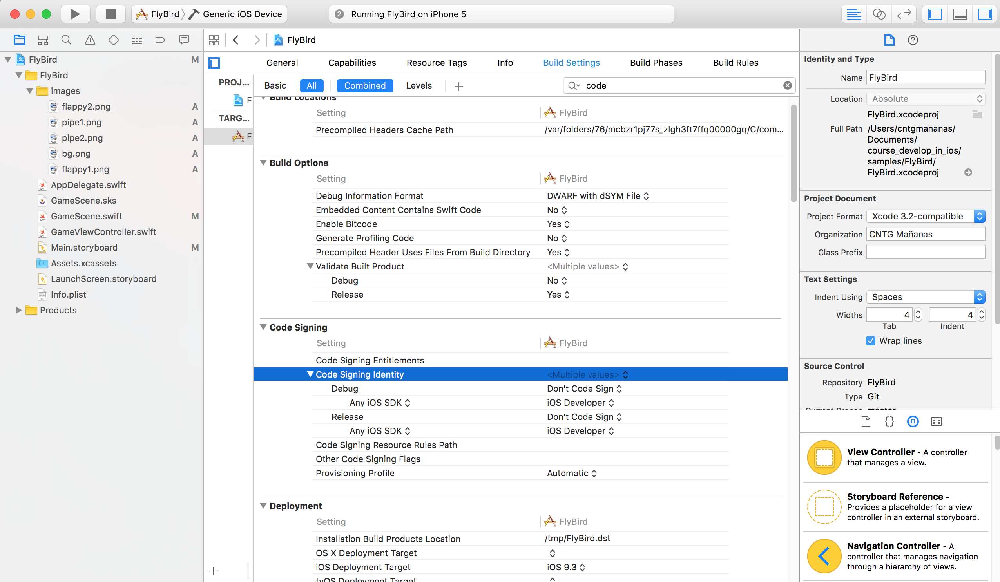
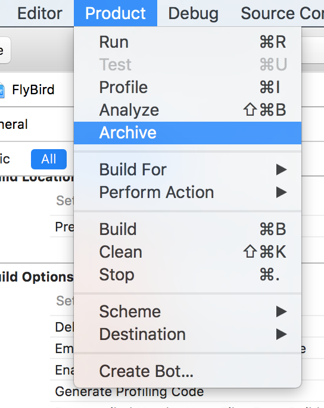

# App Store
----

Para subir hay que tener cuenta en el [Programa de Apple](https://developer.apple.com/programs/)

Pulsar en Enroll y pasar por caja....

Una vez dado de alta, en Developer, en Registering an App Id indicar la descripción de la Aplicación:
- App ID en Explicit App ID con un nombre de App
- Indicar el Bundle ID: es.xunta.cntg.FlyBird
- App Services:. Enable services indicar los que se desean tener adicionales.
- Pulsar en "Register"
- Done

Ir al menú izquierdo en "Provisioning Profiles", un perfil que identifica al desarrollador
y la aplicación. Es necesario crea un nuevo perfil de distribución con destino la Apple Store.
- Seleccionar la App
- Seleccionar el certificado del desarrollador
- Nombre de perfil: ProfileProductionFlappy
- Downdload and Install: Descargar el perfil
- Instalar el perfil con doble clic en la máquina
- Ir a la configuración de la aplicación. En la pestaña "Build Settings" buscar la opción "Code Signing"

- Para ejecutar cambiar el simulador en la parte superior por un dispositivo "Generic iOS Device"
- Ir a Producto y seleccionar "Archive" para firmar la App

- Se abrirá la ventana de Window -> Organicer y seleccionar "Update to App Store"
- Se valida la aplicación

Ir a itunesconnect.apple.com ir a "My Apps", crear la ficha de la aplicación. Seleccionar el idioma, Bundle ID creando, en SKU poner un nombre uri que identifique la App y el dispositivo al que será subido

Seleccionar las categorías, rango de precios, moneda. A la izquiera aparece "Prepare for Submission" y cuando se suba y acepte. Si la rechazan suelen dar el motivo (uso de guía de estilos, apartado 5.3 incumple algún punto). Los tiempos suelen ser largos la primera vez, pero una vez corregido lo normal es que tarde menos.

Hay empresas que hacen ASO para la tienda de la aplicación:
- target
- título y subtítulo
- metadatos, nombre de la aplicación
- capturas de pantalla que hay que poner
- iconos y url varias
