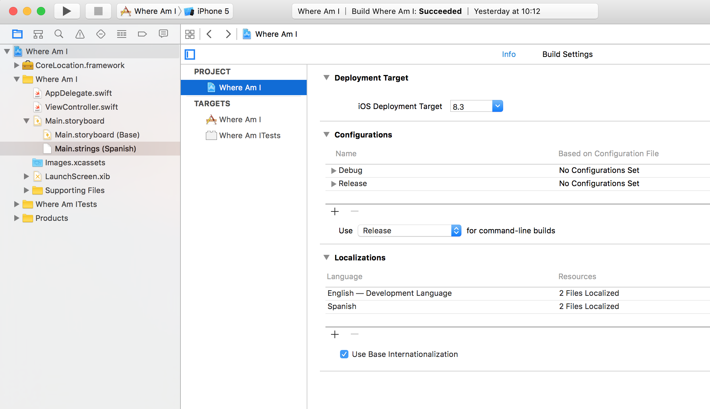

# Localización

Ir a la configuración del proyecto, en el nombre y en Info ir a Localizatión. Pulsar en el botón más y añadir Spanish(es)

Ahora aparecerá en el Main.StoryBoard otra escena con los textos en castellano.


Cambiar los valores
```

/* Class = "UILabel"; text = "Course"; ObjectID = "JMo-uR-pE5"; */
"JMo-uR-pE5.text" = "Curso";

/* Class = "UILabel"; text = "Where Am I?"; ObjectID = "Mjf-Ud-DJn"; */
"Mjf-Ud-DJn.text" = "¿Donde estoy?";

/* Class = "UILabel"; text = "Speed"; ObjectID = "Qik-V2-kxZ"; */
"Qik-V2-kxZ.text" = "Velocidad";

/* Class = "UILabel"; text = "Longitude"; ObjectID = "dDi-yJ-RBR"; */
"dDi-yJ-RBR.text" = "Longitud";

/* Class = "UILabel"; text = "Latitude"; ObjectID = "ec2-Jf-gmM"; */
"ec2-Jf-gmM.text" = "Latitud";

/* Class = "UILabel"; text = "Nearest Address"; ObjectID = "pWq-oT-o9J"; */
"pWq-oT-o9J.text" = "Dirección cercana";

/* Class = "UILabel"; text = "Altitude"; ObjectID = "rR0-OI-qyf"; */
"rR0-OI-qyf.text" = "Altitud";

```

Lanzar y cambiar el idioma en el simulador.

Para añadir un nuevo Label, en panel derecho, en "Document" copiar el "Object ID" del inspector y pegarlo en el fichero de Spanish.


