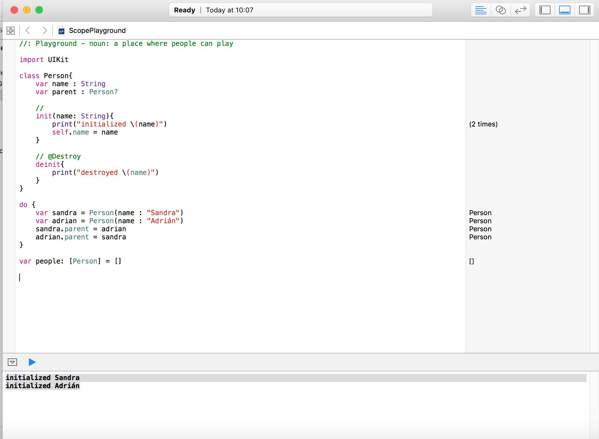
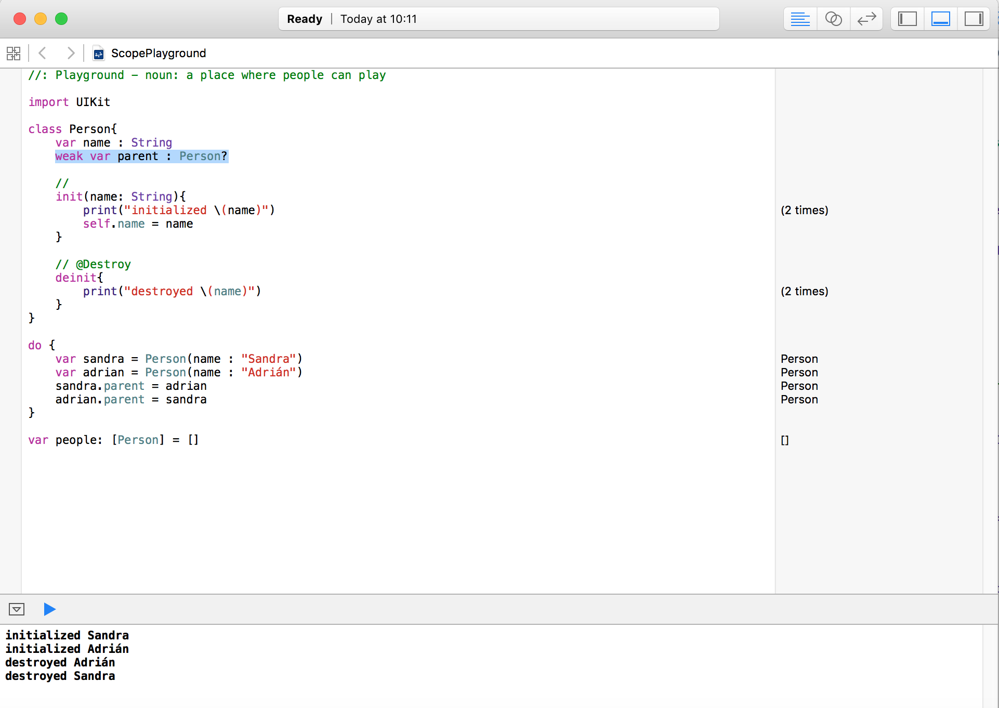
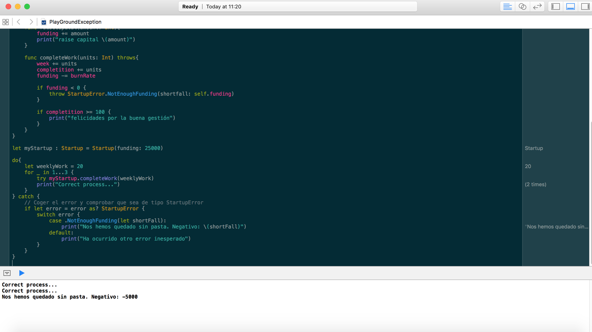

# Introducción a Swift
----------------------

## Clases y estructuras
----------------------
```
    struct Resolution {
        var width = 0
        var height = 0
    }
    class VideoMode {
        var resolution = Resolution()
        var interlaced = false
        var frameRate = 0.0
        var name: String?
    }
```

Las clases tienen propiedades añadidas que las estructuras no tienen propias de la orientación a objetos.
- Herencia
- Interpretar el tipo de clase en tiempo de ejecución

## Funciones

Es habitual definir en los parámetros el nombre del parámetro público y el que será utilizado como variable dentro de la función. En el ejemplo, withRating es el nombre público (normalmente más autodescriptivo) y rating es la variable _immutable_ que se utiliza en la propia función.

```swift
func calculateTipOnTotal(totalBill : Double, withRating rating : Double) -> Double {
    let tipPercentage : Double
    if rating == 5 {
        tipPercentage = 0.25
    } else if rating >= 3 {
        tipPercentage = 0.15
    } else {
        tipPercentage = 0.10
    }

    return totalBill * tipPercentage
}

func showtipAdvice(restaurantTotal : Double, rating : Double) {
    // calculate the total tip
    let result : Double = calculateTipOnTotal(restaurantTotal, withRating: rating)
    // print result
    print("El resultado es \(result)")
}

showtipAdvice(100.34, rating: 1.2)
```

## Protocolos
------------

En Swift las interfaces se llaman [_protocol_](https://developer.apple.com/library/ios/documentation/Swift/Conceptual/Swift_Programming_Language/Protocols.html).
```
    class SomeClass: SomeSuperclass, FirstProtocol, AnotherProtocol {
        // class definition goes here
    }
```

Por ejemplo en la clase AppDelegate:
```
class AppDelegate: UIResponder, UIApplicationDelegate, UISplitViewControllerDelegate {
```

Hereda de la clase UIResponder y además implementa los protocolos UIApplicationDelegate y UISplitViewControllerDelegate.

## Tipos opcionales

A partir de las versiones 2 ha evolucionado y se pueden definir de la siguiente forma. El valor nulo se escribe con _nil_
```
let name : String? = nil
```

Ejemplo:

```swift
func showtipAdvice(restaurantTotal : Double, rating : Int, restaurantName : String?) {
    // calculate the total tip
    let result : Double = calculateTipOnTotal(restaurantTotal, withRating: rating)

    if let restaurantName = restaurantName {
        print("Hemos ido a cenar a \(restaurantName)")
    }

    // print result
    print("El resultado es \(result)")
}

showtipAdvice(100.34, rating: 1, restaurantName: "A casiña")
showtipAdvice(100.34, rating: 1, restaurantName: nil)
```

Para obtener el valor de una variable opcional usa el operador _unwrap_ con el caracter "!". Solo se debe utilizar si el valor del opcional no es nil.
```
let optionalInt: Int? = 9
let actualInt: Int =optionalInt!
```

## Structs

```swift
struct Restaurant {
    let name : String
}

struct RestaurantBill {
    let restaurant : Restaurant
    var totalBill : Double
    var rating : Int

    func tipPercentage() -> Double? {

        guard rating >= 1 && rating <= 5 else {
            return nil
        }

        let tipPercentage : Double
        if rating == 5 {
            tipPercentage = 0.25
        } else if rating >= 3 {
            tipPercentage = 0.15
        } else {
            tipPercentage = 0.10
        }

        return totalBill * tipPercentage
    }
}

let rest = Restaurant(name: "allo")
let bill = RestaurantBill(restaurant: rest, totalBill: 100.10, rating: 4)
```

## Vectores y matrices

En swift son dinámicos similares a las listas en Java.

```swift
// Array
var array : []
// array definiendo el tipo, equivale a List
var listString : [String] = []

// conjuntos con Set, equivale a Set
var hashSet : Set<String> = []
listString.append("One")
listString.append("One")
listString.append("One")
// prints 3
print(listString.count)

hashSet.insert("One")
hashSet.insert("One")
hashSet.insert("One")
// prints 1
print(hashSet.count)

```

## Diccionarios

Estructuras de tipo clave-valor

```
let dictTipPercentage: [Int: Double] = [5: 0.25, 4: 0.20, 3: 0.15, 2: 0.12, 1: 0.10]
var array : [{key, value}, ...]

```

Ejemplo:
```
struct RestaurantBill {
    let restaurant : Restaurant
    var totalBill : Double
    var rating : Int
    let dictTipPercentage: [Int: Double] = [5: 0.25, 4: 0.20, 3: 0.15, 2: 0.12, 1: 0.10]

    func printAll() {
        // Recorrer el diccionario introduciendo la clave y valor en (rating, tipPercentage)
        for(rating, tipPercentage) in dictTipPercentage{
            let tip = totalBill * tipPercentage
            print("Para restaurantes con rating \(rating) se deja la siguente propina \(tip)")
        }
    }
}

let rest = Restaurant(name: "allo")
let bill = RestaurantBill(restaurant: rest, totalBill: 100.10, rating: 4)
bill.printAll()
```

## Guard-stament
---------------

A guard statement is used to transfer program control out of a scope if one or more conditions aren’t met.

A guard statement has the following form:
```
   guard condition else {
       // statements
   }
```

Con _guard_ se puede controlar el condicional, si la condición de entrada no se cumple devuelve nil y si se cumple ejecutará la siguiente parte.

Ver [Guard-stament](https://developer.apple.com/library/ios/documentation/Swift/Conceptual/Swift_Programming_Language/Statements.html#//apple_ref/doc/uid/TP40014097-CH33-ID434)

## Protocolos

Son como las interfaces. Swift se puede decir que es un lenguage de programación orientada a protocolos.

método _is_ equivale a instanceOf en Java

Ejemplo:
```
//: Playground - noun: a place where people can play

import UIKit

protocol Door, CustomStringConvertible {
    // Para declarar setter y getter en el atributo
    var isLocked : Bool{
        get set
    }

    func open()
    func close ()
}

struct SlidingDoor: Door {
    var isLocked: Bool = false

    func open() {
        print("open")
    }

    func close() {
        print("close")
    }
}

class BankVault: Door{

    var isLocked: Bool = false

    func open() {
        if(isLocked){
            print("You can not pass")
        }else{
            print("Opened")
        }
    }

    func close() {
        isLocked = true
        print("closed")
    }

    func unlock(combination: String){
        if combination == "1234" {
            isLocked = false
        }
    }
}

let door1 = SlidingDoor()
let door2 = BankVault()
door1.open()
door2.open()

let doors : [Door] = [door1, door2]
```

## Enumerado

- Definir enumerado: _enum_
- Acceder a un valor de enumerado: _.OPTION_
- Acceder al valor asociado a un enumerado: _myEnum.rawValue_

```
class Restaurant {
  var name : String

  init(name : String) {
    self.name = name
  }
}

enum RestaurantRating: Double {

  case Awesome = 0.25
  case Average = 0.20
  case Poor = 0.15
  case NeverGoingBack = 0.12
  case FoodPoisoning = 0.01

  func niceDescription() -> String {
    if self == .Awesome {
      return "Awesome!!"
    } else if self == .Average {
      return "Average"
    } else if self == .Poor {
      return "Poor"
    } else if self == .NeverGoingBack {
      return "NeverGoingBack"
    } else {
      return "FoodPoisoning"
    }
  }
}

struct {
  var restaurant : Restaurant

  var totalBill : Double
  var rating : RestaurantRating
  let tipPercentage: [Int: Double] = [5: 0.25, 4: 0.20, 3: 0.15, 2: 0.12, 1: 0.10]

  func printAll() {
      for(rating, tipPercentage) in tipPercentage{
          let tip = totalBill * tipPercentage
          print("Para restaurantes con rating \(rating) se deja la siguente propina \(tip)")
      }
  }

  func calculateTip() -> Double? {
    let tipPercentage = rating.rawValue

    return totalBill * tipPercentage
  }
}

let chickenCafe = Restaurant(name: "chicken Cafe")
var bill1 = RestaurantBill(restaurant: chickenCafe, totalBill: 90, rating: RestaurantRating.Awesome)
var bill2 = RestaurantBill(restaurant: chickenCafe, totalBill: 120, rating: RestaurantRating.Average)

```

Los enumerados pueden contener diferentes propiedades definidas. Ejemplo:
```
enum WeatherCondition{
    case Sunny
    case Cloudy(cloudType: String)
    case Rain(inches: Float)
    case Snow(inches: Float, packinSnow: Bool)
}
```

## Virtual vars
```
// Other Proposal with virtual
struct Weath {
    var celsius: Double {
        // Propiedad de escritura
        didSet {
            if celsius < -273.15 {
                celsius = -273.15
            }
        }
    }

    var farenheit: Double {
        // Propiedad solo lectura
        get{
            return celsius * 9/5 + 32
        }
    }

    var temperatureString : String {
        return "La temperatura es \(celsius)C o \(farenheit)F"
    }

    var weatherNow : Weather = Weather(celsius: 22.1, weatherCondition: WeatherCondition.Rain(inches: 0.23))
    var weatherLow : Weather = Weather(celsius: -10000, weatherCondition: WeatherCondition.Snow(inches: 1.4, packinSnow: true))

    print(weatherLow.temperatureString)
    weatherLow.celsius = -10000
    print(weatherLow.temperatureString)}
```

## Closures

Tipos en forma de función similar a JavaScript
Formato: (p1, p2, p3) -> r1
Se declaran creando un bloque con la palabra reservada _in_
```
var clousure = {
  (p1, p2, p3) -> r1 in
}
```

Se puede tener una función que duelva otra función con una serie de parámetros que condicionan la forma del tipo de dato a devolver. Se utiliza para programación asíncrona por ejemplo para crear _AsyncTask_ en iOS. Ver ejemplo:
http://pastebin.com/0HSd3jAE
```
public class AsyncTask<BGParam, BGResult> {
  // code
}

AsyncTask(backgroundTask: {(p:String)->() in
     print(p);
   }).execute("Hello async");

```

Ejemplo de clousure que multiplique valores:
```
var clousureMult = {
    (value : Int, multiplier: Int) -> (Int) in
        return value * multiplier
}


print(clousureMult(2, 2))

```

- Usando clousure en función

```
func makeMultiplier(multiplier: Int) -> ((Int) -> Int) {
    let clousure = {
        (input: Int) -> Int in return input * multiplier
    }

    return clousure
}

let tripler = makeMultiplier(3)
print(tripler(10))
```

Un dato puede ser de tipo clousure sin declarar
```
var incrementer = (input : Int ) -> Int in return input + 1
var doubler = (input: Int) -> Int in return input * 2
var someArithmetic = Int -> Int
someArithmetic = doubler
someArithmetic(2) // 4
someArithmetic = incrementer
someArithmetic(2) // 3
```

## Bucle for

el valor "\_" en el bucle for indica que no importa la variable como en Scala.

```
func
var workingValue = value
for _ in 1...times{
  workingValue = clousure()
}

```

- Otro ejemplo
```
// Paso de parámetro tipo clousure
func repeater(times: Int, value: Int, clousure: Int -> Int) -> Int {
    var workingValue = value
    for _ in 1...times{
        workingValue = clousure(workingValue)
    }

    return workingValue
}

repeater(5, value: 10, clousure: doubler)
repeater(5, value: 1, clousure: incrementer)
```

## Reference counting
--------------------

```
class Person{
  var name : String
  var parent : Person?

  init(name: String){
    print("initialized \(name)")
    self.name = name
  }

  // @Destroy
  deinit{
    print("destroyed \(name)")
  }
}

// Reference counting
do {
  var sandra = Person(name : "Sandra")
  var adrian = Person(name : "Adrián")
  sandra.parent = adrian
  adrian.parent = sandra
}

var people: [Personas] = [sandra, adrian]
```

En el ejemplo, al referenciarse entre los objetos se queda la referencia por el _reference counting_ de Swift y no se destruyen.


Cuando se unen sandra y adrian el contador de referencias se incrementa en una unidad, el scope de Swift descuenta una unidad pero todavía queda una referencia. Por ello se recomienda evitar encadenar dos objetos entre ellos de esta forma.
Para evitar la referencia colgada y que nunca se destruirá. Si esto ocurre mucho puede provocar colgar la aplicación por Memory out.

Solución: usar _weak_

```
weak var parent : Person?
```



## Extensiones

Cuando se vaya a usar un Double se desea que su comportamiento además del normal se añade un comportamiento concreto. Las extensiones permiten definir métodos de clase sin entrar en la clase. Extensión el comportamiendo del tipo definido Double


- Extendiendo clases definidas

```
extension Double {
    var dollarFomarttedString : String {
        // Format to string with 2 decimals
        return String(format: "$%.02f", self)
    }
}

let tip : Double = 29.33 * 12.02

// output: $352.55
tip.dollarFomarttedString
```

- Extendiento protocolos

CustomStringConvertible es un protocolo, es una interfaz.  y se está extendiendo la funcionalidad de todas las clases que implementen este protocolo, por ejemplo String:
```
// Extender el tipo de clase CustomStringConvertible
extension CustomStringConvertible {
    func debug() {
        print("Debug Custom \(self.description)")
    }
}

"Hola Extension".debugDescription
```

- Extensiones heradadas

Las subclases heredarán las extensiones que las implementaciones de la superclase. Ver ejemplo:

```
//: Playground - noun: a place where people can play

import UIKit

/**
 *
 */
class BankVault : CustomStringConvertible{
    var isLocked : Bool = true

    func open(){
        print("Open")
    }

    func close(){
        print("Close")
    }

    var description : String{
        get {
            return "Info CSC"
        }
    }

}

///
class RustyBankVault : BankVault{
    var needsOil : Bool = true

    override func open(){
        if !isLocked {
            print("Open hidaulic BankVault")
        }
    }

    override func close(){
        print("Close hidaulic BankVault")
        needsOil = true

        // Ejecutar el método del padre
        super.close()
    }
}


// Extender el tipo de clase CustomStringConvertible
extension CustomStringConvertible {
    func debug() {
        print("Debug Custom \(self.description)")
    }
}

// CustomStringConvertible es un protocolo, una interfaz, y se está extendiendo la funcionalidad de todas las clases que implementen este protocolo, por ejemplo String:
"Hola Extension".debug()


// "()" instancia un objecto de RustyBankVault
RustyBankVault().debug()

```

## Exceptiones

Capturar excepciones mediante el uso de Exceptiones y el uso de cláusulas _try-catch_.

Cuando se tiene un dominio de valores pequeño delimitado con enumerados y que va creciendo en el tiempo para gestionar los errores.

- Para lanzar una exepción añadir al final de la cabecera del método _throws_ y en la condición
lanzar la excepción (mediante el enumerado) con _throw StartupError.NotEnoughFunding(amount)

- _do-try-catch_
Para hacer un try-catch se utiliza la sentencia _do-try-catch_. El bloque do es el proceso donde se sitúan los _try_
y _catch_ recoge los errores despúes del bloque _do_.
```
do{
  try
      myStartup.completeWork(weeklyWork)
      print("Correct process...")
} catch {
  if let error = error as? StartupError {
    switch error {
      case .NotEnoughFunding(let shortFall):
        // Do anything
        shortFall
        break
      default:
        // Do other
    }
  }
}

```

```
//: Playground - noun: a place where people can play

import UIKit

// Enumerador que extiende de ErrorType
enum StartupError : ErrorType {
    case ShowStoppingBug(bugId: Int)
    case TooMayDistractions
    case NotEnoughTime
    case NotEnoughFunding(shortfall: Int)
}

// Startup class
class Startup{
    var funding: Int = 0
    var completition : Int = 0
    var burnRate : Int = 10000
    var week : Int = 0

    // Constructor nunca se ejecutan desde fuera
    init(funding : Int){
        self.funding = funding
    }

    func raiseCapital(amount: Int){
        funding += amount
        print("raise capital \(amount)")
    }

    func completeWork(units: Int) throws{
        week += units
        completition += units
        funding -= burnRate

        if funding < 0 {
            throw StartupError.NotEnoughFunding(shortfall: self.funding)
        }

        if completition >= 100 {
            print("felicidades por la buena gestión")
        }
    }
}

let myStartup : Startup = Startup(funding: 25000)

do{
    let weeklyWork = 20
    for _ in 1...3 {
        try myStartup.completeWork(weeklyWork)
        print("Correct process...")
    }
} catch {
    // Coger el error y comprobar que sea de tipo StartupError
    if let error = error as? StartupError {
        switch error {
            case .NotEnoughFunding(let shortFall):
                print("Nos hemos quedado sin pasta. Negativo: \(shortFall)")
            default:
                print("Ha ocurrido otro error inesperado")
        }
    }
}
```


