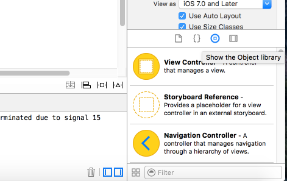
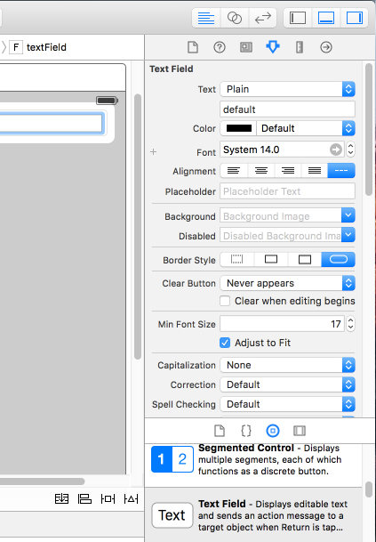
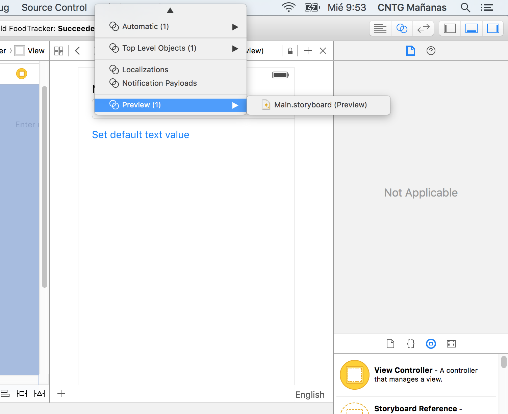
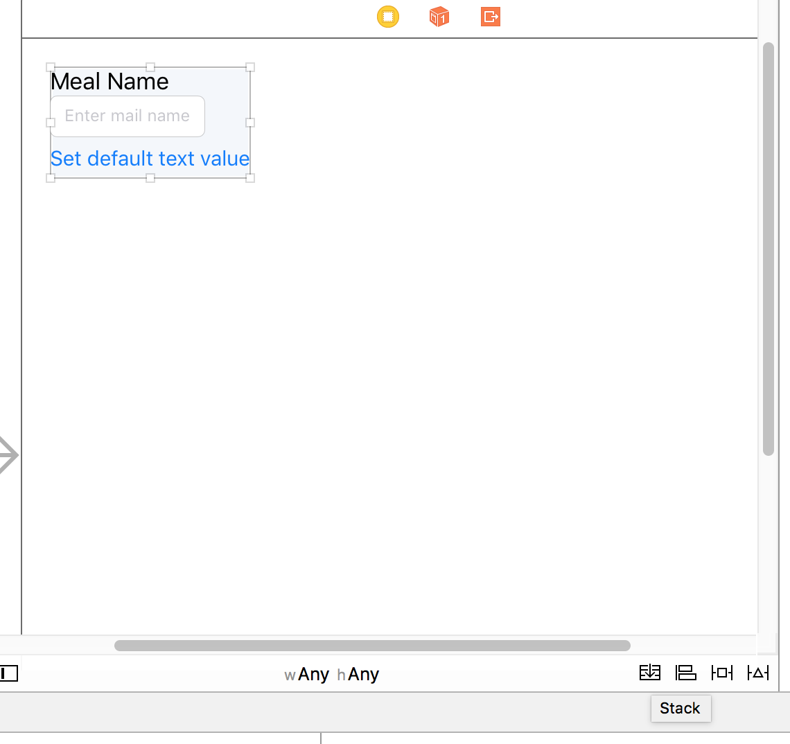
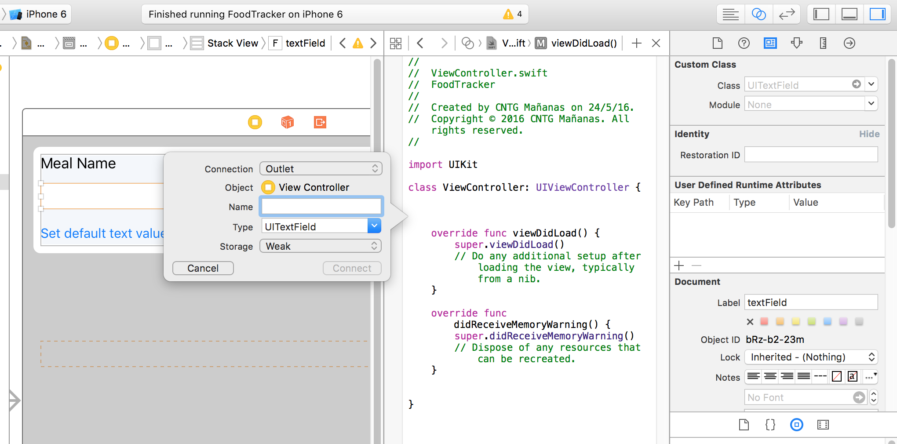
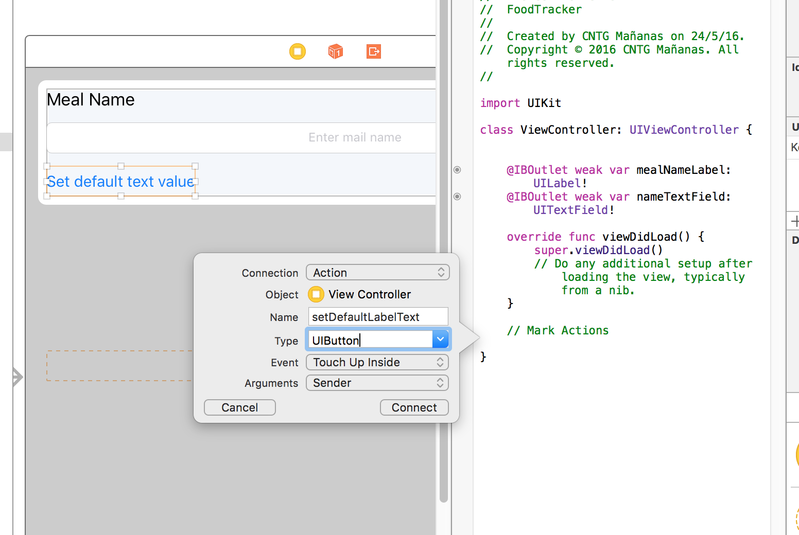

# Inicio
--------

Ejemplo fuera del temario del curso para introducir al alumno la creación de un ejemplo básico de creación en XCode siguiendo la guía de desarrollo de la [documentación oficial para iOS](https://developer.apple.com/library/ios/referencelibrary/GettingStarted/DevelopiOSAppsSwift/Lesson4.html)

Se sigue el ejemplo del siguiente enlace:
https://developer.apple.com/library/ios/referencelibrary/GettingStarted/DevelopiOSAppsSwift/Lesson2.html#//apple_ref/doc/uid/TP40015214-CH5-SW1

## Estructura de un proyecto Master
-----------------------------------

1. Se compone de tres clases:
- AppDelegate

```swift

import UIKit

@UIApplicationMain
class AppDelegate: UIResponder, UIApplicationDelegate, UISplitViewControllerDelegate {

    var window: UIWindow?


    func application(application: UIApplication, didFinishLaunchingWithOptions launchOptions: [NSObject: AnyObject]?) -> Bool {
        // Override point for customization after application launch.
        let splitViewController = self.window!.rootViewController as! UISplitViewController
        let navigationController = splitViewController.viewControllers[splitViewController.viewControllers.count-1] as! UINavigationController
        navigationController.topViewController!.navigationItem.leftBarButtonItem = splitViewController.displayModeButtonItem()
        splitViewController.delegate = self
        return true
    }

    func applicationWillResignActive(application: UIApplication) {
        // Sent when the application is about to move from active to inactive state. This can occur for certain types of temporary interruptions (such as an incoming phone call or SMS message) or when the user quits the application and it begins the transition to the background state.
        // Use this method to pause ongoing tasks, disable timers, and throttle down OpenGL ES frame rates. Games should use this method to pause the game.
    }

    func applicationDidEnterBackground(application: UIApplication) {
        // Use this method to release shared resources, save user data, invalidate timers, and store enough application state information to restore your application to its current state in case it is terminated later.
        // If your application supports background execution, this method is called instead of applicationWillTerminate: when the user quits.
    }

    func applicationWillEnterForeground(application: UIApplication) {
        // Called as part of the transition from the background to the inactive state; here you can undo many of the changes made on entering the background.
    }

    func applicationDidBecomeActive(application: UIApplication) {
        // Restart any tasks that were paused (or not yet started) while the application was inactive. If the application was previously in the background, optionally refresh the user interface.
    }

    func applicationWillTerminate(application: UIApplication) {
        // Called when the application is about to terminate. Save data if appropriate. See also applicationDidEnterBackground:.
    }

    // MARK: - Split view

    func splitViewController(splitViewController: UISplitViewController, collapseSecondaryViewController secondaryViewController:UIViewController, ontoPrimaryViewController primaryViewController:UIViewController) -> Bool {
        guard let secondaryAsNavController = secondaryViewController as? UINavigationController else { return false }
        guard let topAsDetailController = secondaryAsNavController.topViewController as? DetailViewController else { return false }
        if topAsDetailController.detailItem == nil {
            // Return true to indicate that we have handled the collapse by doing nothing; the secondary controller will be discarded.
            return true
        }
        return false
    }

}
```

En la clase _AppDelegate_:
  - Anotación @UIApplicationMain: In this case, the attribute indicates that the class is the application delegate of your app. [Source](https://developer.apple.com/library/ios/documentation/Swift/Conceptual/Swift_Programming_Language/Attributes.html)

  - Herada de la clase [UIResponder](https://developer.apple.com/library/ios/documentation/UIKit/Reference/UIResponder_Class/). The UIResponder class defines an interface for objects that respond to and handle events. It is the superclass of UIApplication, UIView and its subclasses (which include UIWindow). Instances of these classes are sometimes referred to as responder objects or, simply, responders.

  - Implementa  [UIApplicationDelegate](https://developer.apple.com/library/ios/documentation/UIKit/Reference/UIApplicationDelegate_Protocol/)

  The UIApplicationDelegate protocol defines methods that are called by the singleton UIApplication object in response to important events in the lifetime of your app.

  Ver _State changes in an iOS app_
  


  The App Delegate Source File

  The AppDelegate.swift source file has two primary functions:

      It creates the entry point to your app and a run loop that delivers input events to your app. This work is done by the UIApplicationMain attribute (@UIApplicationMain), which appears toward the top of the file. UIApplicationMain creates an application object that’s responsible for managing the life cycle of the app and an app delegate object, which is described below.

      It defines the AppDelegate class, the blueprint for the app delegate object. The app delegate creates the window where your app’s content is drawn and provides a place to respond to state transitions within the app. The AppDelegate class is where you write your custom app-level code.

  The AppDelegate class contains a single property: window. With this property the app delegate keeps track of the window in which all of your app content is drawn. The window property is an optional, which means it may have no value (be nil) at some point.

      var window: UIWindow?

También contienen los siguientes métodos:
```swift
    func application(application: UIApplication, didFinishLaunchingWithOptions launchOptions: [NSObject: AnyObject]?) -> Bool
    func applicationWillResignActive(application: UIApplication)
    func applicationDidEnterBackground(application: UIApplication)
    func applicationWillEnterForeground(application: UIApplication)
    func applicationDidBecomeActive(application: UIApplication)
    func applicationWillTerminate(application: UIApplication)
```

- MasterViewController (Master App) o ViewController (single page App)

La clase ViewController es la "plantilla"  que define una subclase personalizada [_UIViewController_](https://developer.apple.com/library/ios/documentation/UIKit/Reference/UIViewController_Class/) con los siguientes métodos sobreescritos:

```swift
import UIKit

class ViewController: UIViewController {

    override func viewDidLoad() {
        super.viewDidLoad()
        // Do any additional setup after loading the view, typically from a nib.
    }

    override func didReceiveMemoryWarning() {
        super.didReceiveMemoryWarning()
        // Dispose of any resources that can be recreated.
    }
}
```

2. Assets
Aquí irán los ficheros de gráficos y ¿localización?

3. Storyboards
- Main.storyboard
- LaunchScreen.storyboard

In the project navigator, select Main.storyboard.
Xcode opens the storyboard in Interface Builder—its visual interface editor—in the editor area. The background of the storyboard is the canvas. You use the canvas to add and arrange UI elements.

Un storyboard contiene una escena que representa una pantalla de tu aplicación. La flecha del marco izquierdo que marca _Storyboard Entry Point_ define la escena que será la pantalla principal cuando arranque la aplicación.

Xcode provides a library of objects that you can add to a storyboard file. Some of these are elements that appear in the UI, such as buttons and text fields. Others, such as view controllers and gesture recognizers, define the behavior of your app but don’t appear onscreen.

The elements that appear in the UI are known as views. Views display content to the user. They are the building blocks for constructing your UI and presenting your content in a clear, elegant, and useful way. Views have a variety of useful built-in behavior, including displaying themselves onscreen and reacting to user input.

All view objects in iOS are of type UIView or one of its subclasses. Many UIView subclasses are highly specialized in appearance and behavior. Start by adding a text field (UITextField), one such subclass of UIView, to your scene. A text field lets a user type in a single line of text, which you’ll use as the name of a meal.

Para añadir elementos a la vista:
1. Abrir Open library que aparece en la parte inferior derecha del IDE en el icono con redondel y un cuadrado:


2. Seleccionar de la biblioteca el tipo _text field_ y arrastrarlo a la vista.

3. Modificar el tamaño con el ratón y las propiedades desde el inspector de atributos en _Atributes inspector_ en el área de utilidad seleccionando el elemento text field (cuarto icono en la parte derecha superior):


En propiedad _Place holder_ introduce "Enter mail name".
En propiedad _Return Key_ seleccionar del desplegable _Done_
Marcar la propiedad _Auto-enable Return Key_.

4. Añadir un elemento _Label_ y llamarlo "Meal Name"

5. Añadir un elemento botón _UIButton_

6. Ver la pantalla previa desde _Assistant editor_


7. Seleccionar los elementos del formulario con shift key y pulsar en _Stack_


Set 12 en la propiedad _Spacing_ del elemento _Stack view_ y aplicar márgenes con los iconos de la parte inferior derecha _pin_ y marcar 0 para izq y drcha. Selecconar el field text y hacer lo mismo. Con text field seleccionado ir a

8. Seleccionar ViewController y pulsar en el botón de mostrar código (icono conjunto de círculos en la parte superior derecha). Seleccionar el TextFields pulsando control y arrastrar a la párte del código de la clase ViewController debajo de la firma de la clase y poner el nombre _nameTextField_


```
    @IBOutlet weak var nameTextField: UITextField!
```

The _IBOutlet_ attribute tells Xcode that you can connect to the _nameTextField_ property from Interface Builder (which is why the attribute has the IB prefix). The weak keyword means that it’s possible for that property to have no value (be nil) at some point in its life. The rest of the declaration declares a variable of type _UITextField_ named nameTextField.

Note the exclamation point at the end of the declaration. You may remember seeing these at the end of some types in the AppDelegate.swift file. This exclamation point indicates that the type is an implicitly unwrapped optional, which is an optional type that will always have a value after the value is first set.

9.  Define an Action to Perform

Muy importante, el comportamiento de cómo funciona iOS para entender como se va a programar las aplicaciones en iOS. El flujo de las aplicaciones se define por eventos de sistema y del propio usuario.

iOS apps are based on [_event-driven programming_](https://developer.apple.com/library/ios/referencelibrary/GettingStarted/DevelopiOSAppsSwift/GlossaryDefinitions.html#//apple_ref/doc/uid/TP40015214-CH12-SW38). That is, the flow of the app is determined by events: system events and user actions. The user performs actions in the interface that trigger events in the app. These events result in the execution of the app’s logic and manipulation of its data. The app’s response to user action is then reflected back in the UI. Because the user, rather than the developer, is in control of when certain pieces of the app code get executed, you want to identify exactly which actions a user can perform and what happens in response to those actions.

Una acción es un fragmento de código que se ejecuta al ocurrir un evento en la aplicación.

 An action (or an action method) is a piece of code that’s linked to an event that can occur in your app. When that event takes place, the code gets executed. You can define an action method to accomplish anything from manipulating a piece of data to updating the UI. You use actions to drive the flow of your app in response to user or system events.

 You create an action in the same way you create an outlet: Control-drag from a particular object in your storyboard to a view controller file. This operation creates a method in your view controller file that gets triggered when a user interacts with the object the action method is attached to.

 Arrastrar pulsando control el botón con el nombre _setDefaultTextLabel_ y seleccionar tipo _action_ y que reciba un tipo _UIButton_
 

Añadir al método:
```    @IBAction func setDefaultLabelText(sender: UIButton) {

        mealNameLabel.text = "Default Text"

    }

```

10. Añadir la clase implemente _UITextFieldDelegate_ e indicar al contructor que permita delegar el _nameTextField_:
```

    override func viewDidLoad() {
        super.viewDidLoad()


        // Handle the text field’s user input through delegate callbacks.
        nameTextField.delegate = self

    }
```


The UITextFieldDelegate protocol contains optional methods, which means that you’re not required to implement them. But to get the specific behavior you want, you’ll need to implement two of these methods for now:

- func textFieldShouldReturn(textField: UITextField) -> Bool
- func textFieldDidEndEditing(textField: UITextField)

 To understand when these methods get called and what they need to do, it’s important to know how text fields respond to user events. When the user taps a text field, it automatically becomes first responder. In an app, the first responder is an object that is first on the line for receiving many kinds of app events, including key events, motion events, and action messages, among others. In other words, many of the events generated by the user are initially routed to the first responder.

 11. Añadir el método optional _textFieldShouldReturn_ del Protocolo [_UITextFieldDelegate_](https://developer.apple.com/library/ios/documentation/UIKit/Reference/UITextFieldDelegate_Protocol/)

 ```
    func textFieldShouldReturn(textField: UITextField) -> Bool {
      // Hide the keyboard.
      textField.resignFirstResponder()
      return true
    }    

    func textFieldDidEndEditing(textField: UITextField) {
        mealNameLabel.text = textField.text
    }
 ```
