# Arquitectura iOS
------------------

Patrón de arquitectura [Model-View-Controller](https://developer.apple.com/library/ios/documentation/General/Conceptual/DevPedia-CocoaCore/MVC.html).


The Model-View-Controller (MVC) design pattern assigns objects in an application one of three roles: model, view, or controller. The pattern defines not only the roles objects play in the application, it defines the way objects communicate with each other. Each of the three types of objects is separated from the others by abstract boundaries and communicates with objects of the other types across those boundaries. The collection of objects of a certain MVC type in an application is sometimes referred to as a layer—for example, model layer.

MVC is central to a good design for a Cocoa application. The benefits of adopting this pattern are numerous. Many objects in these applications tend to be more reusable, and their interfaces tend to be better defined. Applications having an MVC design are also more easily extensible than other applications. Moreover, many Cocoa technologies and architectures are based on MVC and require that your custom objects play one of the MVC roles.

Lectura recomendada [iOS Architecture Patterns Demystifying MVC, MVP, MVVM and VIPER](https://medium.com/ios-os-x-development/ios-architecture-patterns-ecba4c38de52).

- UIController controlador que gestiona la vista.
- UIViews
- Model: The Model is a dumb data structure

El usuario pulsa un botón y se ejecuta un evento. El controlar recibe el evento y este hace una petición al modelo, la lógica de negocio.

## Understand the View Controller Lifecycle
------------------------------------------

So far, the FoodTracker app has a single scene, whose UI is managed by a single view controller. As you build more complex apps, you’ll be dealing with more scenes, and will need to manage loading and unloading views as they’re moved on and off the screen.
An object of the UIViewController class (and its subclasses) comes with a set of methods that manage its view hierarchy. iOS automatically calls these methods at appropriate times when a view controller transitions between states. When you create a view controller subclass (like the ViewController class you’ve been working with), it inherits the methods defined in UIViewController and lets you add your own custom behavior for each method. It’s important to understand when these methods get called, so you can set up or tear down the views you’re displaying at the appropriate step in the process—something you’ll need to do later in the lessons.


## MVP vs MVC

Lectura recomendada [GUI Architectures](http://martinfowler.com/eaaDev/uiArchs.html)

The Model-View-Controller is a common design pattern when it comes to the development of an iOS application. Usually the view layer consists of elements from UIKit defined programmatically or in xib-files, the model layer contains the business logic of the application and the controller layer, represented by classes of UIViewController, is the glue between model and view.

https://ios.james.ooo/model-view-controller-presenter-8bb4149fa5ef
http://iyadagha.com/using-mvp-ios-swift/

# XCode

El proyecto creado muestra la información de como se debe ejecutar. En la estructura de proyecto en la ventana central izquierda define un _target_ con el nombre del proyecto (en el ejemplo _Planetas_). Si se selecciona el target en el centro, pestaña _General_ están las propiedades del proyecto.
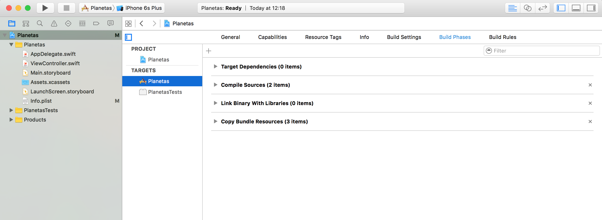

- En Main.storyboard está la pantalla principal de la App. Es la parte de la vista.

Es la parte llamada _InterfaceBuilder_ que ya está integrada en XCode (antes estaba por separada).

- En la parte de inferior derecha están los elementos de la InterfaceBuilder que se pueden arrastrar a la vista. Para ello doble clic sobre la vista o seleccionar el elemento _View_ de la parte de _ViewController_.
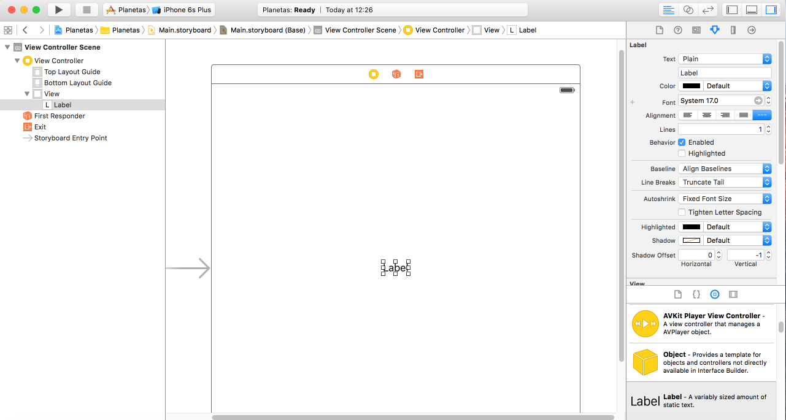

Importante!!!
- Desmarcar la propiedad _Use Size Classes_ en la parte derecha en _Show the file inspector_ (icono de hoja). Abrá que aceptar los cambios.
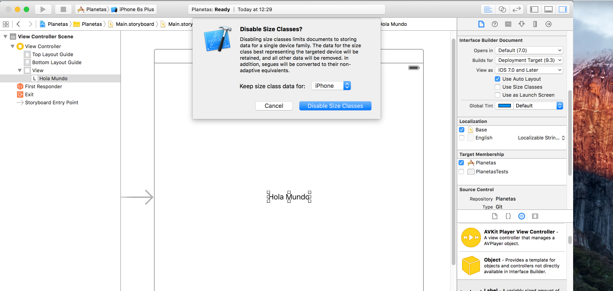


- En _Show the attributes inspector_ se muestran las propiedades del elemento, estás se pueden modificar como el nombre del label, el color, espaciados, tipo de letra, etc.

- Añadir un botón con nombre "Poner nombre" y añadir una acción que al pulsar se ilumine. Es importante que se señalen los cambios, en el inspector, en las propiedades ir a _State config_ que está por defecto. Si se selecciona el estado _Highlighted_ y cambiar el color para ese estado.
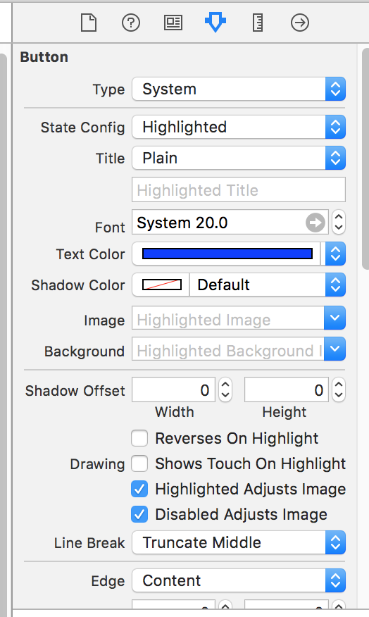

- Cambiar modelo del simulador a iPhone 5 y ejecutar.
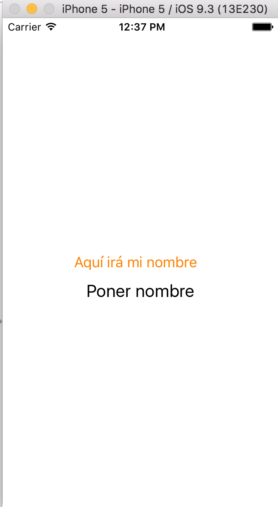{: width: 200px; }

- Seleccionar el botón y pulsar en el icono de conjuntos de dos círculos en la parte superior derecha.

```
class ViewController: UIViewController {

```

Pulsar la tecla _Control_ seleccionando el _widget_ label y arrastrar al código, debajo de la cabecera de la clase para crear el atributo del elemento. Poner el nombre _lbName_ de tipo _UILabel_.
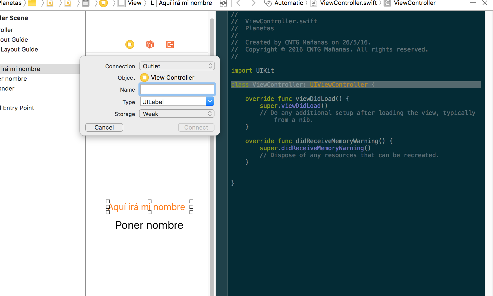


```
@IBOutlet weak var lbName: UILabel!

```
La propiedad está declarada con propieda Storage _weak_. La explicación al final indica que es obligatorio que tenga un valor.


- Arrastra el botón como acción. Poner de tipo _Connection_ _Action_ y asignar un nombre de método y que se ejecute cuando ocurra el evento _Touch Up Inside_ (valor por defecto). El tipo del parámetro de entrada es por defecto _AnyObject_, cualquier tipo de objecto. Para que sea cualquier tipo incluidas estructuras o tipos primitivos es _Any_.

```
    @IBAction func changeName(sender: AnyObject) {
        lbName.text = "Mi nombre"
        print("Ha pulsado el botón")
    }
```


- Volver al Storyboard: Pulsar el icono de círcurlos opción _All Stacked_ o el icono que está a su izquierda.

- Mostar la consola pulsando el icono del centro para ver el print al pulsar el botón.
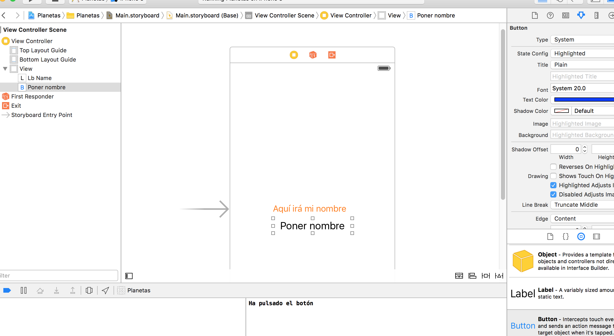

## Storyboard

El panel central-izquierdo del Storyboard especifica la estructura jerárquica de las pantallas.
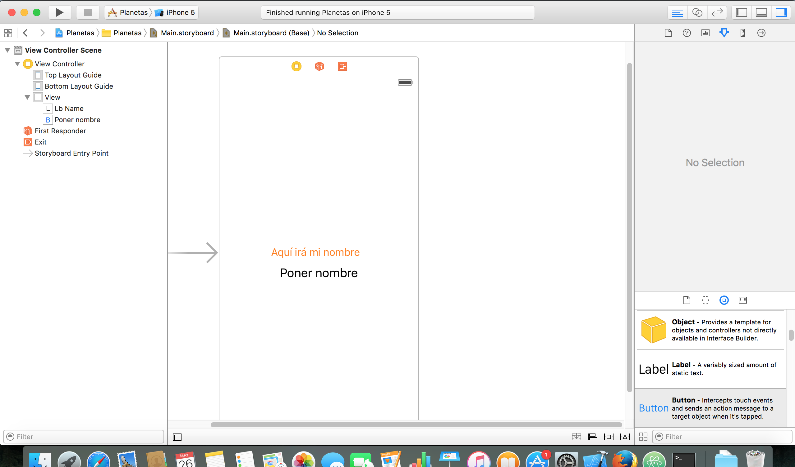

- Seleccionar el botón y mantiendo pulsada la tecla _Control_ pulsar con el ratón o touchpad para ver las propiedades.
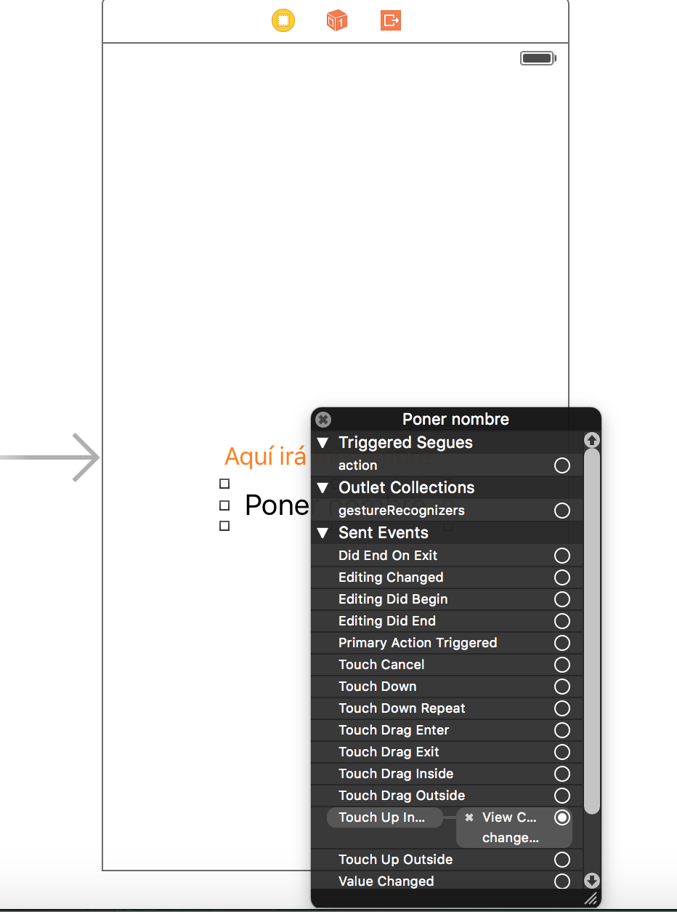

Pulsar sobre la "x" del evento de _Touch Up Inside_ para desconectar la acción al pulsar el botón. El método se mantiene en el código, pero el widget no hará caso al pulsar en la App.

- _Referencing Outlets_
Antes se añadía el Outlet y luego se conectaba el widget. Si se modifica el nombre de la propieda, se desconecta del _widget_.

En el código fuente del controlador se muestra un icono redonde sobre la propiedad. Si está en gris completamente coloreada es que está conectada. Si se desconecta por haber cambiado el nombre se puede volver a conectar arrastrando desde el código hacia el _widget_ en la vista.
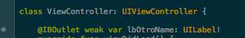

Es recomendable asegurar que en la vista se comprueben los conectos.
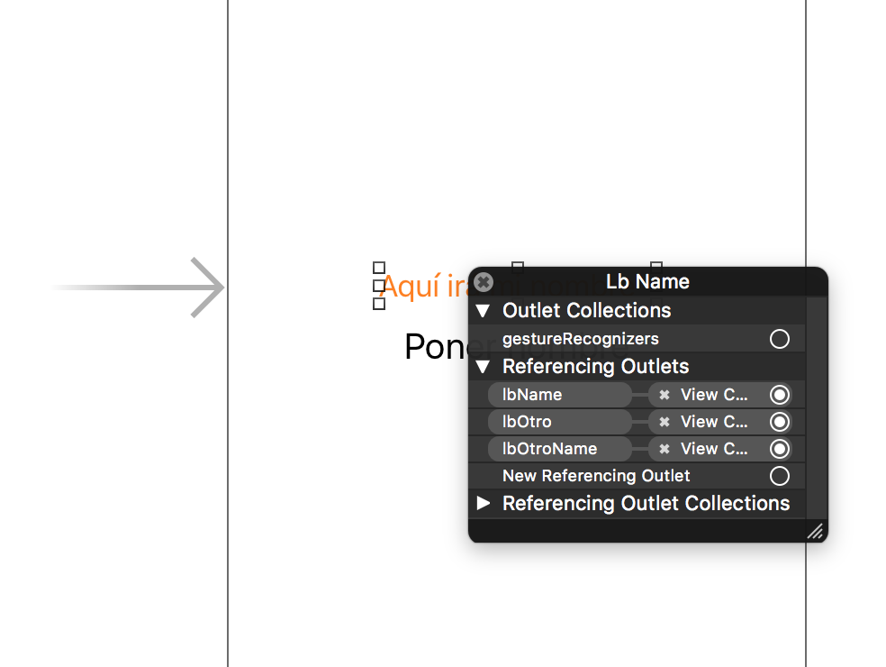

- En la vista de la pantalla de la App hay 3 iconos:
  - ViewController: icono amarillo. En la parte derecha, seleccionar el tercer _Show the Indentity Inspector_ con forma de ficha. Es muy importante que aquí se referencie la clase _ViewController_ del controlador asociado a esta pantalla. Si se desvicula producirá un error al lanzar la aplicación.

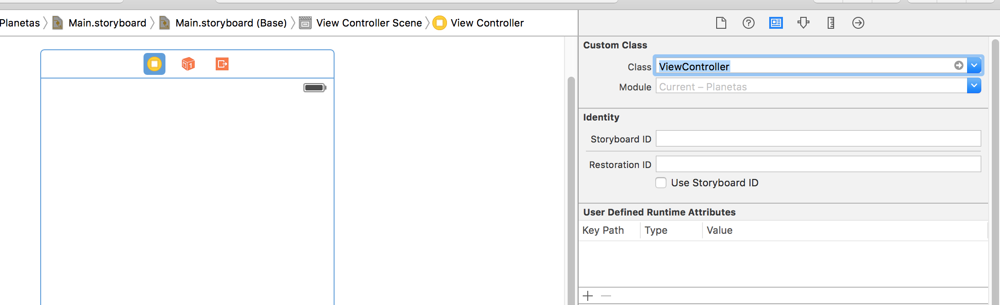

## Crear nueva vista

Seleccionar en el árbol de Storyboard "View Controller" y en la parte derecha inferior crear un nuevo "View Controller" para crear una nueva vista.

Para marcar esta vista como principal hay que arrastrar la flecha ("->") que indica si es de la pantalla inicial.

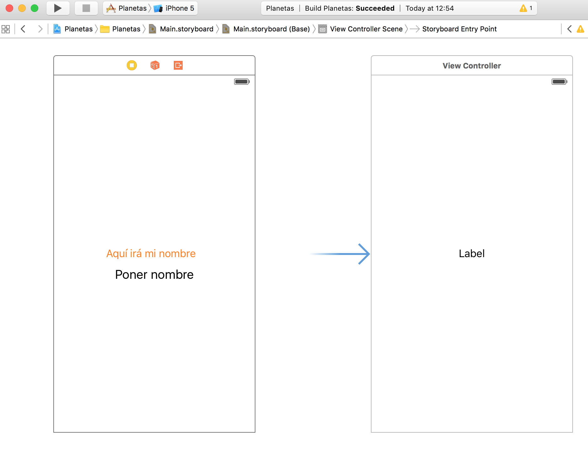
