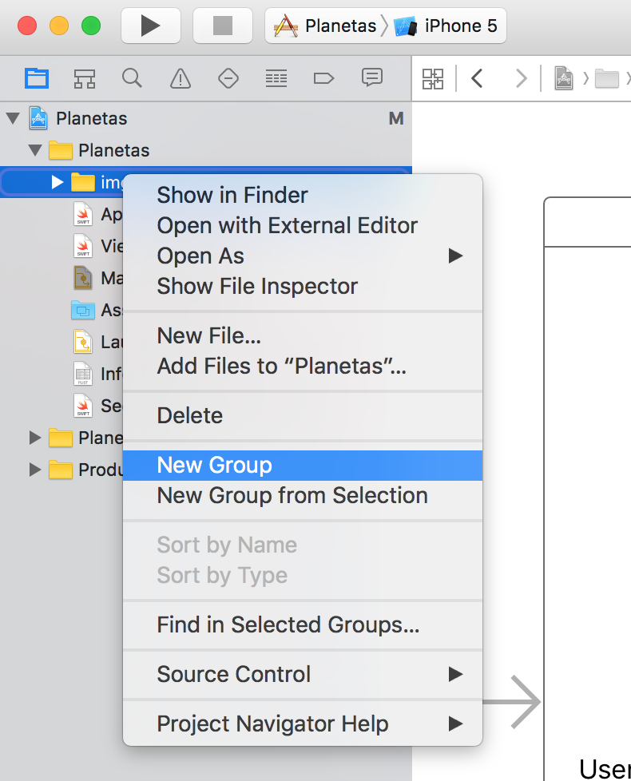
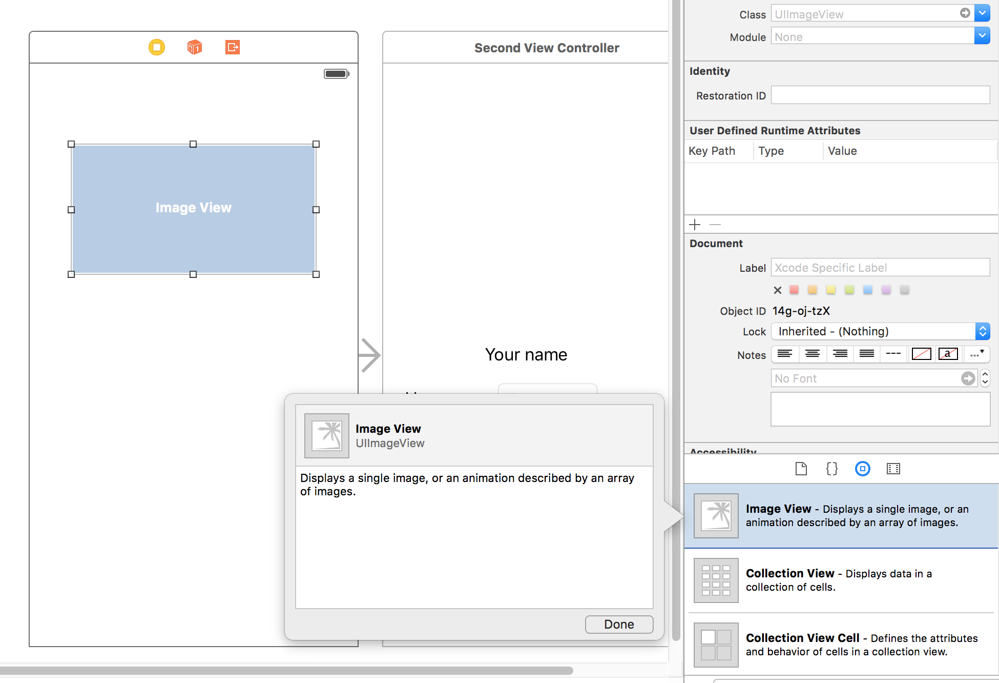
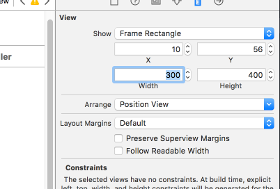
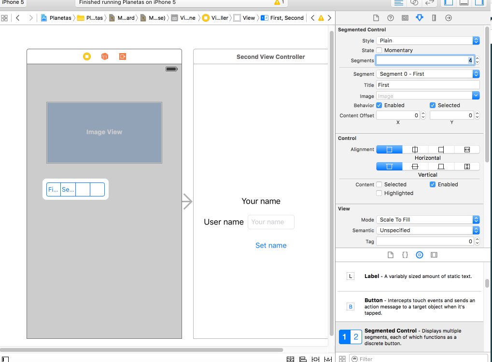
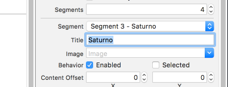
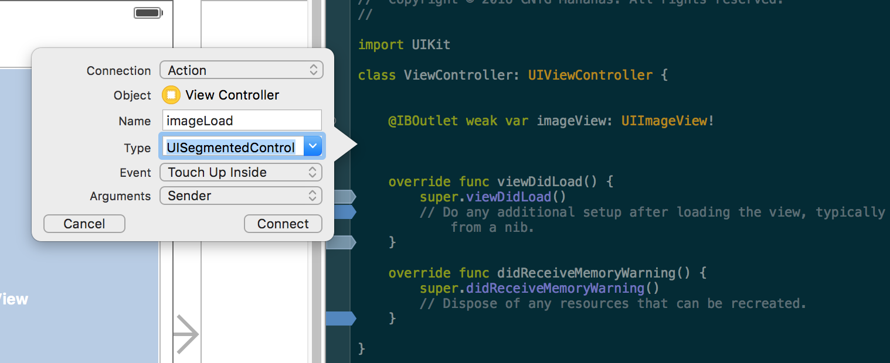
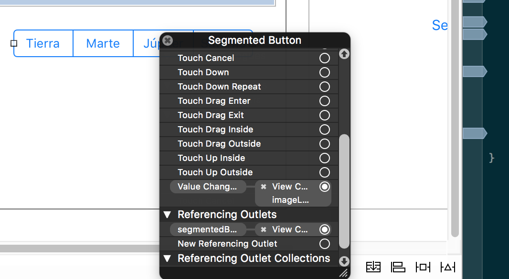
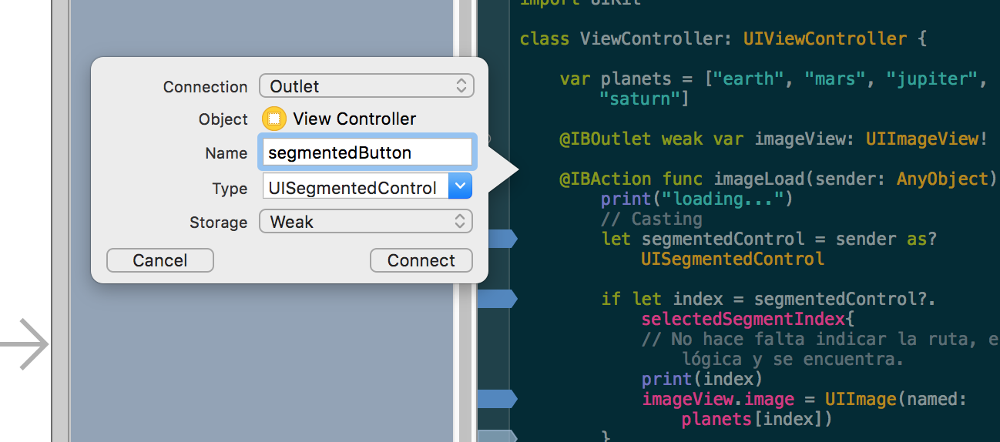
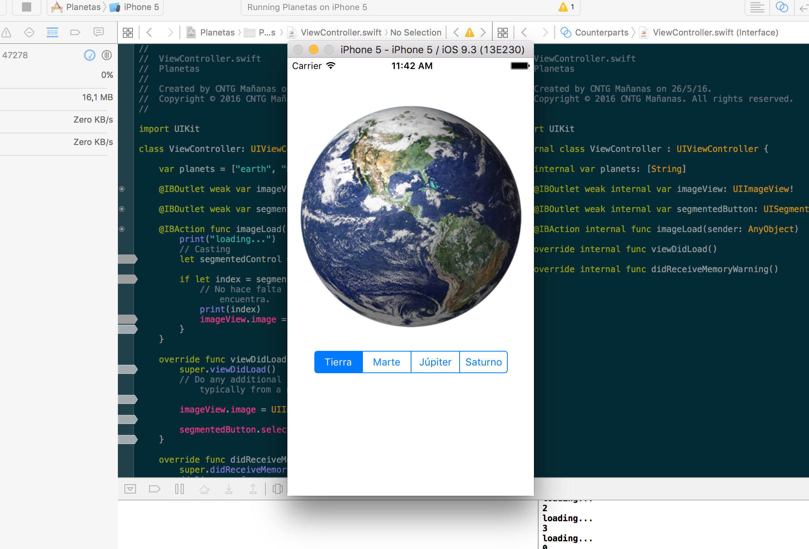

## Ejemplo ImageView

En este ejemplo se usará el Botón _Segmented Control_ para mostrar según el segmento seleccionado una imagen con una planeta u otro.

En una widget _ImageView_ se mostrará la imagen del planeta seleccionado a partir de un vector con las opciones: Tierra, Marte, Júpiter y Saturno

1. Descargar imágenes de los planetas en png. Guardarlos fuera del proyecto y mover estos recursos al proyeto Assets arrastrando. Tamaño 300x300 en una nueva ruta del proyecto llamada _img_/_planets_. Para crear una ruta se crean directorio lógicos mediante _New -> Group_


Con la aplicación ImageMagick se pueden convertir las imágenes a formato png y a un tamaño prefijado, por ejemplo 300x400:
```bash
$ convert tierra.png -resize 300x300 tierra300x400.png
```

2. Crear la interfaz _UIInterface_ con un tipo de imagen _ImageView_ y cambiar su propiedad en el perfil. A continuación crear el botón segmentado para que realice las cuatro acciones diferentes.

Según los ejemplos:






Pulsar en _Edit_, _Size to Fit contenct_ para expandir los botones con el tamaño del texto.


Seleccionar el pirmer segmento en el primer segmento del botón y pulsar en _Behavior_, marcar la opción _Selected_

Seleccionar el proyecto y pulsar en File -> new -> File... . En la ventana -> _User Interface_ StoryBoard si se desea crear una nueva escena o _View_ para crear una nueva pantalla en la escena actual.

Poner el botón y añadir 4 segmentos. En editor -> _Size to Fit Content_

3. Crear la lógica en el controlador que cargue diferentes imágenes.


Arrastrar los widgets al controlador. Para ello pulsar _Control_ seleccionar el widget _Image View_ y arrastrar hacia la clase ViewController asignando el nombre _imageView_.



Conectar el _Segmented Button_ con el método imageLoad. El tipo de conector debe ser _Change Value_.


El código debería quedar así:
```
var planets = ["earth", "mars", "jupiter", "saturn"]

@IBOutlet weak var imageView: UIImageView!
@IBOutlet weak var segmentedButton: UISegmentedControl!

@IBAction func imageLoad(sender: AnyObject) {
    // Casting
    let segmentedControl = sender as? UISegmentedControl

    if let index = segmentedControl?.selectedSegmentIndex{
        // No hace falta indicar la ruta, es lógica y se encuentra.
        imageView.image = UIImage(named: planets[index])
    }
}
```
con el indicador del círculo de que han quedado contectados.

Se recomienda que el tipo del parámetro en el método del evento sea _AnyObject_ en lugar del tipo del widget para que se pueda reutilizar el mismo método con otros widgets.


En el controlador hacer que cargue por defecto la primera imagen y se marque desde el código la primera opción del botón:
```
override func viewDidLoad() {
    super.viewDidLoad()
    // Do any additional setup after loading the view, typically from a nib.

    imageView.image = UIImage(named: planets[0])
    segmentedButton.selectedSegmentIndex = 0
}
```

Ejecutar la aplicación.


