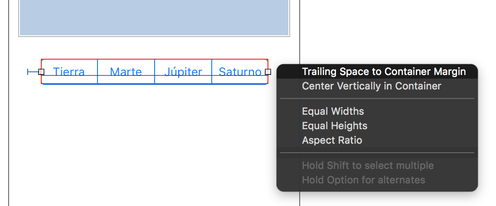
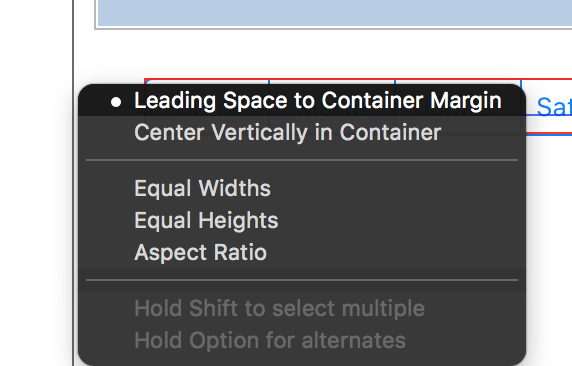
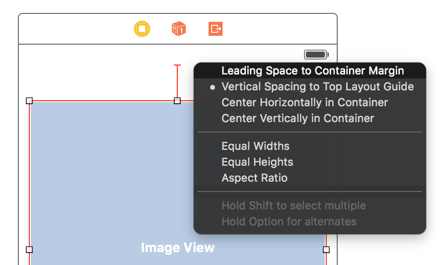
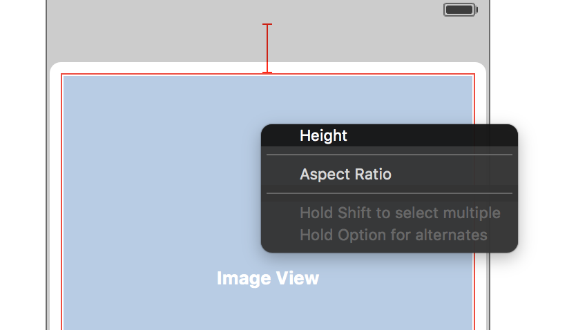
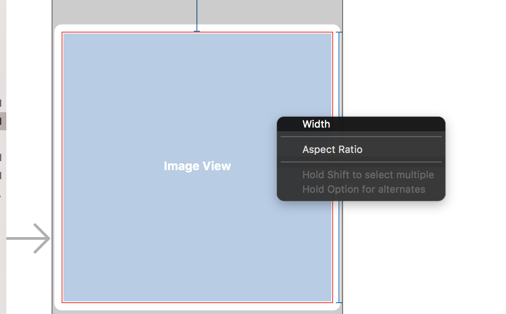
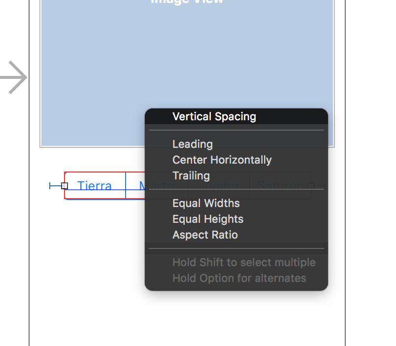
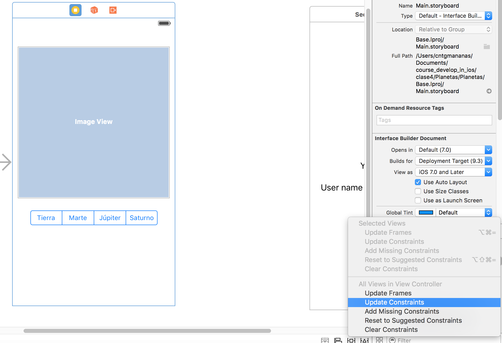

# Constraints
-------------

Qué pasa si se rota la aplicación con la pantalla del ejemplo de planetas. Lo mismo si se ejecuta en una pantalla diferente como iPhone 6plus.

Sobre la aplicación de planetas se debe adaptar con nuevos _layouts_. Ir a StoryBoard y reducir los widgets.
El StoryBoard es un sistema de anclaje para decirle a la imagen que siempre esté en proporcion para una pantalla en vertical. Pulsar la tecla Control y sobre _Image View_ arrastrar y aparece una flecha que hay que llevar hacia fuera.

Lo mismo para El Segment hacia izquierda y derecha.

Alinear el botón con Image View arrastrando y soltar sobre la Image View, escoger:

