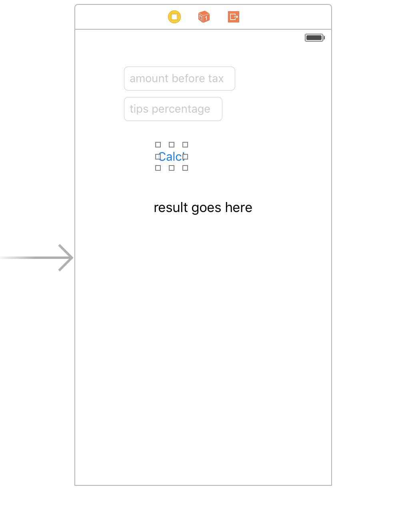

# Ejemplo Calcular propinas
---------------------------

Ejercicio que calcula las propinas del camarero en un restautante

1. Crear la pantalla con los siguientes elementos:
- amount before tax: input
- Tips percentage: input
- calcule button
- result goes here


2. Conectar los textField, el label del resultado como propiedades en la clase del controlador.

3. Conectar el botón como evento de acción al pulsar

4. Convertir el texto de cada textField a tipo Double. Ver http://stackoverflow.com/questions/24031621/swift-how-to-convert-string-to-double

5. Calcular la cantidad y mostrar el restulado formateado con una Extensión de Double.

Ir a new File y crear una clase de tipo Swift con el nombre _TipCalc_.


Resultado ejemplo:
```
//
//  ViewController.swift
//  calculateTip
//
//

import UIKit

extension Double {
    var dollarFomarttedString : String {
        // Format to string with 2 decimals
        return String(format: "$%.02f", self)
    }
}

class ViewController: UIViewController {

    @IBOutlet weak var amountBeforeTax: UITextField!
    @IBOutlet weak var tipsPercentage: UITextField!
    @IBOutlet weak var resultLabel: UILabel!

    override func viewDidLoad() {
        super.viewDidLoad()
        // Do any additional setup after loading the view, typically from a nib.
    }

    override func didReceiveMemoryWarning() {
        super.didReceiveMemoryWarning()
        // Dispose of any resources that can be recreated.
    }

    @IBAction func calculateTip(sender: AnyObject) {
        let amountAsString : String? = amountBeforeTax.text
        let tipAsString : String? = tipsPercentage.text

        if amountAsString != nil && tipAsString != nil {
            let amount : Double = (NSNumberFormatter().numberFromString(amountAsString!)?.doubleValue)!
            let tip : Double = (NSNumberFormatter().numberFromString(tipAsString!)?.doubleValue)!
            let result : Double = (amount * tip) + amount
            resultLabel.text = result.dollarFomarttedString
        }

    }

}
```

Resultado:

- ViewController.swift:
```
//
//  ViewController.swift
//  calculateTip
//
//  Created by CNTG Mañanas on 27/5/16.
//  Copyright © 2016 CNTG Mañanas. All rights reserved.
//

import UIKit

extension Double {
    var dollarFomarttedString : String {
        // Format to string with 2 decimals
        return String(format: "$%.02f", self)
    }
}

class ViewController: UIViewController {

    @IBOutlet weak var txInitial: UITextField!
    @IBOutlet weak var txTip: UITextField!
    @IBOutlet weak var lblResult: UILabel!


    let tipCalc : TipCalc = TipCalc(amountBeforeTax: 25.00, tipPercentage: 0.2)
    var textFields : [UITextField!] = []

    override func viewDidLoad() {
        super.viewDidLoad()
        // Do any additional setup after loading the view, typically from a nib.

        txInitial.text = String(format: "%0.2f", arguments: [tipCalc.amountBeforeTax])
        txTip.text = String(format: "%0.2f", arguments: [tipCalc.tipPercentage])

        // Se suele poner las cajas de texto en un array de widgets
        textFields = [txInitial, txTip]
    }

    override func didReceiveMemoryWarning() {
        super.didReceiveMemoryWarning()
        // Dispose of any resources that can be recreated.
    }

    @IBAction func buttonTapper(sender: AnyObject) {
        calcTip()
    }

    // Función privada y no vinculada a ningún widget
    private func calcTip(){
        // delegar calculo sobre la clase de TipCalc
        if let tipText = txTip.text, amountText = txInitial.text{
            tipCalc.tipPercentage = Float(tipText)!
            tipCalc.amountBeforeTax = Float(amountText)!

            tipCalc.calculateTip()

            // Asignar valor formateado a label de resultado
            lblResult.text = String(format: "Tu cantidad tip es %0.2f", arguments: [tipCalc.tipAmount])
        }
    }

}

```

- TipCalc.swift
```
//
//  TipCalc.swift
//  calculateTip
//
//  Created by CNTG Mañanas on 27/5/16.
//  Copyright © 2016 CNTG Mañanas. All rights reserved.
//

import Foundation

class TipCalc {
    var tipAmount : Float = 0.0
    var amountBeforeTax : Float = 0.0
    var tipPercentage : Float = 0.0

    init(amountBeforeTax : Float, tipPercentage: Float){
        self.amountBeforeTax = amountBeforeTax
        self.tipPercentage = tipPercentage
    }

    func calculateTip() {
        tipAmount = amountBeforeTax * tipPercentage
    }

}
```
