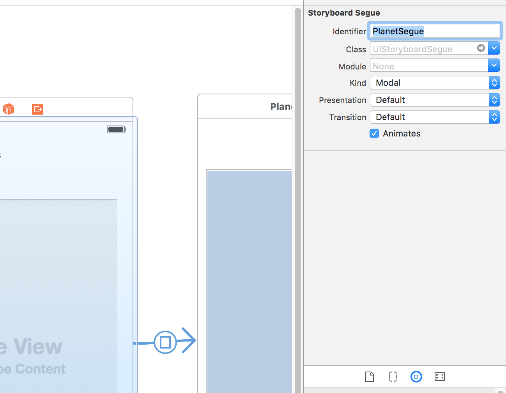

# Experiencia de usuario en iOS
-------------------------------

En cada caja de texto se debería introducir eventos que faciliten la experiencia de usuario, por ejemplo, cuando pulse intro que haga la misma operación que pulsar el botón de calcular.

Para ello, el código del evento será escrito en el controlador y se usarán _Protocolos_ de los diferentes tipos de widgets utilizados en la vista.

Un protocolo permite definir métodos obligatorios y opcionales (_optional_ frente a la propiedad o función). Por ejemplo, el protocolo [_UITextFieldDelegate_](https://developer.apple.com/library/ios/documentation/UIKit/Reference/UITextFieldDelegate_Protocol/) permite asignar acciones contra eventos que se realicen sobre el widget como _textFieldShouldReturn_ o _textFieldDidEndEditing_.

## Ejemplo Calcular Propinas
----------------------------

- Añadir protocolo de forma clásica:
```
class ViewController: UIViewController, UITextFieldDelegate {
```

Los Protocolos suelen llevar el sufijo _Delegate_.

- Conectar los testField con _delegate_ al controlador. Para ello pulsar _Control_ y clic sobre el widget.
Manteniendo pulsada la tecla _Control_ seleccionar en Outlets -> _delegate_ y arrastrar hacia el botón superior de la pantalla sobre el cículo amarillo "View Controller".


- Redefinir el método _textFieldShouldReturn_
```
// Protocolo para los widgets de tipo UITextField de la pantalla en este controlador
// a partir de la interfaz UITextFieldDelegate
func textFieldShouldReturn(textField : UITextField) -> Bool {
    let textFieldsArray = textFields as NSArray
    let i = textFieldsArray.indexOfObject(textField)

    // Si no es el último elemento del array
    if i < textFieldsArray.count - 1 {
        let newTextField = textFieldsArray[i + 1] as UITextField
        // Ir al foco del siguiente elemento si no es el último tipo input
        // Y mantiene el teclado
        newTextField.becomeFirstResponder()
    } else {
        // Perder el foco si es el último para que desaparezca el teclado.
        textField.resignFirstResponder()
        // y se calcula el valor de la calculadora
        calcTip()
    }

    return true
}
```

- Al pulsar intro en el primer textField cambiará el foco al siguiente. En el último, realizará la operación de calcular propina.


## Ejemplo Planetas
----

Tenemos un array de elemento limitado en los elementos. Para solucionar esto están los widgets de lista de elementos paginada con _scroll_. Es el widget de _View Table_, hay dos:

- Datos: UITableViewDelgate
- Eventos: UITableViewDataSource

Se tiene secciones y filas. Una sección en la tabla y varias filas. No se le pondrá ni footer ni headers. Las rows por sección será el total del array de planetas. Las filas serán pintadas de forma automática sin necesidad de realizar un bucle _for_ mediante un Protocolo [_UITableViewCell_](https://developer.apple.com/library/ios/documentation/UIKit/Reference/UITableViewCell_Class/) con el método especial llamada _cellAtIndexPath_ que le indicas el índice de cada vuelta y qué hay que pintar en cada una.


1. Abrir el proyecto de Planetas o realizar una copia del mismo y crear una nueva pantalla. Ir a New File -> User Interface -> _Launch Screen_


**NOTA**: Recordar asignar la nueva _StoryBoard_ al proyecto como principal en las propiedades del proyecto, en la opción "Main Interface".

2. Ir al panel derecho y en "Show the file Inspector" y desmarcar las opciones "Use Size Classes" y "Use as Launch Screen".

3. Seleccionar el controlador ViewController. Ir a la nueva pantalla del StoryBoard y seleccionar pulsando en el icono amarrillo "View Controller". En el panel derecho, en la opción pestaña con icono similar a una ficha "Show the identity inspector" seleccionar en _Class_ la clase del controlador ViewController y en _Module_ el nombre del proyecto "Planetas". Pulsar en el icono de cículo para ver el código del controlador de la pantalla.


4. Arrastrar y un "Table View" y despúes sobre el un "Table View Cell".


5. Añadir la extensión PlanetsViewController para UITableView y el tipo de delegate UITableViewDelegate y UITableViewDataSource.

Será necesario implementar algunos métodos obligatorios de estos protocolos. Una opción con el autocompletado
```
extension PlanetsViewController: UITableViewDelegate, UITableViewDataSource {

}
```

6. En la pantalla de interaface seleccionar el "Table View Cell" y en propiedades en "Idenfifier" poner _PlanetCell_.


iOS ha creado un sistema de reciclaje de memoria. Como una cinta infinita que vuelve a reutilizarse, cuando desaparecen los elementos de la vista superior se aprovechan para sobreescribir con los nuevos elementos. Es importante el identificado _PlanetCell_ para reaprovechar en la celda.


7. Contectar los eventos a la plantalla de View Controller
Pulsando Control mostrar el panel con fondo negro y en Outlets -> dataSource y delegate arrastrar hacia el elemento View Controller de la pantalla.


8. Resultado


9. Crear una nueva pantalla en la interfaz. Doble clic sobre el lienzo y buscar el elemento "ViewController" en el panel derecho inferior "Show the Object Library"

10. Cocoa Touch Class. Cocoa es el framework para crear las interfaces de Mac. En iOS se extiende ese framework y se llama Cocoa "Touch" donde se puede interactuar con la táctil. Crear un nuevo Controlar de coca llamado PlanetViewController de tipo _UIViewController_. No marca la opción "also create XIB file". Esto viene de la versión Xcode 6 donde un XIB es el formato del componente vista similar a los XML de Android.


11. En panel derecho "Show the identity inspector" añadir el controlador


12. Crear la propiedad de imageView en el código. Añadir además un array con las imágenes una variable con el índice del planeta que será mostrado.
```
@IBOutlet weak var imageView: UIImageView!
var planets = ["earth", "mars", "jupiter", "saturn"]
var planetToShow = 0

    override func viewDidLoad() {
        super.viewDidLoad()

        // por defecto cargar la imagen de planetToShow
        imageView.image = UIImage(named: planets[planetToShow])
    }
```


13. Ir al PlanetsViewController y añadir un método de IUViewTableProtocol con los datos de la fila seleccionada
```
didSelectRowAtIndexPath

// ir al segundo controlador informando del índice con indexPath.row

func tableView(tableView: UITableView, didSelectRowAtIndexPath indexPath: NSIndexPath) {
    // ir al segundo controlador informando del índice con indexPath.row
    performSegueWithIdentifier("PlanetSegue", sender: nil)
    // TODO
}
```

14. Relación Modal entre pantallas
Vincular pantallas: Ir a la pantalla de la primera pantalla y con control pulsando desde View Controller (icono amarillo) arrastrar hacia la segunda pantalla. En el desplegable seleccionar "Modal".


15. Seleccionar la conexión flecha entre pantallas y en "Atributos inspector" en identifiers hay que asignar el nombre (pueden haber varios segues) "PlanetSegue". Será necesario para utilizar la vinculación "Segue" en el primer controlador hacia el segundo.


16. Conectar la TableView al controllador
```
@IBOutlet weak var tableView: UITableView!
```


17. Añadiendo un _Segue_ entre escenas del StoryBoard

Ver https://developer.apple.com/library/ios/recipes/xcode_help-IB_storyboard/Chapters/StoryboardSegue.html

Añadir _prepareForSegue_ en la clase del primer controlador para que actualice el índice
```
override func prepareForSegue(segue: UIStoryboardSegue, sender: AnyObject?) {
    if segue.identifier == "PlanetSegue" {
        // obtener el ViewController de PlanetSegue
        // hay que castearlo a PlanetViewController
        // que tiene la propiedad planetToShow
        let planetController = segue.destinationViewController as! PlanetViewController

        // actualizar el índice de la celda seleccionada con tableView
        if let indexPath = tableView.indexPathForSelectedRow {
            planetController.planetToShow = indexPath.row
        }
    }
}
```

18. Demo


19. Añadir un botón de cerrar la pantalla secundaria y volver a la principal

Seleccionar y arrastrar un widget tipo _Button_. En el icono _exit_ de la pantalla (arriba, el tercer icono). y pulsando la tecla "Control" arrastrar al botón creado -> No funciona

Solución: Arrastrar el botón al controlador PlanetViewController y conectar una acción de nombre _butonCloseTab_ llamando a self.close()
```
@IBAction func buttonCloseTab(sender: AnyObject) {
    self.dismissViewControllerAnimated(true, completion: nil)
}
```


20. Relación Push (no Modal)

Esto no debería ser necesario si las pantallas no fuesen modales con una barra _Action_ que muestra un botón de volver para navegar entre las pantallas.

Usando un [NavigationController](https://developer.apple.com/library/ios/documentation/WindowsViews/Conceptual/ViewControllerCatalog/Chapters/NavigationControllers.html) para navegar entre pantallas. Se mostrará una barra de navegación en la pantalla superior.

Eliminar la relación modal con "Command + Retroceso". Seleccionar el ViewController principal y en Editor -> Embebed In -> seleccionar "Navigation Controller".


Utiliza una estructura pila (ordenación LIFO) que interactuará con el elemento de la pila, apilando con PUSH y extrayendo con POP. La relación nueva pantalla NavigationController es necesaria.

21. Crear el _Segue_ con Navigation Controller hacia la segunda pantalla _PlanetViewController_. Arrastrar desde vista del controllador de la primera pantalla hacia la segunda pulsando la tegla "Control" y seleccionar la opción _Push_


22. Poner el mismo nombre al Segue de nombre _PlanetSegue_

