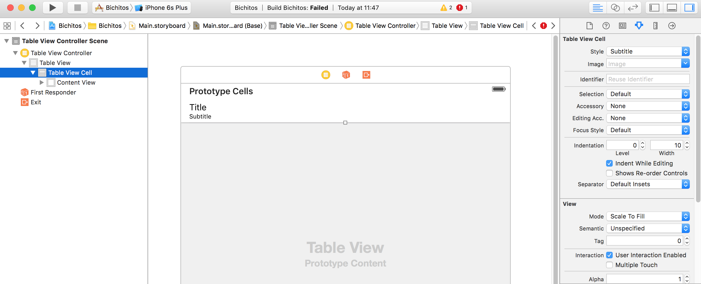
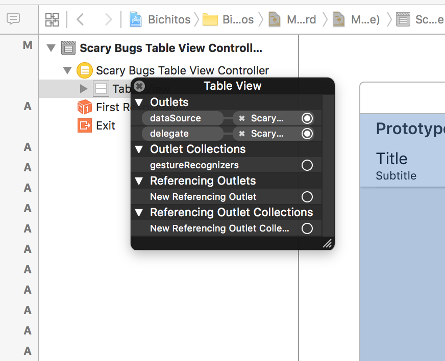
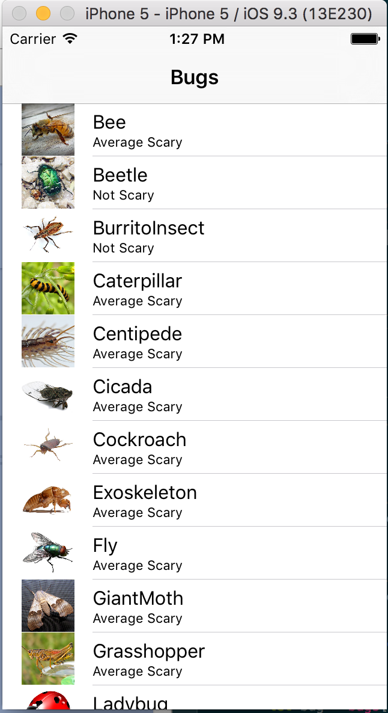

# TableView Sections
--------------------

Una sección está compuesta por una cabecera (título), cuerpo y un pie.

Ver http://blog.apoorvmote.com/uitableview-with-multiple-sections-ios-swift

Se verá como borrar e insertar elementos. Se puede crear la parte visual que incluya elementos más genéricos como TableView al igual que se pueden crear Controladores de un tipo (UITableViewController) que ya implemente el protocolo Delegate y genere código de los métodos obligatorios así como los opcionales comentados.

## Ejemplo Bichitos

Descompromir el proyecto de _assets/pacs_tableView.zip_ y dentro extraer el proyecto Bichitos.zip. Abrir el proyecto y verificar las imágenes del grupo _images_. En un ViewTable se mostrará en una sección las imágenes con los datos.

Se debe evitar siempre tener Lógica de Negocio y de Datos en el controlador. La mejor práctica que solo haya lógica de Presentación en el controlador. Crear una clase insector en otra parte que sea instanciada en la capa modelo, en los servicios, y que tenga una lógica para recuperar los insectos. El controlador tendrá como mucho un array con los objetos de los diferentes bichos.

La TableView con su celda se le dirá que implementar los eventos de Delegate y _TableViewDataSource_. Existe un controllador que se llama [UITableViewController](https://developer.apple.com/library/ios/documentation/UIKit/Reference/UITableViewController_Class/).

1. Vinculado al TableView el UITableViewController.
Crear el grupo _classes_ y la clase
en new File -> iOS -> Swift File y crear la clase _ScaryBug_

Esta clase tendrá 3 propiedades y dos métodos estáticos:

```
//
//  ScaryBug.swift
//  Bichitos
//
import UIKit

enum ScaryFactor: Int {
    case NotScary
    case ALittleScary
    case AverageScary
    case QuiteScary
    case MuchScary
}

class ScaryBug {
    let name: String

    // las opcionales con ? se entiende que por defecto = nil
    var image: UIImage?
    let howScary : ScaryFactor

    init(withName name: String, imageName: String?, howScary: ScaryFactor){
        self.name = name
        self.howScary = howScary

        if let imageName = imageName {
            if let image = UIImage(named: imageName) {
                self.image = image
            }
        }
    }

    /**
    * Returns an array with the internal ScaryBug objects
    * @return [ScaryBug]
    */
    static func bugs() -> [ScaryBug] {
        var bugs = [ScaryBug]()

        bugs.append(ScaryBug(withName: "Bee", imageName: "bee.jpg", howScary: .AverageScary))
        bugs.append(ScaryBug(withName: "Beetle", imageName: "beetle.jpg", howScary: .AverageScary))
        bugs.append(ScaryBug(withName: "BurritoInsect", imageName: "burritoInsect.jpg", howScary: .AverageScary))
        bugs.append(ScaryBug(withName: "Caterpillar", imageName: "caterpillar.jpg", howScary: .AverageScary))
        bugs.append(ScaryBug(withName: "Centipede", imageName: "centipede.jpg", howScary: .AverageScary))
        bugs.append(ScaryBug(withName: "Cicada", imageName: "cicada.jpg", howScary: .AverageScary))
        bugs.append(ScaryBug(withName: "Cockroach", imageName: "cockroach.jpg", howScary: .AverageScary))
        bugs.append(ScaryBug(withName: "Exoskeleton", imageName: "exoskeleton.jpg", howScary: .AverageScary))
        bugs.append(ScaryBug(withName: "Fly", imageName: "fly.jpg", howScary: .AverageScary))
        bugs.append(ScaryBug(withName: "GiantMoth", imageName: "giantMoth.jpg", howScary: .AverageScary))
        bugs.append(ScaryBug(withName: "Grasshopper", imageName: "grasshopper.jpg", howScary: .AverageScary))
        bugs.append(ScaryBug(withName: "Ladybug", imageName: "ladybug.jpg", howScary: .AverageScary))
        bugs.append(ScaryBug(withName: "Mosquito", imageName: "mosquito.jpg", howScary: .AverageScary))
        bugs.append(ScaryBug(withName: "PotatoBug", imageName: "potatoBug.jpg", howScary: .AverageScary))
        bugs.append(ScaryBug(withName: "PrayingMantis", imageName: "prayingMantis.jpg", howScary: .AverageScary))

        return bugs
    }

    /**
    * Converts enum to String
    * @return String the text of ScaryFactor
    */
    static func scaryFactorToString(scaryFactor : ScaryFactor) -> String {
        var scaryString = ""

        switch scaryFactor {
        case .NotScary:
            scaryString = "Not Scary"
        case .ALittleScary:
            scaryString = "A Little Scary"
        case .AverageScary:
            scaryString = "Average Scary"
        case .QuiteScary:
            scaryString = "Quite Scary"
        case .MuchScary:
            scaryString = "Much Scary"
        }

        return scaryString
    }
}

```

2. Ir al Main.StoryBoard y crear la pantalla inicial
En el panel derecho inferior, en el tercer icono buscar el "Table View Controller". No confundir con View Controller. Seleccionarlo y arrastrar hacia el lienzo.

Desplegar el panel derecho de inspección y selecionar en "Table View cell" en la propiedad "Style" poner el tipo _Subtitle_. La parte gráfica cambiará y tendrá 3 elementos: imagen, título e información secundaria.



3. Crear clase de Cocoa _ScaryBugsTableViewController_ de tipo _UITableViewController_

Clic derecho en el proyecto new File -> iOS -> _Cocoa Touch Class_. Es importante escoger que sea de iOS y Cocoa junto con el tipo de Controllador para que incluye los métodos obligatorios y los opcionales comentados.

Añadir la propiedad bugs con el array que se obtenga del método estático creado en ScaryBug.

```
class ScaryBugsTableViewController: UITableViewController {

    var bugs = [ScaryBug]()

    override func viewDidLoad() {
        super.viewDidLoad()

        bugs = ScaryBug.bugs()

        // Añadir título
        title = "Bugs"
```

4. Asociar la pantalla con el controllador creado en el paso 3 _ScaryBugsTableViewController_

Automáticamente la pantalla Table View Controller incluye la conexión del DataSource y el delegate con el controlador.


5. Mostar los elementos en el TableViewCell

```
override func numberOfSectionsInTableView(tableView: UITableView) -> Int {
    return 1
}

override func tableView(tableView: UITableView, numberOfRowsInSection section: Int) -> Int {
    return bugs.count
}


override func tableView(tableView: UITableView, cellForRowAtIndexPath indexPath: NSIndexPath) -> UITableViewCell {
    let cell = tableView.dequeueReusableCellWithIdentifier("cellIdentifier", forIndexPath: indexPath)

    // Configure the cell...
    let bug = bugs[indexPath.row]

    cell.textLabel?.text = bug.name
    cell.detailTextLabel?.text = ScaryBug.scaryFactorToString(bug.howScary)

    // control if the image exists
    if let imageView = cell.imageView, bugImage = bug.image {
        imageView.image = bugImage
    }

    return cell
}

```

6. En las propiedades de ViewController ir al panel derecho, en propiedades del inspector ir a "View controller" -> marcar "Is Initial View Controller"

7. Seleccionar la pantalla Table View Controller el widget Table View Cell, en el panel derecho en "inspector", añadir en la propiedad Identifer el nombre indicado en el código en el método _tableView_ en dequeueReusableCellWithIdentifier: _cellIdentifier_

{width: 100px}

Añadir una barra de navegación para que se ajuste a la pantalla superior.
Con el Table View Controller seleccionado ir a Editor -> Embebed In -> Navigation Controller.

Como opción se puede añadir también un pie "Tab Bar Controller".
