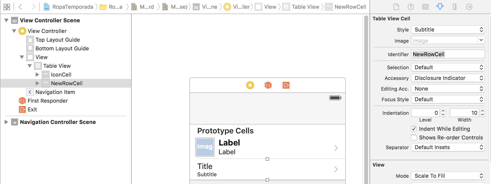

# TableView (continuación)
----------------

Se continuará el ejercicio de TableView realizado en el apartado anterior de [TableView](8b_TableView.md) para realizar la edición de los elementos de la sección. Abrir el proyecto "RopaTemporada" de los ejemplos en _samples_.

Normalmente las secciones se componen de:
- header
- body
- footer

Se cargarán los iconos en categorías o grupos. Se podrán borrar elementos y manipular la información de los datos de estos grupos.

1. Crear grupo _Data_ en el raíz del proyecto y sobre este crear una clase "Swift File" del grupo iOS llamada _Icon_ que importe UIKit.

```
import UIKit

enum RatingType : Int {
    case Unrated
    case Ugly
    case Ok
    case Nice
    case Awesome
}

class Icon {

    var title : String
    var subtitle : String
    var image : UIImage?
    var rating = RatingType.Unrated

    /**
    * Constructor
    */
    init(withTitle title : String, subtitle: String, imageName : String?, rating : RatingType){
        self.title = title
        self.subtitle = subtitle
        self.rating = rating

        if let imageName = imageName {
            if let iconImage = UIImage(named: imageName){
                self.image = iconImage
            }
        }
    }
}
```

2. Crear otra clase _IconSet_ en _Data_

Almacenará en un array los grupos diferentes de iconos e implmentará el protocolo similar a _Comparable_ en Java llamado _Equatable_

Añadir la instanciación de icono de _summer_ y _winter_:

```
$ for i in `ls *winter*.png`;
do
  echo "icons.append(Icon(withTitle: \"$i\", subtitle: \"$i\", imageName: \"$i\", rating: .Awesome))";
done
```

Copiar la salida a un método _winterSet_ y lo mismo para _summerSet_:

```
import UIKit

class IconSet : Equatable {
    let name : String
    var icons : [Icon] = []

    /**
    * Contructor
    */
    init(name: String, icons: [Icon]){
        self.name = name
        self.icons = icons
    }

    static func winterSet() -> IconSet {
        var icons = [Icon]()
        icons.append(Icon(withTitle: "Icons winter 01", subtitle: "Icons subtitle for Winter 01", imageName: "icons_winter_01", rating: .Nice))
        icons.append(Icon(withTitle: "Icons winter 02", subtitle: "Icons subtitle for Winter 02", imageName: "icons_winter_02", rating: RatingType.Ok))
        icons.append(Icon(withTitle: "Icons winter 03", subtitle: "Icons subtitle for Winter 03", imageName: "icons_winter_03", rating: .Ok))
        icons.append(Icon(withTitle: "Icons winter 04", subtitle: "Icons subtitle for Winter 04", imageName: "icons_winter_04", rating: RatingType.Awesome))
        icons.append(Icon(withTitle: "Icons winter 05", subtitle: "Icons subtitle for Winter 05", imageName: "icons_winter_05", rating: RatingType.Nice))
        icons.append(Icon(withTitle: "Icons winter 06", subtitle: "Icons subtitle for Winter 06", imageName: "icons_winter_06", rating: RatingType.Ok))
        icons.append(Icon(withTitle: "Icons winter 07", subtitle: "Icons subtitle for Winter 07", imageName: "icons_winter_07", rating: RatingType.Nice))
        icons.append(Icon(withTitle: "Icons winter 08", subtitle: "Icons subtitle for Winter 08", imageName: "icons_winter_08", rating: RatingType.Ok))
        icons.append(Icon(withTitle: "Icons winter 09", subtitle: "Icons subtitle for Winter 09", imageName: "icons_winter_09", rating: RatingType.Ok))
        icons.append(Icon(withTitle: "Icons winter 10", subtitle: "Icons subtitle for Winter 10", imageName: "icons_winter_10", rating: RatingType.Awesome))

        return IconSet(name: "Winter", icons:icons)
    }

    static func summerSet() -> IconSet {
        var icons = [Icon]()
        icons.append(Icon(withTitle: "Icons Summer  01", subtitle: "Icons Summer  subtitle01", imageName: "summericons_100px_01", rating: RatingType.Awesome))
        icons.append(Icon(withTitle: "Icons Summer  02", subtitle: "Icons Summer  subtitle02", imageName: "summericons_100px_02", rating: RatingType.Ok))
        icons.append(Icon(withTitle: "Icons Summer  03", subtitle: "Icons Summer  subtitle03", imageName: "summericons_100px_03", rating: RatingType.Ok))
        icons.append(Icon(withTitle: "Icons Summer  04", subtitle: "Icons Summer  subtitle04", imageName: "summericons_100px_04", rating: RatingType.Ok))
        icons.append(Icon(withTitle: "Icons Summer  05", subtitle: "Icons Summer  subtitle05", imageName: "summericons_100px_05", rating: RatingType.Awesome))
        icons.append(Icon(withTitle: "Icons Summer  06", subtitle: "Icons Summer  subtitle06", imageName: "summericons_100px_06", rating: RatingType.Ok))
        icons.append(Icon(withTitle: "Icons Summer  07", subtitle: "Icons Summer  subtitle07", imageName: "summericons_100px_07", rating: RatingType.Ok))
        icons.append(Icon(withTitle: "Icons Summer  08", subtitle: "Icons Summer  subtitle08", imageName: "summericons_100px_08", rating: RatingType.Ok))
        icons.append(Icon(withTitle: "Icons Summer  09", subtitle: "Icons Summer  subtitle09", imageName: "summericons_100px_09", rating: RatingType.Ok))
        icons.append(Icon(withTitle: "Icons Summer  10", subtitle: "Icons Summer  subtitle10", imageName: "summericons_100px_10", rating: RatingType.Ugly))

        return IconSet(name: "Summer", icons:icons)
    }

    /**
    * Returns a list with all iconSet groups
    * @return [IconSet]
    */
    static func iconSets() -> [IconSet] {
        return [IconSet.summerSet(), IconSet.winterSet()]
    }

}

```

3. Implementar el protocolo _Equatable_
Tiene que ir fuera de la clase un método para la comparación:

```
/**
 * Compare if the given objects are equals
 * @return Bool if lhs and rhs are equals
 */
func == (lhs: IconSet, rhs: IconSet) -> Bool {
    var isEqual = false
    if lhs.name == rhs.name && lhs.icons.count == rhs.icons.count {
        isEqual = true
    }
    return isEqual
}
```

4. Crear en un StoryBoard vacía una pantalla de tipo _ViewController_
Desmarcar en identity and Type "Use Size Classes".

5. Añadir el widget _TableView_, no un Table View Controller.

6. Sobre el TableView arrastrar un widget _Table View Cell_
En las propiedades del panel derecho, en inspector, nombrar el Identifer _IconCell_
dejar en Style en "Custom", aunque se podría escoger un estilo.

7. Clic pulsando Control sobre el elemento "Table View" y conectar delegate y DataSource con el View Controller.


8. Conectar el ViewController con el controllador en identity inspector, en CustomClass, en Class

9. Crear la propiedad conectada con el widget _tableView_ en el controllador.

```
@IBOutlet weak var tableView: UITableView!
```


Compilar con Cmd + B

10. Arrastrar un widget _ImageView_ sobre el Table View Cell (debe sombrearse la forma en un rectángulo azul).
Indicar un tamaño 40x40 y ponerlo a la izquierda. Copiar la imagen y colocar otra a la derecha con tamaño 25x25 con la imagen por defecto _star_uns.png_

11. en el panel derecho con el widget "Table View Cell" _IconCell_ seleccionado, en el panel derecho en inspector, en "Accesory" seleccionar "Disclosure Indicator" que le indicará al usuario de hay un evento adicional al seleccionar la fila.


Por código se pueda hacer así:

```
cell.accessoryType = UITableViewCellAccessoryType.DisclosureIndicator
```

12. Añadir un Label a la derecha del icono como título. Ir al panel derecho inspector y en "Font" seleccionar en style "Bold" para que se remarque en negrita


13. Añadir un Label subtitle debajo con tamaño de letra 14 en "Font"

14. Crear una clase Cocoa Touch Class en New File -> iOS -> Cocoa Touch Class
De tipo _UITableViewCell_ y con el nombre IconTableViewCell

15. Ir a la pantalla para conectar propiedades con la nueva clase _IconTableViewCell_
Hay que seleccionar la pantalla el widget _TableViewCell_, importante que sea el widget. En sus propiedades en el panel derecho ir al icono de ficha y vincular la controlador IconTableViewCell

Para ver el código en modo dual, seleccionar modo manual y buscar la clase.


16. Añadir un Navigation controller seleccionando la pantalla y en Editor -> Embebed In -> Navigation controller.

En panel derecho en inspector marcar "Is Initial View Controller"

17. En la clase ViewController añadir una extensión que implemente los Delegate del TableView

Implementar los nombres de parámetros _numberOfSectionsInTableView_ (una sección), _numberOfRowsInSection_ (número de elementos en la celda), _cellForRowAtIndexPath_ (cargar los elementos por indexPath.raw):

```
    func numberOfSectionsInTableView(tableView: UITableView) -> Int {
        // TODO
    }

    func tableView(tableView: UITableView, numberOfRowsInSection section: Int) -> Int {
        <#code#>
    }

    func tableView(tableView: UITableView, cellForRowAtIndexPath indexPath: NSIndexPath) -> UITableViewCell {
        <#code#>
    }
```

18. Añadir propiedad iconSets con los grupos de iconos que

```
var iconSets = [IconSet]()

    override func viewDidLoad() {
        super.viewDidLoad()

        iconSets = IconSet.iconSets()

        automaticallyAdjustsScrollViewInsets = true
    }
```

19. Scroll a true del protocolo UITableViewController

```
automaticallyAdjustsScrollViewInsets = true
```

20. Añadir el total de grupos, número de secciones en el TableView

```
func numberOfSectionsInTableView(tableView: UITableView) -> Int {
    return iconSets.count
}
```

21. Añadir el total de elementos que habrá por sección usando el parámetro _section_
```
return iconSets[section].icons.count
```

22. Añadir por cada sección el título de la sección:
Buscar el método con _titleForHeaderInSection_:

```
func tableView(tableView: UITableView, titleForHeaderInSection section: Int) -> String? {
        return iconSets[section].name
    }
```

22. Implementar _cellForRowAtIndexPath_ que mostará los datos de cada celda.
el parámetro indexPath contine la sección _section_ y la fila _row_:

```
func tableView(tableView: UITableView, cellForRowAtIndexPath indexPath: NSIndexPath) -> UITableViewCell {

        let cell : UITableViewCell
        let set = iconSets[indexPath.section]
        cell = tableView.dequeueReusableCellWithIdentifier("IconCell", forIndexPath: indexPath)

        if let iconCell = cell as? IconTableViewCell {
            let icon = set.icons[indexPath.row]
            iconCell.titleLabel.text = icon.title
            iconCell.subtitleLabel.text = icon.subtitle
            if let iconImage = icon.image {
                iconCell.iconImageView.image = iconImage
            }else{
                iconCell.iconImageView.image = nil
            }

            // TODO show rating star
        }

        return cell
    }
```

23. Indicar con el icono de la estrella el rating

```
if icon.rating == .Awesome {
    iconCell.favouriteImageView.image = UIImage(named: "star_sel.png")
}else{
    iconCell.favouriteImageView.image = UIImage(named: "star_uns.png")
}
```

Resultado:


## Parte 2: Editando TableView

1. Añadir el método _commitEditingStyle_ en la extensión de UITableView:

```

    func tableView(tableView: UITableView, commitEditingStyle editingStyle: UITableViewCellEditingStyle, forRowAtIndexPath indexPath: NSIndexPath) {
        <#code#>
    }
```

Lanzar el simulador y hacer un _Swipe_ sobre una fila.


2. Ahora se tienen operaciones de borrado o insertar:

Realiza dos operaciones:
- _Swipe_
- Borrar


```
        if editingStyle == .Delete {
            print("Se ha borrado")
        } else if editingStyle == .Insert {
            print("Se ha insertado")
        } else if editingStyle == .None {
            print("Nothing")
        }
```

3. Poder eliminar filas:

```
let set = iconSets[indexPath.section]
if editingStyle == .Delete {
    // 1. delete the first row of DataSource
    set.icons.removeAtIndex(indexPath.row)
    // In real call service model to persist

    // 2. update the tableView. Bad idea, low performance
    //tableView.reloadData()
    // Best performance
    tableView.deleteRowsAtIndexPaths([indexPath], withRowAnimation: .Automatic)
}
```
4. Poner tabla en modo edición

Pero si se desea realizar una especie de proceso en bloque, que el usuario pueda eliminar varios elementos a la vez. Para ello hay que poner la tabla de forma esplícita en modo edición. La tabla tendrá una barra superior con un botón arriba que al pulsar la tabla se ponga en modo edición (en iOS todas las celdas se ponen con la opción de eliminar).

Ir a la vista jerárquica del Main.StoryBoard. En la jerarquía seleccionar el widget creado por defecto _Navigation Item_, debajo de _View_.


Este ítem se puede acceder desde el código de controlador _ViewController_ al implmentar el delegate _UIViewContrller_. Añadirlo al método _viewDidLoad_ y añadirle un botón a la parte derecha. El método _editButtonItem()_ que ya incluye genera un botón.

```
navigationItem.rightBarButtonItem = editButtonItem()

// size settings
tableView.rowHeight = 44.0
tableView.estimatedRowHeight = 70.0
```

Al pulsar el botón, se pondrá la tabla en modo edición.

5. En el protocolo, en la extensión añadir el método _setEditing_ del protocolo:

```
override func setEditing(editing: Bool, animated: Bool) {
        super.setEditing(editing, animated: true)

        if editing {
            tableView.setEditing(true, animated: true)
        } else {
            tableView.setEditing(false, animated: true)
        }
    }
```

Si se ejecuta, al pulsar en "Edit" se mostrará en modo edición:


6. Preparar las llamadas para realizar insercción o eliminar la celda de insertar al pulsar en _Done_

```
if editing {
    tableView.beginUpdates()
    for (i, set) in iconSets.enumerate() {
        let indexPath = NSIndexPath(forRow: set.icons.count, inSection: i)
        tableView.insertRowsAtIndexPaths([indexPath], withRowAnimation: .Automatic)
    }
    tableView.endUpdates()

    tableView.setEditing(true, animated: true)
} else {
    tableView.beginUpdates()

    for (i, set) in iconSets.enumerate() {
        let indexPath = NSIndexPath(forRow: set.icons.count, inSection: i)
        tableView.deleteRowsAtIndexPaths([indexPath], withRowAnimation: .Automatic)
    }

    tableView.endUpdates()
    tableView.setEditing(false, animated: true)
}
```

7. Añadir a la extensión el método _editingStyleForRowAtIndexPath_

Este método recibe como entrada el indexPath actual de la fila y sección. En función de si la fila es la última se devuelve la operación de edición "Insert" y sino, será una operación de borrado. Por eso en el punto anterior se llama a _deleteRowsAtIndexPaths_.

```
let set = iconSets[indexPath.section]
if indexPath.row >= set.icons.count {
    return .Insert
} else {
    return .Delete
}
```

8. Crear celda para insertar elementos

Ir a Main.StoryBoard ir a Table View widget y en "Prototype Cells" en panel derecho inspector cambiar el valor 1 a 2.


seleccionar el segundo IconCell y cambiar en la propiedad Style la opción "Subtitle" con el nombre de Identifier "NewRowCell".


9. En el controllador implementar la inserción

Modificar el numberOfRowsInSection:

```
    func tableView(tableView: UITableView, numberOfRowsInSection section: Int) -> Int {
        let adjustment = editing ? 1 : 0
        return iconSets[section].icons.count + adjustment
    }
```

10. En cellForRowAtIndexPath añadir la celda de edición si está en modo edición:

```
/* Añadir una celda en modo de insercción */
if indexPath.row >= set.icons.count && editing {
    cell = tableView.dequeueReusableCellWithIdentifier("NewRowCell", forIndexPath: indexPath)
    cell.textLabel?.text = "Add Icon"
    cell.detailTextLabel?.text = nil
    cell.imageView?.image = nil
} else {
    cell = tableView.dequeueReusableCellWithIdentifier("IconCell", forIndexPath: indexPath)
    ...
}
```

11. Ir al método sobreescrito con _commitEditingStyle_ para que cree el icono al pulsar en la celda:

```
func tableView(tableView: UITableView, commitEditingStyle editingStyle: UITableViewCellEditingStyle, forRowAtIndexPath indexPath: NSIndexPath) {
  ....
    } else if editingStyle == .Insert {
        // Cuando el usuario pulse la celda crear un nuevo icono
        let newIcon = Icon(withTitle: "New Icon", subtitle: "", imageName: nil, rating: .Unrated)
        set.icons.append(newIcon)
        tableView.insertRowsAtIndexPaths([indexPath], withRowAnimation: .Automatic)
    }
}
```

12. Añadir el método _didSelectRowAtIndexPath_

```
    func tableView(tableView: UITableView, didSelectRowAtIndexPath indexPath: NSIndexPath) {
        let set = iconSets[indexPath.section]

        if indexPath.row >= set.icons.count && editing {
            self.tableView(tableView, commitEditingStyle: .Insert, forRowAtIndexPath: indexPath)
        }
    }
```


